# Section 3: Entering and Editing Text and Formulas

## Labels

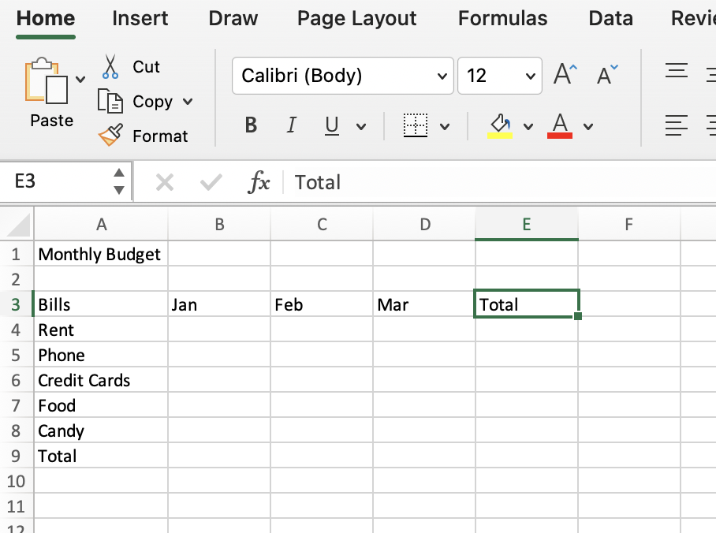

- There are row labels on the side and column labels at the tope, where we can put text values (alpha values are letters).

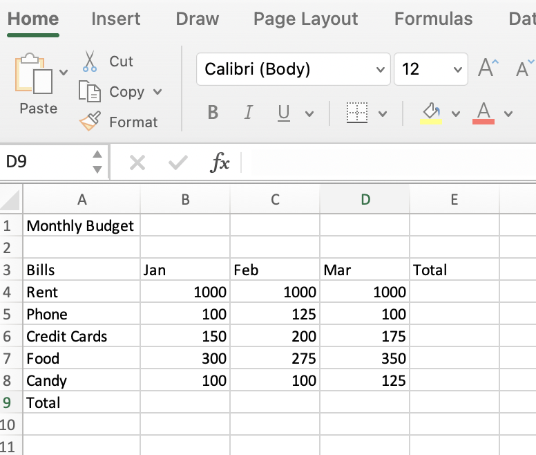

- Numeric values are right-aligned by default in Excel. This makes our decimals cleaner. Alpha values are left-aligned by default.

- If you import data and your numeric values are left-aligned, there will often be a green triangle in the top left corner of each of those cells, which means Excel is thinking there is something wrong there and it's treating those text values as alpha values.

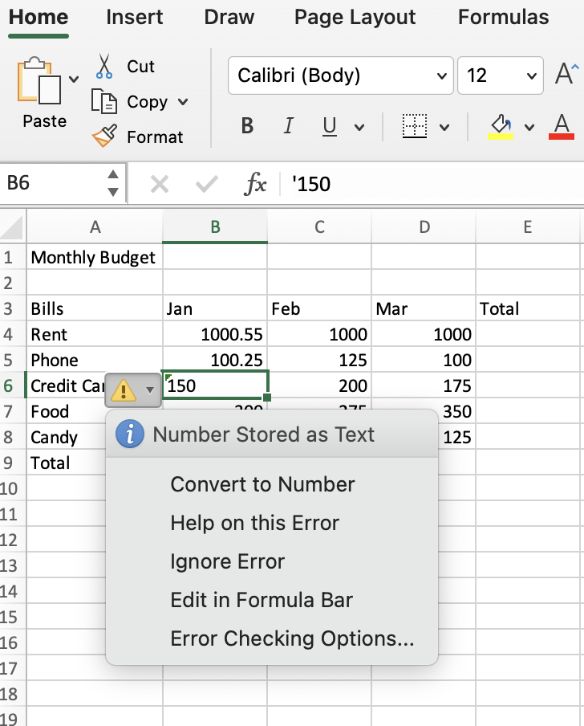

- The solution is to right-click the cell and select "Convert to number".

## Date Values

- Typically, a date comprises of 3 parts: day, month, and year. Date values are right-aligned by default, and dates are treated as numeric values.

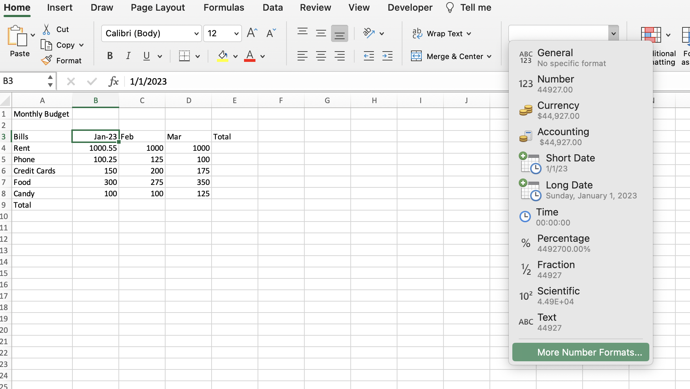

- To format date, select "More Number Formats...".

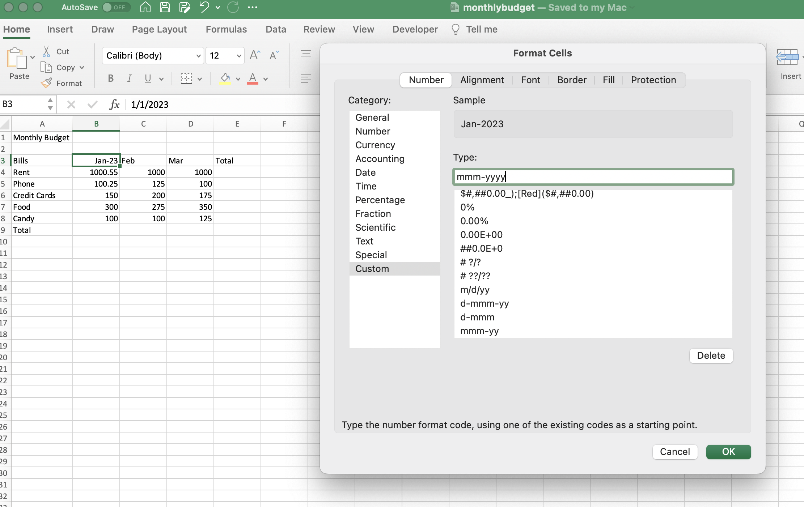

- Then create a custom format if the format you want is not in the common date formats.

## Cell References

- A single cell can be referenced (e.g., C5) or a range can be referenced (e.g., C5:C10).

- You can also reference cell groups that are non-contiguous (cells that are not touching). This is useful for when you don't want to include all of the contents of a table, only parts of it.

## Formulas / Basic Calculations

- To start a formula in Excel, you begin with the equal sign in the formula bar (=).

- You can sum a range of cells manually (known as an absolute or fixed reference) or by adding the cell references together individually (known as a relative reference).

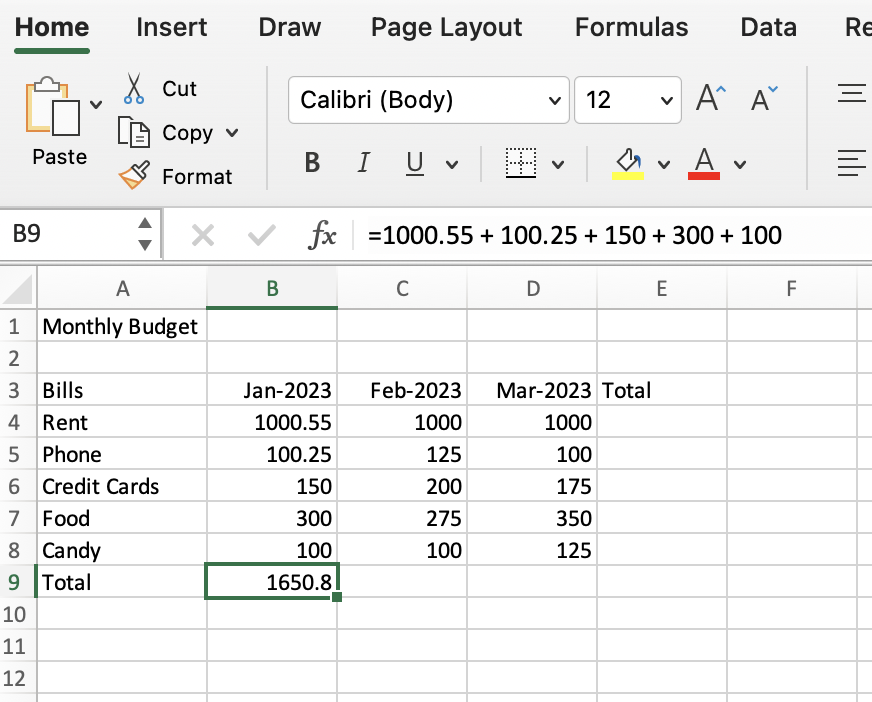
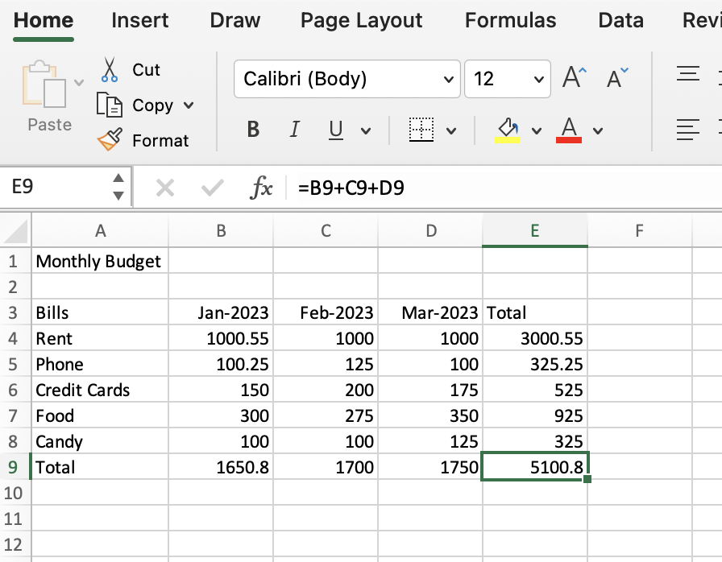

## Relative Reference

- When you copy and paste a "relative formula", the formula will update relative to its location (e.g., if I copy and paste =B4+B5 into one column to the right, it will update to =C4+C5). It will always update to two rows up, not the entire column necessarily (unless you specified this).

## Absolute (or Fixed) Reference

- If I copy and paste a relative reference, but one of the values needs to be fixed (or absolute), the updated pasted formula will error.

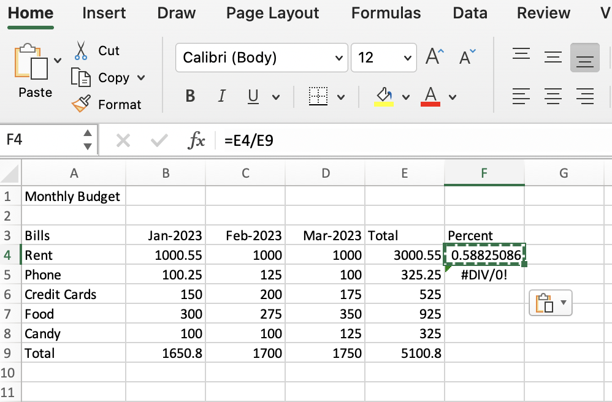
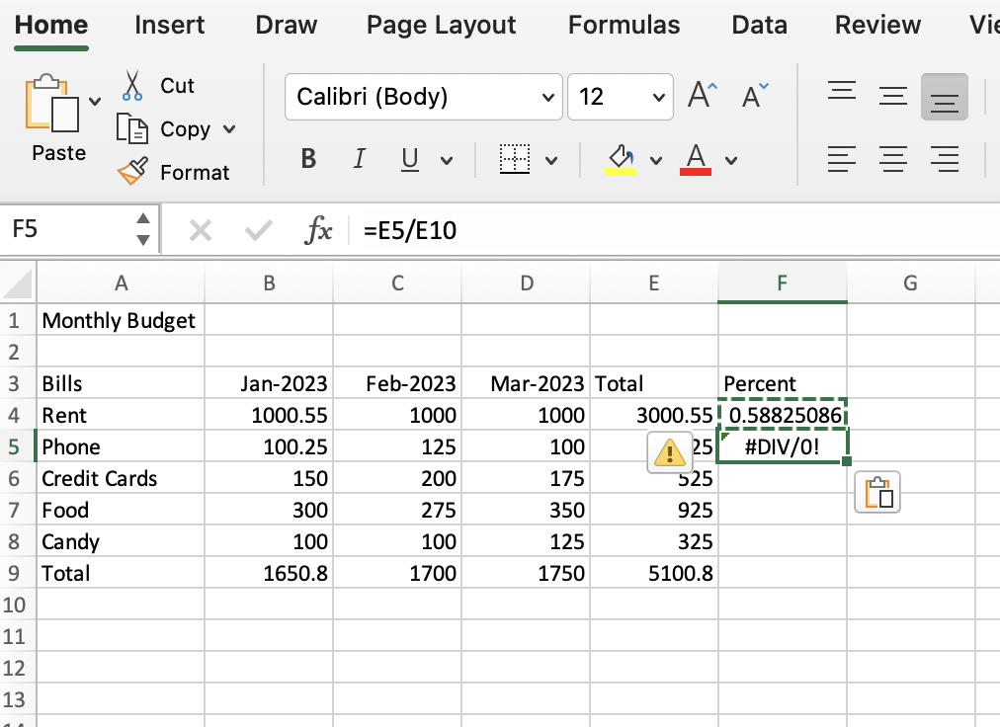

- To make a value absolute, we add a dollar sign ($) in front of each component of the cell value. The copy and pasted formula will no longer error.

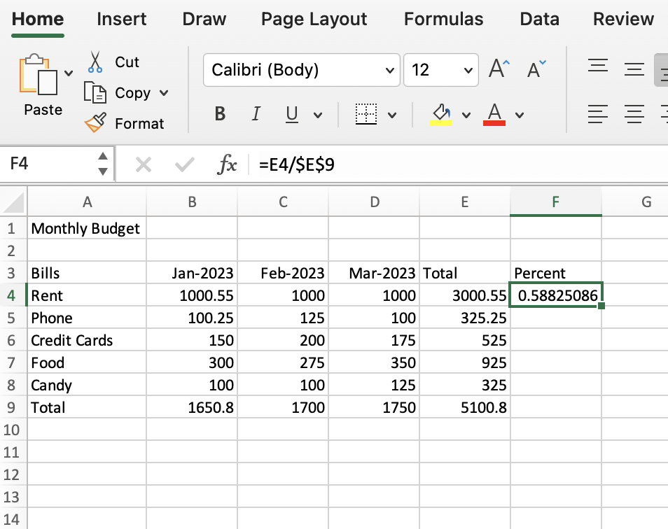

## Evaluate Formula

- On Windows, you can select a cell where you are entering a complicated formula, then select "Evaluate Formula" from the "Formulas" tab. You can click "Evaluate" for every cell value listed, and it will show you the value in real time.

- PEMDAS (parentheses, exponents, multiplication, division, addition, subtraction) is the order in which your evaluations execute.

- BODMAS (brackets, orders, division, multiplication, addition, subtraction) is common outside of the United States.

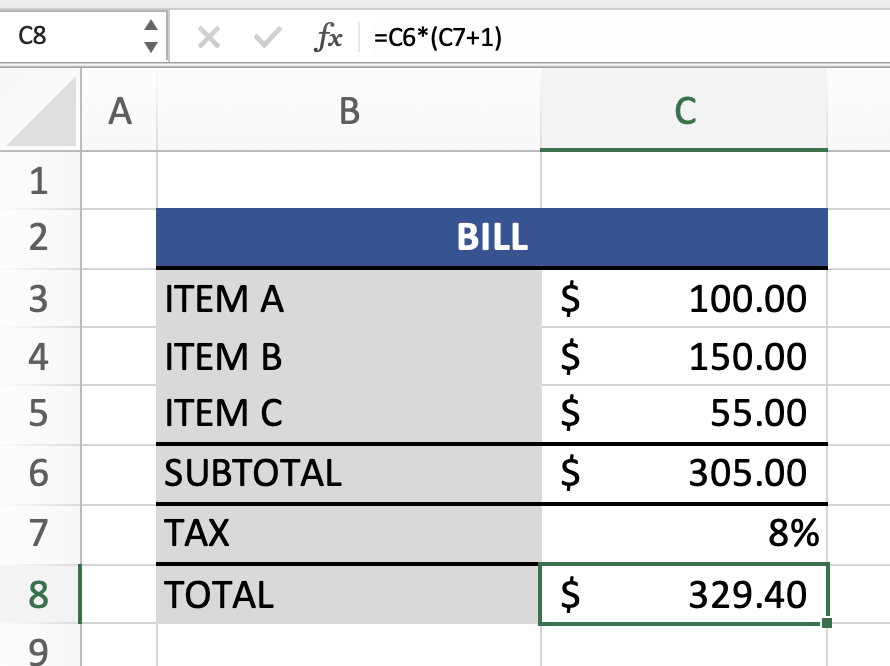

- Above is an example the construction of a formula that can calculate differently depending on the order of operations.

## Quiz

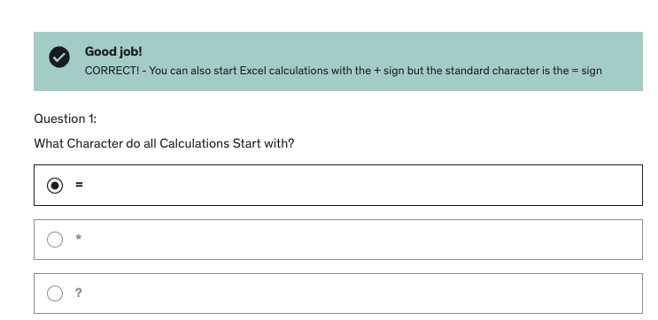

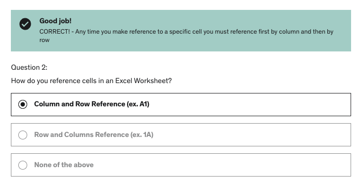

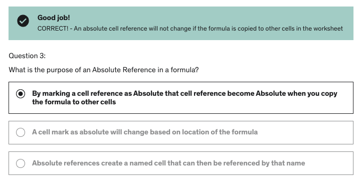

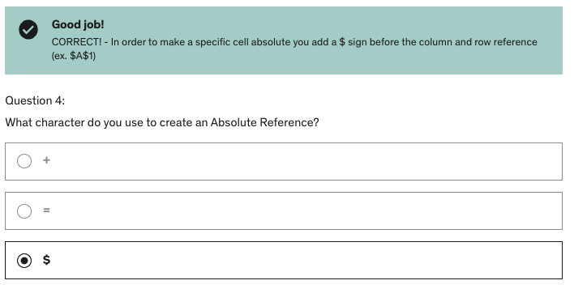

**Developer**

- Caroline Crandell - cecrandell - cecrandell19@gmail.com - [LinkedIn](https://www.linkedin.com/in/carolinecrandell/)
