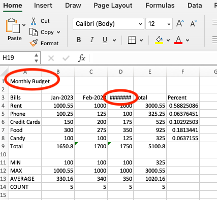
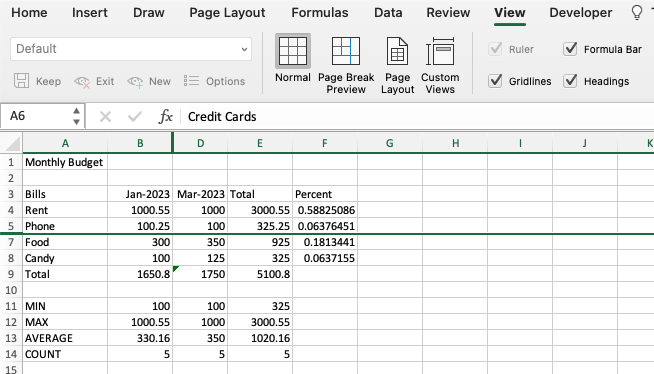
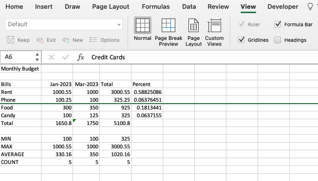
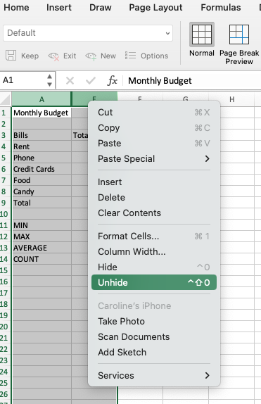
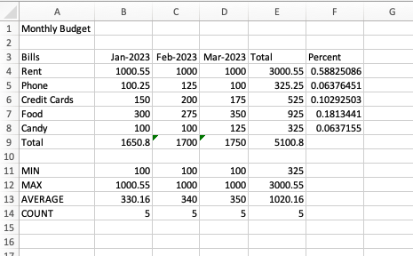
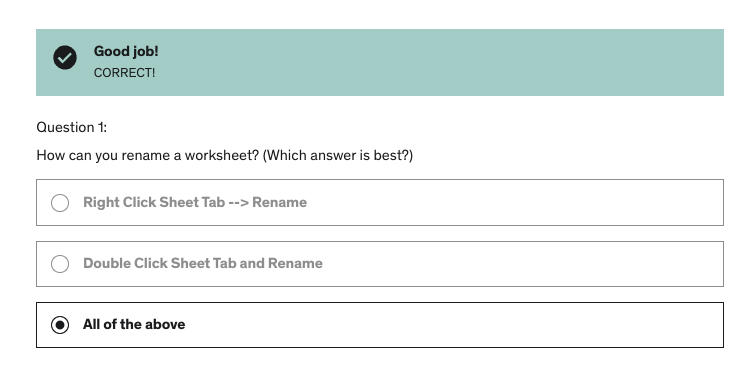
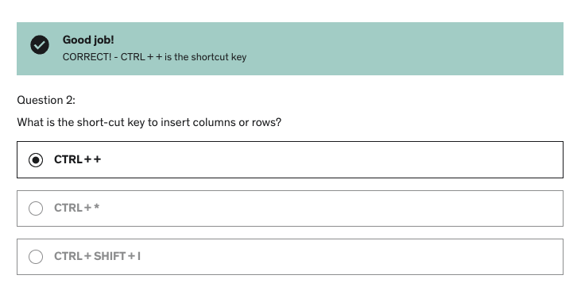
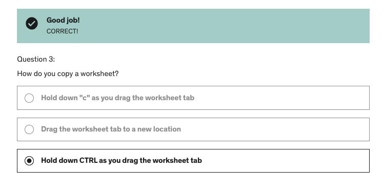
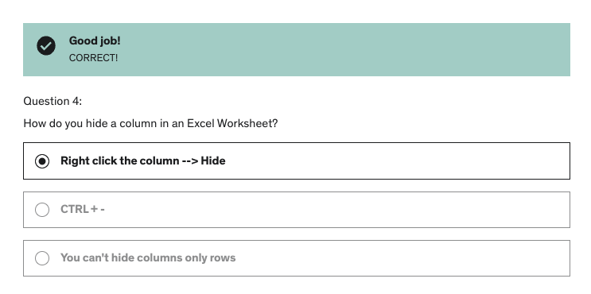
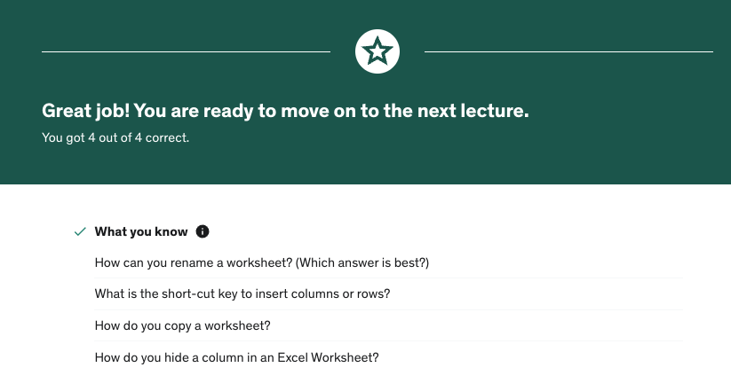

# Section 5: Modifying an Excel Worksheet

## Moving and Copying Data in an Excel Worksheet

- If you want to move data (e.g., if you want to make a nice border), you can select the range and when you go to the edge of your selection, your cursor becomes a four-headed arrow. You can then drag the selection wherever you want in the worksheet.

- If you want to move the data into a new worksheet or workbook, you can copy/cut/paste your selection.

## Inserting and Deleting Rows and Columns

- To insert a new row/column, you can select a row/column and right-click and select "Insert" (you can also achieve this through the "Insert" option in the "Home" tab on the ribbon).

- On Windows, the shortcut is Control + +.

- If the new row/column is within a range, the calculations will updated automatically. If the new row/column is outside of a range, you will need to update this manually.

- To delete a row/column, you can select a row/column and right-click and select "Delete" (you can also achieve this through the "Delete" option in the "Home" tab on the ribbon).

- On Windows, the shortcut is Control + -.

- If the deleted row/column is within a range, the calculations will updated automatically. If the deleted row/column is outside of a range, you will need to update this manually.

## Changing the Width and Height of Cells

- If a column is too narrow, the contents of numeric values that exceed the width of the column will read "########", indicating the column needs to be wider. Alpha values will just be cut off.

- This can be fixed by dragging the width of the column at the top, or double-clicking to autofit the column width to the width of the cell in that column with the largest width.

- The solution above can also be applied to a range of columns. Dragging the width of one column in a selected range will make all of the columns in that range the same width. Double-clicking on column in a selected range will also make all of the columns in that range the width of the cell in each respective column with the largest width.

- All of the above can be applied to the height of rows.

## Hiding and Unhiding Excel Rows and Columns

- Sometimes there's sensitive data that only we need to see, but we don't want others to see or print it.

- To hide a column or row, we can right-click the column or row and select "Hide".

- To unhide a column or row, we can right-click the column or row and select "Unhide", or we can drag the width/height of the column/row back out.

- To distract users from noticing any hidden columns/rows, you can hide the headings from the "View" tab in the ribbon.

- If you hide multiple columns (e.g., if you just want to show a summary and not all of the months of data), you can select both bookend columns, right-click, and select "Unhide" and all of the columns will return.

- Sidenote: later in the course, "Protect Sheet" in the "Review" tab of the ribbon will be covered, to prevent users from unhiding columns.

## Renaming a Worksheet

- Renaming a worksheet can be done by double-clicking "Sheet1" (or similar) and typing the new name. You can also right-click and select "Rename".

- It's important to choose intuitive names that are related to the contents of that worksheet.

## Deleting a Worksheet

- **THERE IS NO UNDO FOR DELETING A WORKSHEET** - proceed with caution.

- If you delete a worksheet without meaning to, DO NOT SAVE the workbook and close Excel. Re-open the workbook, and it should restore the document from the last time you saved, which will be before you deleted the worksheet.

- If you **do** want to delete a worksheet, right-click the worksheet and select "Delete". Excel asks if you're sure - click yes.

- Excel keeps track of worksheets you deleted, so if you delete "Sheet1", the next time you add a worksheet, it will be named "Sheet2", regardless of whether Sheet1 had data in it. You can always rename "Sheet2" to "Sheet1" if that is important to you.

## Moving and Copying an Excel Worksheet

- To move a worksheet, you can reorder worksheets just by dragging them at the bottom of the workbook.

- To copy a worksheet, you can right-click and click "Copy" and it will index the copied worksheet because you cannot have two worksheets with the same name (e.g., Sheet1 and Sheet1 (2)).

- On Windows, you can also hold down CTRL as you drag a worksheet tab to copy that worksheet.

- If you want to copy a worksheet into a different workbook, you can do so by selecting "(new book)" (which will create a new workbook for you), or you can select a workbook that is also already open on Excel.

## Quiz

**Developer**

- Caroline Crandell - cecrandell - cecrandell19@gmail.com - [LinkedIn](https://www.linkedin.com/in/carolinecrandell/)
