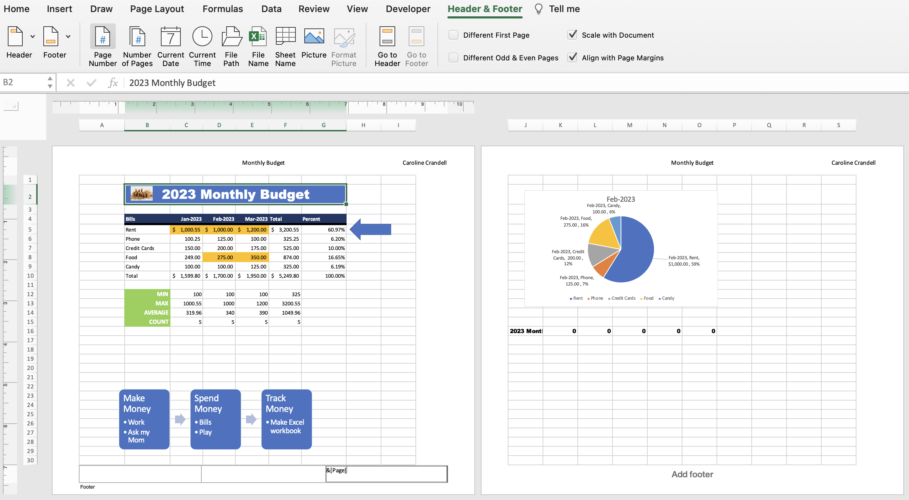

# Section 9: Printing an Excel Worksheet

## Print Preview

- Printing an Excel workbook can be a little chaotic, as shown above when we first check the Print Preview.

- When we go back to the workbook after viewing Print Preview, Excel helpfully provides gridlines to show us where pages start and end.

- Landscape orientation is best for Excel workbooks.

- You can scale the worksheet to fit to one page or custom scale it. You can also adjust the margins from Page Setup.

- By default, Print Preview only prints one worksheet at a time, unless you select otherwise.

- Similar to Microsoft Word, sometimes it's easier to actually see the pages that will be printed. You can change the view in Excel under the "View" tab in the ribbon, by updating "Normal" to "Page Layout".

## Header and Footer

 
- Sometimes it's useful to have headers and footers to display things like page numbers, file paths, your name, etc. You can do so from "Page Layout" view and clicking into the "Header" or "Footer" section.

- When you do so, a new tab appears in the ribbon: "Header & Footer", where you can add all sorts of things like current date, file name, etc.

## Printing a Specific Range of Cells

- If you only want to print a certain range of cells, you can select the range and then in Print Preview, you can change "Active Sheets" to "Selection" from the "Print:" section.

- If you're printing the same selection of cells regularly, you can set up a "Print Area". This can be done under the "Page Layout" tab in the ribbon under "Print Area" then "Set Print Area".

- Then when you go to Print Preview, "Active Sheets" now refers to your set print area. On Windows, you can "Ignore Print Area", but on Mac, you need to "Clear Print Area" from the "Page Layout" tab in the ribbon.

## Quiz

**Developer**

- Caroline Crandell - cecrandell - cecrandell19@gmail.com - [LinkedIn](https://www.linkedin.com/in/carolinecrandell/)
