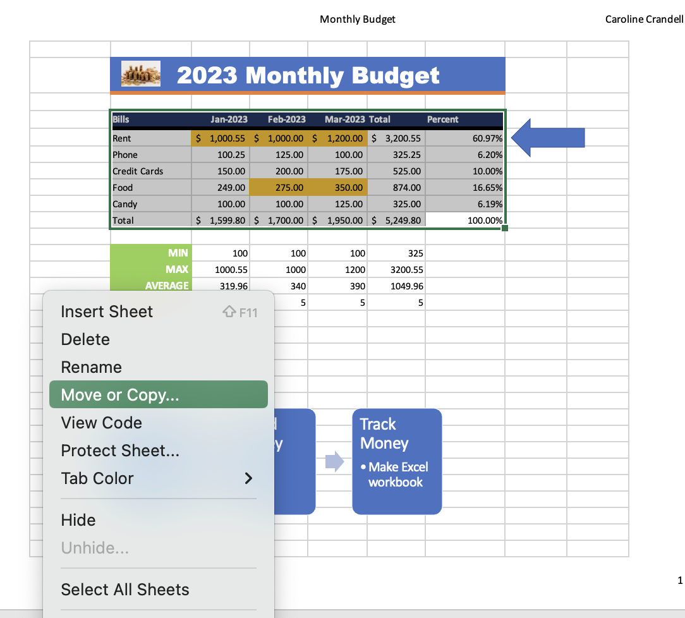
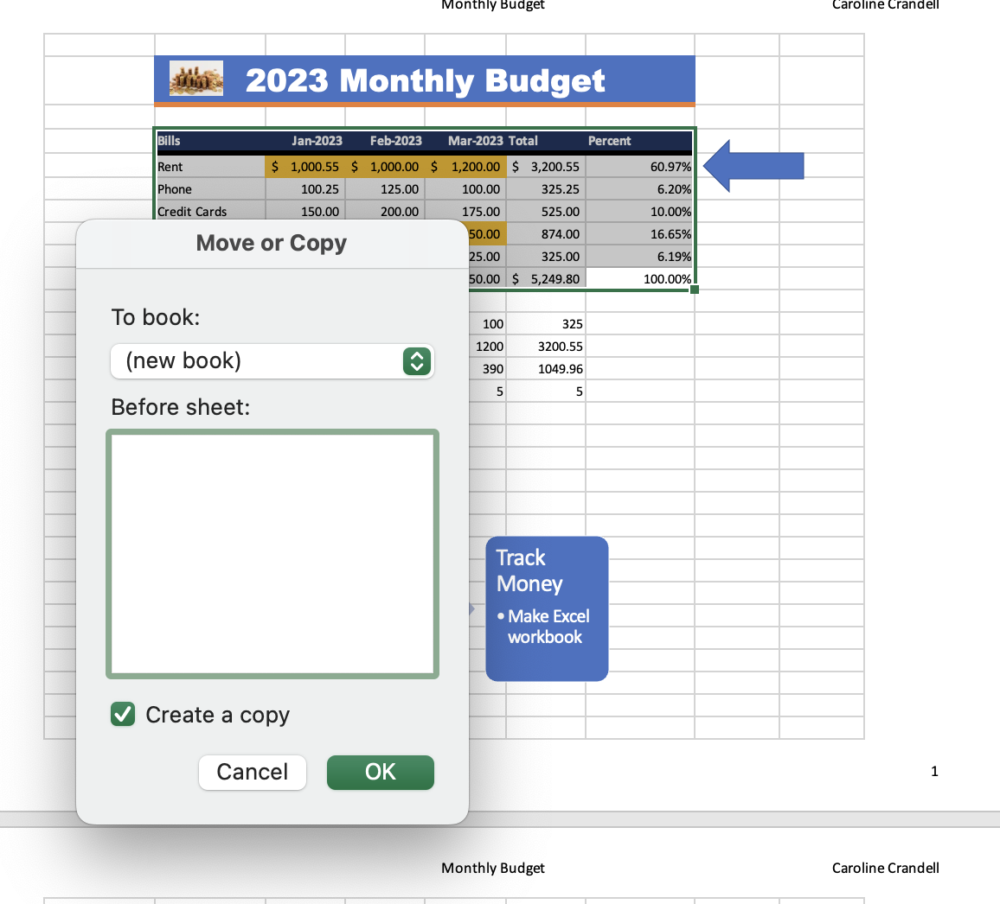
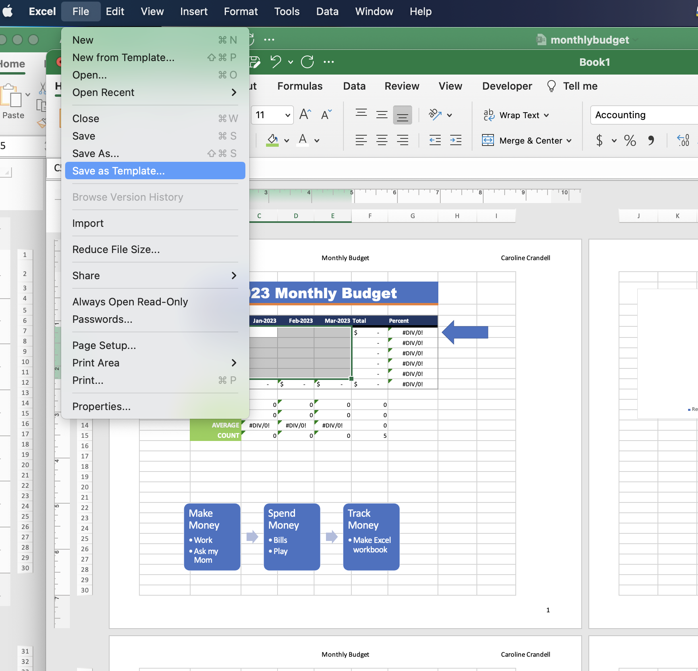
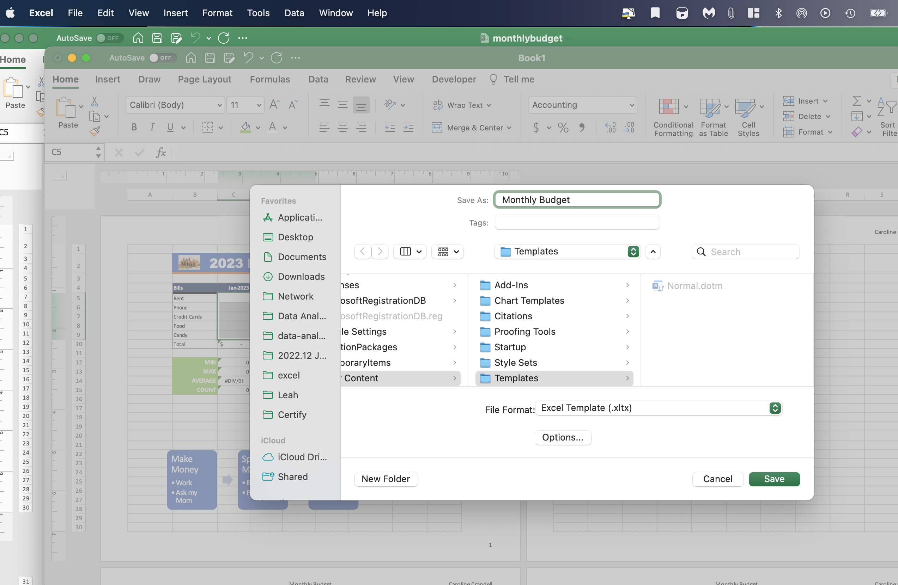
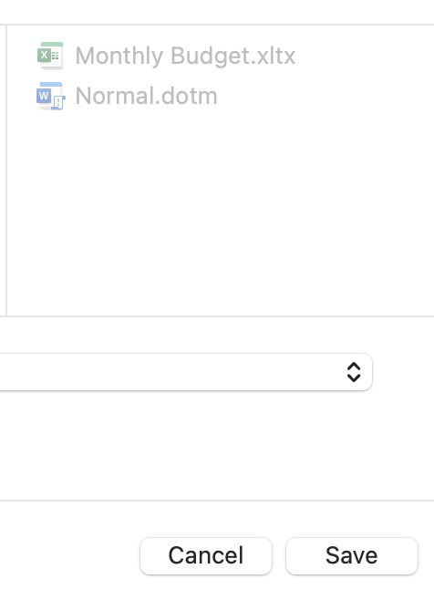
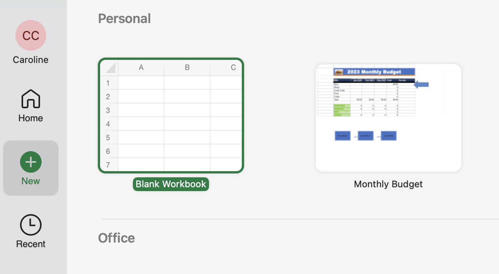
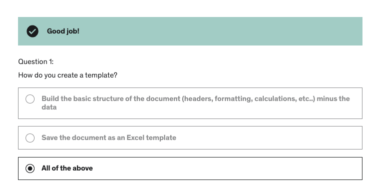
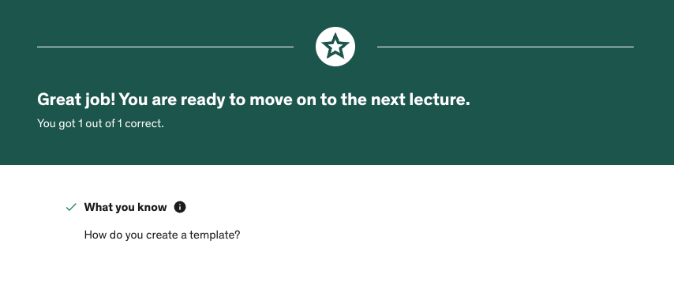

# Section 10: Working with Excel Templates

## Opening an Existing Template

- From the "File" tab, you can select "New from Template" and search for or choose from "Office" or "Personal" templates, ranging from loan workbooks to calendars to budgets etc.

- When you create a new workbook from a template, you can then make edits to the data to customize it to your needs.

## Creating a Custom Template

- Before creating a custom template, it's best to make a copy of your workbook. You can right-click on the worksheet and select "Move or Copy..." and tick "Create a copy".

- Once you've made a new workbook, you can delete the data that needs customizing and "Save as Template..." from the "File" tab. It will then prompt you to save to the Excel Templates folder, as a `.xltx` file.

- When you open Excel and make a new workbook from a template, you can see your personal template you just created.

## Quiz

**Developer**

- Caroline Crandell - cecrandell - cecrandell19@gmail.com - [LinkedIn](https://www.linkedin.com/in/carolinecrandell/)
