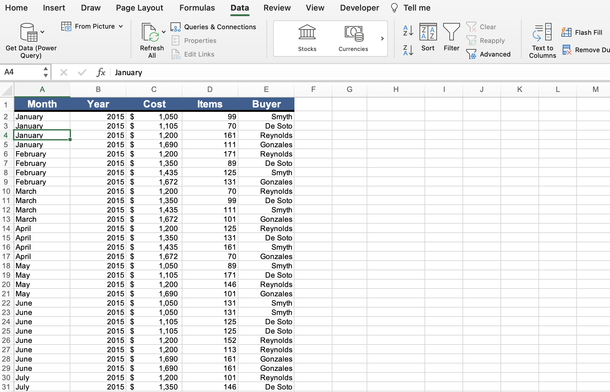
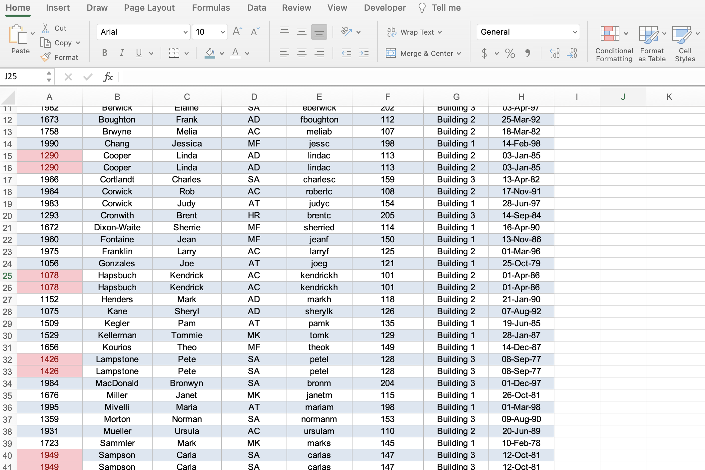
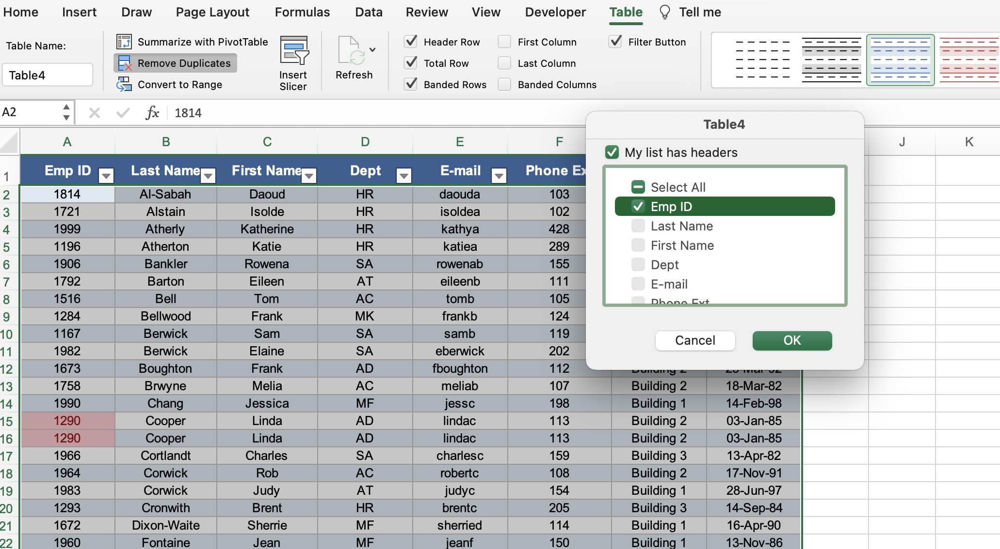

# Section 14: Working with an Excel List

## Understanding the Excel List Structure

- The column headers are identifers, and they are there for us (e.g., to identify what the data is below it) and for Excel (e.g., for pivot tables, sorting, etc.).

- When you first receive a list, make sure there are no empty rows or columns.

- If there is an empty row, Excel will identify this as two separate lists, because they are non-contiguous.

## Sorting a List Using Single Level Sort

- The purpose of a list is to store data so that later on yu can find it. Sorting makes data easy to find.

- An easy way to sort a column is to select a cell in the column you want to sort by, then select the "Data" tab in the ribbon, then select the ascending or descending icon.

## Sorting a List Using Multi-Level Sorts

- To sort by more than one column, select a cell in one of the columns of data you want to sort by, then select the "Data" tab in the ribbon, and click the "Sort" icon.

- Then select "Add Level" in the top left corner of the window (+ icon for Mac) and select the additional column you want to sort by in the drop down next to "Then by". You can see the list is sorted by `Last Name` first, then `Emp ID`.

## Using Custom Sorts in an Excel List

- In the bottom left of the workbook, if you right-click on the arrows, you can see a list of the worksheets in your workbook.

- If you were to sort a column by month, Excel sorts this alphabetically by default, which we often do not want.

- If you select a cell in the month column, then select the "Data" tab in the ribbon, then click the "Sort" icon, you can select "Custom List..." from the drop down under "Order".

- Excel has four pre-made custom lists: days of the week, abbreviated days of the week, months of the year, and abbreviated months of the year.

- Select the months of the year and then Excel will sort accordingly.

## Filter an Excel List Using the AutoFilter Tool

- To filter your list, select a cell in one of the columns of data you want to filter by, then select the "Data" tab in the ribbon, and click the "Filter" icon. Doing so inserts drop down icons next to each of our column headers.

- You can then click a drop down for your chosen column, and untick "(Select All)" to then tick the data value you do want to filter on.

- Once you click out of the filter window, you can see a funnel icon next to the drop down of the column you just filtered, indicating that this column is filtered.

- You can then go back into the filter window and select other data values you want to include in the filter.

- You can also filter multiple columns.

- To clear all of your filters, you can click "Clear" under the "Data" tab in the ribbon.

## Creating Subtotals in a List

- Before we can run the built-in Excel subtotal tool, you need to sort the appropriate column that you want to subtotal by (e.g., if I want to subtotal the sales by product, I need to first sort the product column).

- The manual way of subtotalling (which you should never do, especially if you have thousands of rows of data) is inserting a blank row between each group and manually summing the sales.

- The (much) better way of subtotalling is to select a cell in one of the columns of data, then select the "Data" tab in the ribbon, and click the "Subtotal" icon.

- Then select the column you want to subtotal the sales for (in our example: "Product").

- Then select the function you want to use (for subtotal: "Sum").

- Now you can see the subtotals of sales for products!

- A nifty tool that Excel provides when you subtotal: if you select "1" from the far left panel, Excel displays just the "Grand Total".

- If you select "2" from the far left panel, Excel displays just the group subtotals and the "Grand Total".

- If you select "3" from the far left panel, Excel displays everything.

## Format a List as a Table

- "Format as Table" was introduced to Excel in 2007.

- This tool prevents you from formatting a table manually, and it also is dynamic, so it updates when you filter or sort your list.

- To format your list, select a cell in one of the columns of data, then select the "Home" tab in the ribbon, and click the "Format as Table" drop down.

- You can then select which style you would like for your table and select the data range.

- After clicking "OK", your table is styled, filtered, and there's a new "Table" tab ("Design" tab in Windows) in the ribbon.

- From the "Table" tab ("Design" tab in Windows) in the ribbon, you can tick "Total Row", it will by default put a count at the bottom of the outer column.

- You can choose a different function by selecting the drop down next to that count.

- If you drag down the little corner icon in the bottom of this cell, you can add blank rows to the bottom of your table.

- When you populate these blank rows, the "Total Row" functionality is dynamic and will update automatically.

- You can also add another function to the bottom of a column by selecting the cell under the last row of that column and then selecting the drop down to choose a function.

## Duplicate

- To identify duplicate rows, find a unique column, select the top cell of data, then on Windows: Control + Shift + Down Arrow (on Mac Command + Shift + Down Arrow) to select all cells with data in that column.

- Then in the "Home" tab, select "Conditional Formatting" then "Highlight Cells Rules" then "Duplicate Values...".

- A new window will open, and you can choose what to look for and how to style cells and then click "OK". In our case, we are looking for duplicates.

- You can now see that the duplicates have been highlighted.

## Removing Duplicates

- There are two ways to remove duplicates:

1. If you haven't formatted your table, you can select "Remove Duplicates" from the "Data" tab in the ribbon.

2. If you have formatted your table, you can select "Remove Duplicates" from the "Table" tab ("Design" tab in Windows) in the ribbon.

- A new window will appear, and it wants you to identify what you consider to be duplicates.

- If you want to remove **exact** matches, keep everything in the window selected. Sometimes, you might want to unselect first name (e.g., if one row says "Rob" and another says "Robert").

- But since employee IDs should be unique, we only want to select `Emp ID`.

- When we click "OK", we can see the duplicates have been removed.

## Quiz

**Developer**

- Caroline Crandell - cecrandell - cecrandell19@gmail.com - [LinkedIn](https://www.linkedin.com/in/carolinecrandell/)
