# Section 15: Excel List Functions

## D Functions

- Functions in Excel that begin with `D` are referring to "database" functions.

## DSUM()

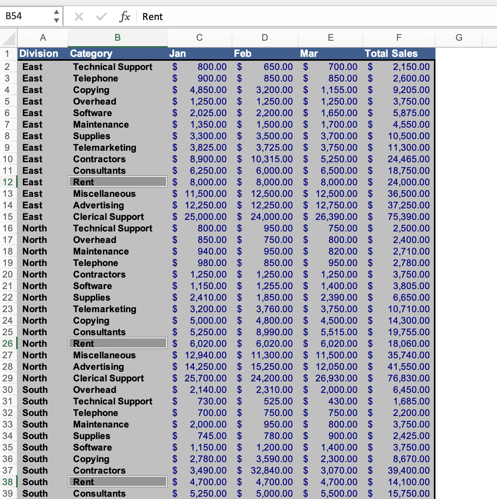

- Often, we will want to `SUM()` the numeric values of a column, but there are certain situations where we want to `SUM()` numeric values in a column only for a certain category (e.g., rent).

- For this scenario, Excel has the `DSUM()` function, which sums by category.

- For `DSUM()` to work, we first need to set up the criteria section of the function, identifying which column we want to search for a value within.

- We can do this by placing the column header in a new cell and the value we're looking for in a new cell off to the side (it's critical that the spelling and casing is exactly the same).

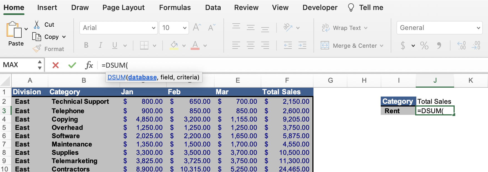

- Then we can give the `DSUM()` a header (e.g., "Total Sales"), under which we can start building the `DSUM()` function.

- The first argument of `DSUM()` requires the entire database range, which you can input manually or with shortcuts (from the top left corner of the table, on Windows: Control + Shift + Down Arrow and on Mac Command + Shift + Down Arrow which selects the whole column up until it recognizes a blank space in the rows, then on Windows: Control + Shift + Right Arrow and on Mac Command + Shift + Right Arrow). Make sure to include the column headers here.

- The second argument of the `DSUM()` requires the field, so you can select anywhere in the column that has the numeric values you want to sum. It's common practice to just select the cell of the column header (e.g., "Total Sales").

- The third argument of the `DSUM()` requires the critera, which we indicated in new cells off to the side (the category column header and the name of the category we want to sum).

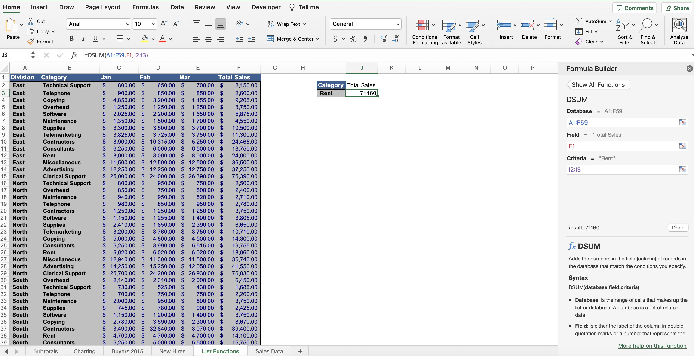

- You can manually type these arguments into the formula entry section of the formula bar, or you can select the "fx" icon in the formula bar. After inputting these three arguments, the `DSUM()` will sum all numeric values for that category.

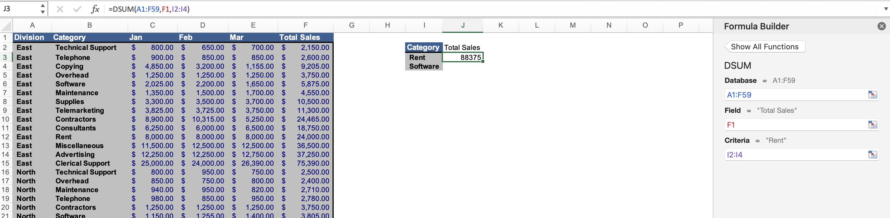

- If we wanted to expanded the criteria from one value to multiple, `DSUM()` allows for an `OR` clause, where we can include multiple cells in the critera range (e.g., include a numermic value in the total sum if the category value is one value OR another).

- If we wanted to expand the search to two columns (e.g., category and division), we can do so by putting the column header (e.g., "Division") in a new cell adjacent to the original column header (e.g., "Category") and the value we're looking for in a new cell off to the side (again, it's critical that the spelling and casing is exactly the same).

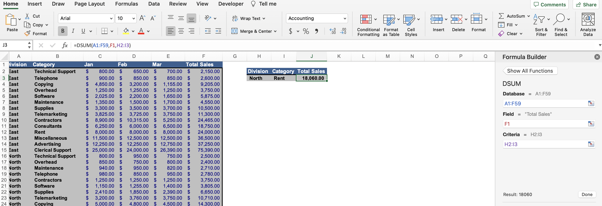

- Then in the criteria argument of the `DSUM()` function, expand the range to include the new category. This is the `AND` clause.

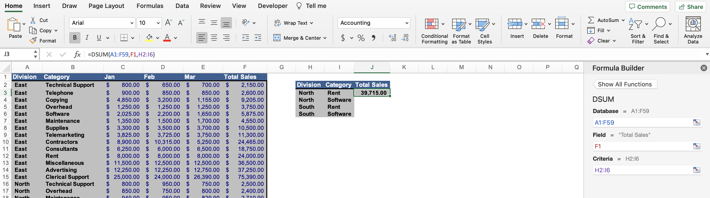

- If we wanted to use the `OR` and `AND` clauses together (e.g., multiple categories and multiple category values), we can do so by adding additional rows in the criteria section, and updating the criteria cell range to include our new `OR` clauses. Populating the category cells with new values represents the `OR` clause and updating the criteria cell range represents the `AND` clause.

## DAVERAGE()

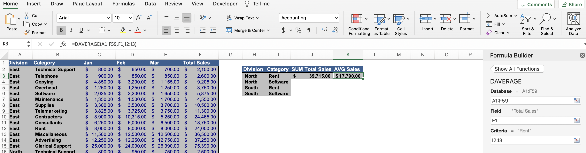

- `DAVERAGE()` is identical to `DSUM()`, but it averages a database cell range.

## DCOUNT()

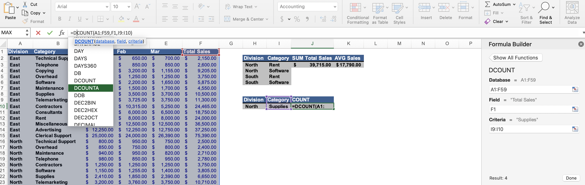

- `DCOUNT()` is identical to `DSUM()`, but it provides the count for a database cell range.

- `DCOUNT()` counts numeric cell values by default, and `DCOUNTA()` counts alpha values.

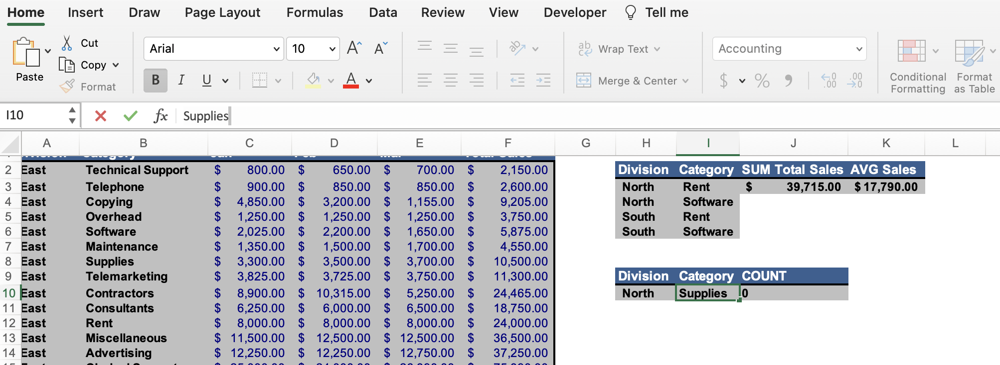

- It's also important to note: if you accidently put a space after a cell value in database functions, it will break and return zero. Beware of this!

## Database Functions

- There are various other database functions such as: `DGET()`, `DMIN()`, `DMAX()`, `DSTDEV()`, and `DPRODUCT()`.

## SUBTOTAL()

- `SUBTOTAL()` provides a similar outcome to our database functions, but the structure of the arguments is a bit different.

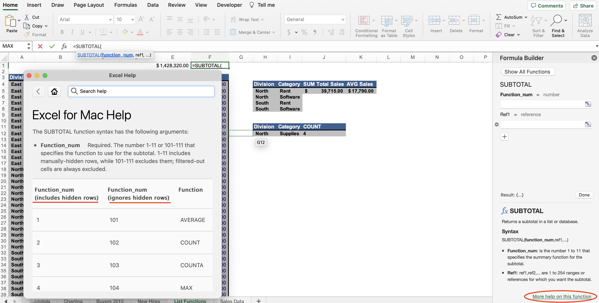

- If you start to type the function in the formula bar, you can click on "More help on this function" to get the numeric values for `function_num`. There are two categories: one that includes hidden rows (e.g., 2 for `COUNT()`) and one that ignores hidden rows (e.g., 101 for `AVERAGE()`).

- Now we need to filter the data to get a subtotal. Click anywhere in your list of values and go to the "Data" tab in the ribbon and select "Filter", and you will see the drop downs populate your column headers.

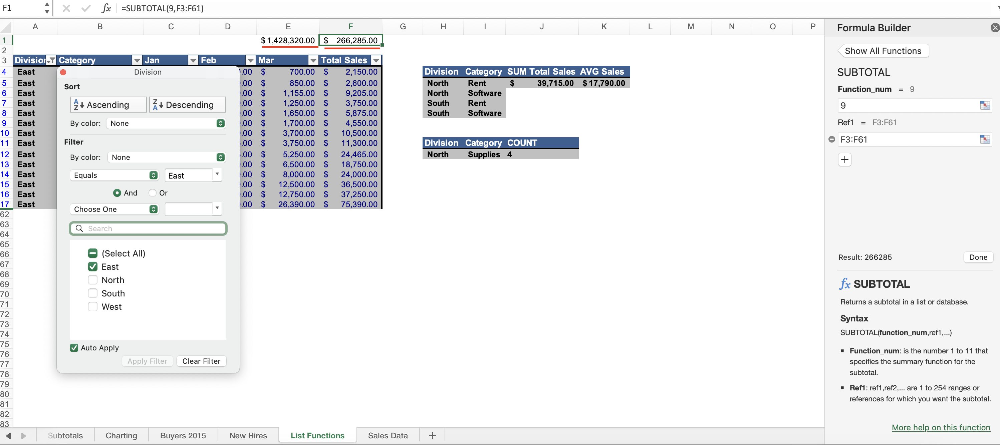

- Click a drop down for one of the columns and untick "Select All" and only tick one. You will then see your `SUBTOTAL()` update to only the value you selected.

- `SUM()` will retain the sum of that column regardless of the filter, but `SUBTOTAL()` will update when there's a filter.

## Quiz

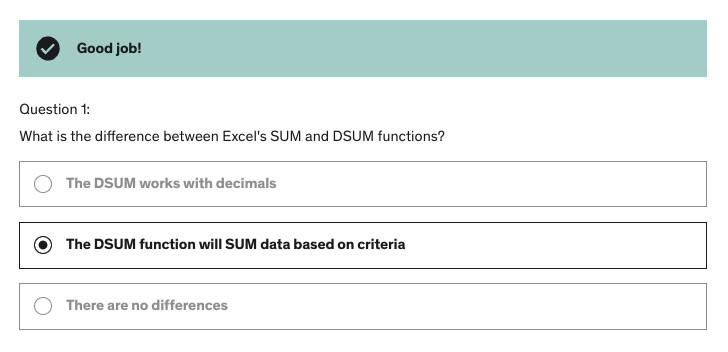

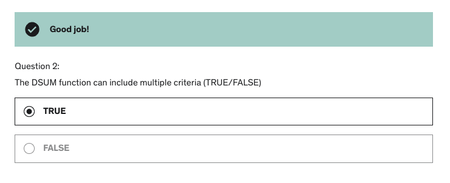s

**Developer**

- Caroline Crandell - cecrandell - cecrandell19@gmail.com - [LinkedIn](https://www.linkedin.com/in/carolinecrandell/)
