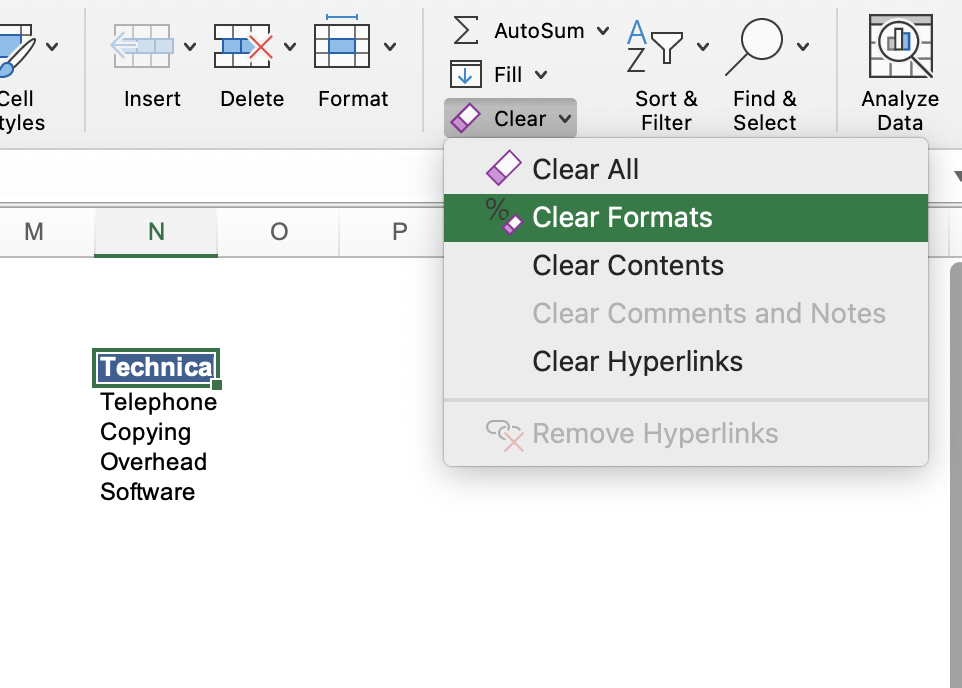

# Section 16: Excel Data Validation

## Why is Data Validation Important?

- When you get a dataset from a third party, sometimes they don't validate their data, and there can be misspellings, abbreviations, spelled out numbers instead of numeric values, etc. This is called "dirty data" or inconsistently-formatted data.

- We need to make a way to format the data consistently - to "clean" it. We don't want extraneous data, we want to format things properly (e.g., phone numbers). We want to control how users are inputting data.

- For example, in the list above, if we wanted values in the "RATE" column to only be in the range of $14.95" to "$39.95", or in the "AUTO" column, we only wanted "y" and "n" and not "yes" and "no", or in the "MAKE" column, we only wanted "Ford", "Chevy", "Pontiac", "Oldsmobile", or "Dodge" and only spelled that way and no other makes of cars, data validation will enable us to do this.

## Excel Data Validation List

- To make a new data validation rule, select a cell range (a column) and then select the "Data" tab in the ribbon and click the drop down next to "Data Validation" and select "Data Validation...".

- For the "MAKE" column, we only want a list of alpha values, so we indicate what values we want (most of the time these are separated by commas, but sometimes they need to be semicolons).

- Then when users input new rows, they can select from the drop down menu.

## Excel Data Validation Decimal

- There are several other options for data validation rules (e.g., a range of whole numbers like 1-10, date and times like between two dates or times or greater than or lesser than this date or time, or text length where the input needs to be equal to 10 characters like postal codes or phone numbers etc.), such as decimals, where we can specify that the input needs to be between "14.95" and "39.95", following the same steps as the Excel data validation list process above.

- The custom data validation rule allows you to create calculations that define the criteria for you.

- Once the rule is set and we input data that does not follow the rule, we get an alert.

## Excel Data Validation Custom Errors

- For a more user-friendly experience, we can create custom error alerts for users. We can do this by navigating to the "Data Validation" settings window (select a cell range (a column) and then select the "Data" tab in the ribbon and click the drop down next to "Data Validation" and select "Data Validation...").

- The "Style:" drop down indicates what icon the user will see when they input dirty data, but it also indicates what options they have on how to proceed.

- The "Stop" style indicates that the user cannot proceed - they can cancel or retry.

- The "Warning" style indicates that the user violated the rule, but they can still proceed if they want - they can select yes or no.

- The "Information" style indicates that the user violated the rule, but that's fine, and they can just like "OK".

## Dynamic Formulas by Using Excel Data Validation Techniques

- Lists are not the only place you can perform data validation. You can also combine list data validation with functions (interactive and dynamic)!

- In the previous section on [databse functions](/Section%2015%3A%20Excel%20List%20Functions/README.md), we used functions that required cell values to be spelled exactly the same as they are in the list in order for the function to work. This leaves a lot of room for user error, so we can combine data validation and functions to prevent errors.

- To do this, we type our list of acceptable cell values off to the side somewhere on the worksheet, spelled exactly as they are in the column of choice.

- Then we highlight the cells that we've applied a function to where the cell value needs to be exact (these cells can be non-adjacent) and go to the "Data" tab in the ribbon and select "Data Validation" then "Data Validation...".

- Then we select "List" from the drop down menu, and then our source will be the cell range of the values acceptable spelled corrected off to the side.

- Then our function cells will have drop down menus next to them, helping to prevent user errors.

- Fun trick: to clear formatting from a cell, select the cell you want to clear the formatting for, and then you can select "Clear", then "Clear Formats" from the "Home" tab in the ribbon.

## Quiz

**Developer**

- Caroline Crandell - cecrandell - cecrandell19@gmail.com - [LinkedIn](https://www.linkedin.com/in/carolinecrandell/)
