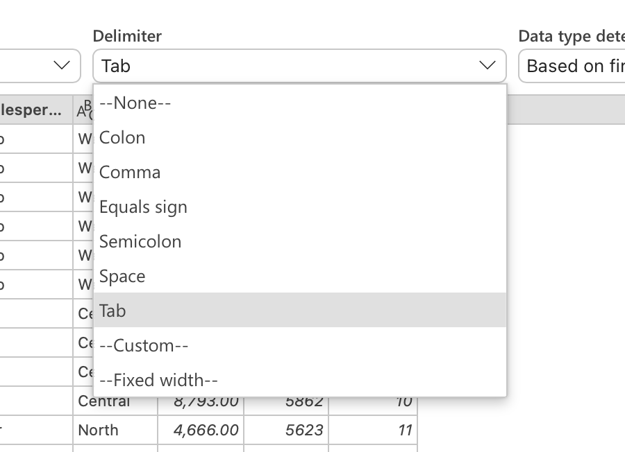

# Section 17: Importing and Exporting Data

## Importing Data into Excel

- Sometimes we need to import data from an external source. That could be something simple like a text file or huge like a Microsoft Access database.

## Importing Data from Text Files

- Systems like Crystal Reports or Microsoft Access often export to text files, so we want to take that text file and import it into Excel.

- We're going to use a "tab delimited text file" as an example, which has column headers and rows of data, each separated by a tab.

- There are also CSV files, which are comma separated documents ("comma-separated values").

- To import data from a tab delimited text file, we go to the "Data" tab in the ribbon, and select "Get Data (Power Query)..." then select the text file from your computer.

- You will then see a preview of the table, and you can select the appropriate values from the various drop down menus (e.g., "Tab" in the "Delimiter" drop down and "Based on first 200 rows" from the "Data type detection" drop down).

- If you select "Transform Data", it will take you to a second window called the "Power Query Editer". We won't work with this in this section, but it's an option.

- If you select "Load", it will load all of the data into your Excel workbook and it will name the worksheet the name of your text file.

- Your workbook is tied to this text file now, so if this text file is updated, you can refresh your Excel workbook, and the data will update.

- For old versions of Excel, follow this [article](https://support.microsoft.com/en-us/office/text-import-wizard-c5b02af6-fda1-4440-899f-f78bafe41857) to use "Text Import Wizard".

## Importing Data from a Database

- Microsoft Access is a database tool that has many tables (bits and pieces of a larger picture). Queries can also live in a Microsoft Access file.

- On Mac, Excel is not configured to handle Microsoft Access files (I'm completing this course on a Mac), but I will provide Windows steps below.

- A Microsoft Access file ends in `.accdb` and includes tables, queries, forms, reports, pages, macros, and modules.

- To import data from a Microsoft Access file, we go to the "Data" tab in the ribbon, and select "Get Data" then select "From Database" then select "From Microsoft Access Database" and then select the Microsoft Access file from your computer.

- The navigator window will show queries and tables. If you select a table, it will show you a preview.

- Then you can select "Load", and it will load the data into a worksheet. Your workbook is tied to this Microsoft Access file now, so if this Microsoft Access file is updated (e.g., someone deletes rows), you can refresh your Excel workbook, and the data will update.

- For old versions of Excel, you can follow this [article](https://support.microsoft.com/en-us/office/text-import-wizard-c5b02af6-fda1-4440-899f-f78bafe41857) to use "Text Import Wizard", but instead of selecting "From Text", you can select "Get Access" or similar.

## Microsoft Excel Legacy Import Options for New Excel Versions

- To access legacy options that are usually on old versions of Excel, you can follow this [article](https://support.microsoft.com/en-us/office/data-import-and-analysis-options-3ea52160-08bc-45ac-acd9-bc4a11bcc2a2).

## Exporting Data to a Text File

- Sometimes we need to export our data in Excel into another database, system, or application, and sometimes they don't interact well with Excel. Text files (e.g., tab delimited and comma separated) are a pretty standard file type that many applications can import, so it's useful to be able to export our data to a text file, because it is just the data (no functions, formatting, calculations etc).

- To export to a text file, select "Save As..." from the "File" tab, and change the file type to `.txt` or `.csv` from the "File Format:" drop down menu.

- An alert will appear, informing you that the workbook has multiple sheets and that there will be possible data/formatting loss. You can ignore these, as it will still export your worksheet into a text file in the folder where your workbook is saved.

## Quiz

**Developer**

- Caroline Crandell - cecrandell - cecrandell19@gmail.com - [LinkedIn](https://www.linkedin.com/in/carolinecrandell/)
