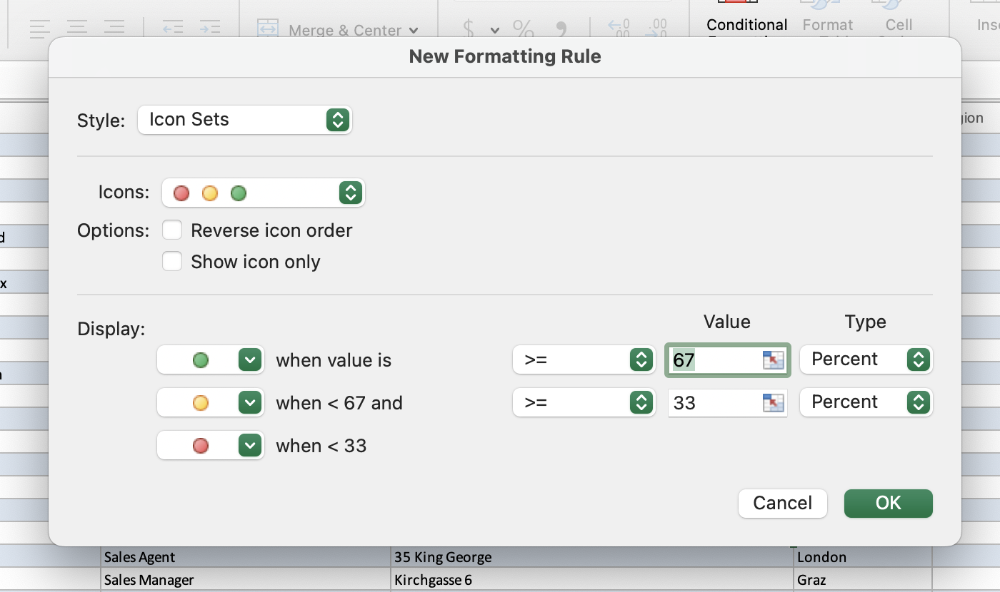

# Section 19: Working with Excel's PowerPivot Tools

## Why PowerPivot?

- PowerPivot allows you to make a PivotTable from more than one worksheet (lists or tables).

- One scenario could be appending one worksheet to another worksheet if they have the same column headers.

- Another scenario could be joining one worksheet with another worksheet where they have a column header in common.

- In the later scenario, we need to include multiple tables into a PivotTable. To use multiple tables, a new PivotTable can be created using the Data Model (which is a part of PowerPivot and is really just a dataset of your Excel data).

- To get multiple tables into a dataset, we need a Data Model, and then we base the PivotTable off of that Data Model.

## Activating Excel Power Pivot

- PowerPivot is not available in every edition of Excel (only in 2010 - 2013 versions), and it needs to be added in for the versions that do have it.

- On Mac, Excel is not configured to implement PowerPivot (I'm completing this course on a Mac), but I will provide Windows steps below.

- To add Power Pivot in, follow the steps in this [Microsoft article](https://support.microsoft.com/en-us/office/start-the-power-pivot-add-in-for-excel-a891a66d-36e3-43fc-81e8-fc4798f39ea8).

- Once activated, a new tab will appear in the ribbon: "Power Pivot".

## Creating Data Models with PowerPivot

- To create a Data Model, select a cell anywhere in your table (make sure your table is formatted as a table and named appropriately) and from the "Power Pivot" tab in the ribbon, select "Add to Data Model".

- A brand new window will open ("Power Pivot for Excel"), where you can make your Data Model.

- In this new window, we have the option to get external data from various sources if we want (e.g., from a data service or database).

- We check that the data looks good and then we exit this window (everything is still connected).

- Then we go back to our workbook and select the other worksheet we want to include in the Data Model that shares a column header with the previous worksheet.

- Then select a cell anywhere in your table (make sure your table is formatted as a table and named appropriately) and from the "Power Pivot" tab in the ribbon, select "Add to Data Model".

- The "Power Pivot for Excel" window will appear, but now we can see both worksheet tabs at the bottom of this new window.

## Excel Power Pivot Data Model Relationships

- From the "Power Pivot for Excel" window, right-click on the column header in one worksheet that matches identically to the column header in the other worksheet and select "Create Relationship..." then select the column header from the first worksheet, then select the second worksheet from the drop down menu, and select the column header that matches identically to the first worksheet. Click "OK", and now we have made a Data Model relationship.

- By default, the "Power Pivot for Excel" window is in "Data View" (the view in which the step above was executed). An easier way to make a Data Model relationship is to do so viewing the table structures. You can see the table structure by clicking the "Home" tab in the ribbon, then selecting the "Diagram View".

- To make a Data Model relationship from "Diagram View", you need to drag the column header from one table to the column header in the other table that matches identically.

- In this example, the `CustomerInfo` table is the "parent table" and the `OrderInfo` table is the "child table". This is because the `Customer ID` in the `CustomerInfo` table is unique (that record can only show up once), whereas there can be multiple `Customer ID` entries in the `OrderInfo` table, because one customer can have multiple orders.

- Once we've created that relationship, on the edge of the `CustomerInfo` table, we see a "1", indicating that the column header is unique and only appears once in this table. on the edge of the `OrderInfo` table, we see a "\*", indicating that the column header can appear multiple times in this table.

## Creating PivotTables based on Data Models

- Still from the "Power Pivot for Excel" window, in the "Home" tab in the ribbon, select the "PivotTable" drop down menu, and many options will appear. If we click "PivotTable", this brings us back to the standard Excel interface, and we can select to put it on a new worksheet.

- Now when we look at the "PivotTable Fields" list section, we can see several tables in this section. Depending on how many tables you have in your workbook that are formatted as tables, they will all appear in this section. In our example, `CustomerInfo` and `OrderInfo` should now appear in this section.

- If you click the drop down icon next to the `CustomerInfo` table, you can drag a field into one of the "Columns", "Rows", and/or "Values" sections. Likewise with the `OrderInfo` table, and now we are combining data from both tables into one PivotTable - so cool!

## Excel Power Pivot KPIs

- Now that we've created a PivotTable based on a PowerPivot Data Model, we can make a calculation inside of PowerPivot and use that calculation inside of the PivotTable as a KPI (key performance indicator).

- To do so, we need to manage or edit the Data Model. You can go to the "Power Pivot" tab in the ribbon, and click "Manage", which will take us back to the "Power Pivot for Excel" window.

- If you highlight a column in one of the worksheets, you can see in the "Home" tab in the ribbon that there's an "AutoSum" drop down and under it is a "Create KPI" drop down, but the latter is not (yet) active.

- To activate the the "Create KPI" drop down, we need to make a calculation (or "measure") first. We can do so by summing (or using another function such as averaging) the column (using the "AutoSum" drop down in the "Home" tab in the ribbon), and now the "Create KPI" drop down becomes active.

- A new window appears which has the following sections: "Define target value:", "Define status thresholds:", and "Select icon style:".

- In the "Define target value:" section, we can select "Measure:" or "Absolute value:". In selecting the latter, we can choose a value that will represent the maximum value in the status thresholds (e.g., 100).

- In the "Define status thresholds:" section, we can adjust when we want the red icon to appear (e.g., if a value is between 60 and 100, we want a red icon to appear), as well as the yellow and green icons.

- In the "Select icon style:" section, we can select our icons of choice.

- After selecting "OK", we can exit the "Power Pivot for Excel" window, and in our "PivotTable Fields" list, we can now see a field in the table where we created a calculation/KPI for one of the columns (e.g., "Average of Freight") that has a stoplight icon next to it. This stop light indicates that there's a KPI attached to it. If we click the drop down next to this field, we will see three options: "fx Value", "Goal", and "Status".

- "fx Value" will give us the value of that field, "Goal" will give us the "Absolute Value" that we set in the PowerPivot KPI window (e.g., 100), and "Status" will give us the corresponding red, yellow, or green icon. We can now drag any of these values into any of the PivotTable sections.

- If you're like me and do not have access to PowerPivot, you can still set status icons by going to the "Home" tab in the ribbon, then selecting the "Conditional Formatting" drop down, then selecting "Icon Sets", then "More Rules..." to set the icon ranges.

- You don't need PowerPivot to create KPI icons, but you do need PowerPivot to create a relationship between multiple tables.

- **Developer**

- Caroline Crandell - cecrandell - cecrandell19@gmail.com - [LinkedIn](https://www.linkedin.com/in/carolinecrandell/)
