# Section 24: Working with Excel's Conditional Functions

## Working with Excel Name Ranges

- An alternative to column row address is name ranges.

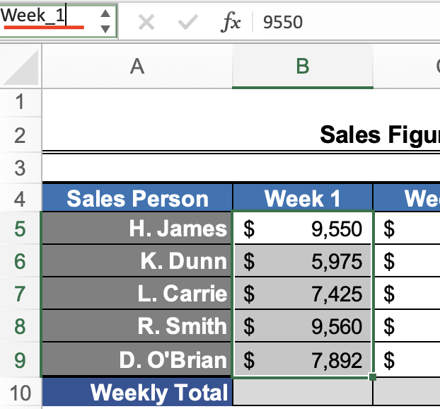

- To name a name range, select a range of cells and then double click the "Name Box" in the top left corner to rename this range (no spaces), then press Enter/Return.

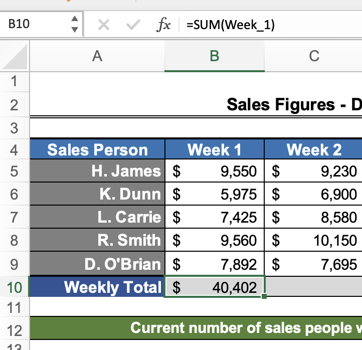
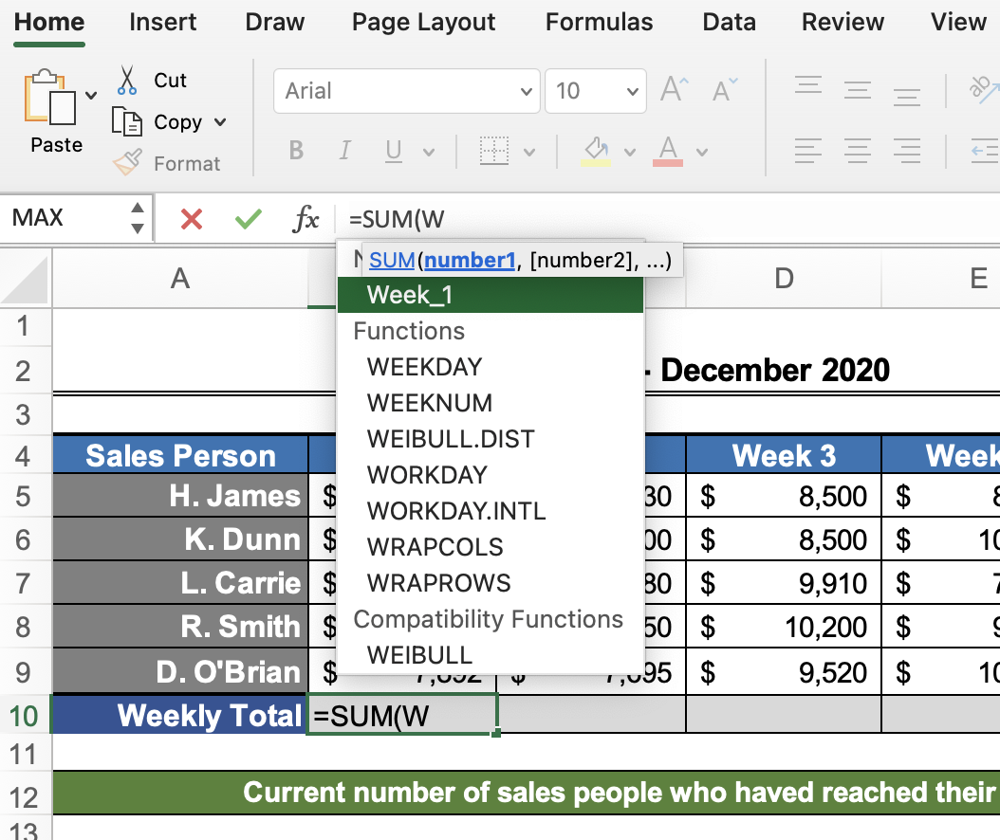

- When you start typing a formula and open the parentheses, you can start typing your new name range, and it will show your new name range in the drop down.

## Advantages and Disadvantages of Excel Name Ranges

### Advantages

- A name for a range gives more context and defines it, making it a less abstract coloumn row reference.

- We can use names ranges inside of formulas, which is useful for large datasets, but also in lookups.

- We can name a whole table of data and use that inside of a formula.

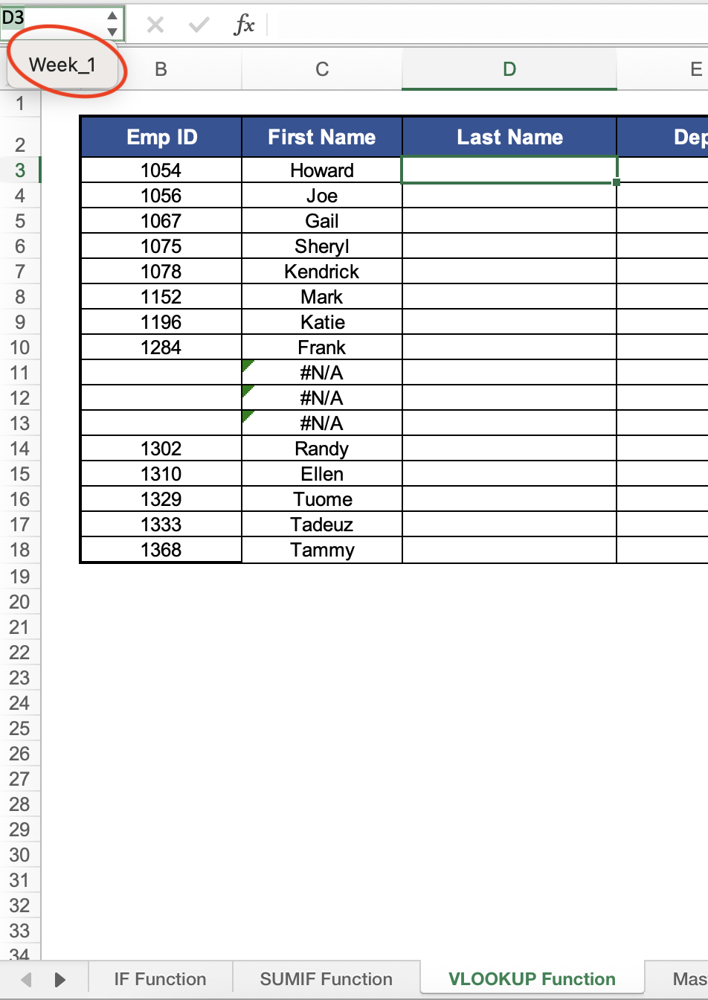

- Name ranges can also help us navigate to data. If you are in a different worksheet, and you select the drop down menu from the top left "Name Box", you can select your name range (e.g., "Week_1"), and it will take you to that worksheet, and it will have that name range highlighted in the worksheet. You can also print this selection.

### Disadvantages

- A relative cell reference will update if you copy and paste into the adjacent cell. An absolute cell reference will only ever refer to the exact cell you indicate. A name range is an absolute reference to a cell range (e.g., "Week_1" will only ever reference to the week 1 data; it will not update to week 2 data if you copy and paste the name range into a new column). Therefore, you wouldn't want to use name ranges if you plan to copy and paste the references.

## Editing an Excel Name Range

- If you need to edit a named cell range (e.g., if you referenced the wrong cells, or you need to increase or decrease the reference within the name, or you need to change the name), you can find all name ranges by navigating to the "Formulas" tab in the ribbon and selecting "Name Manager".

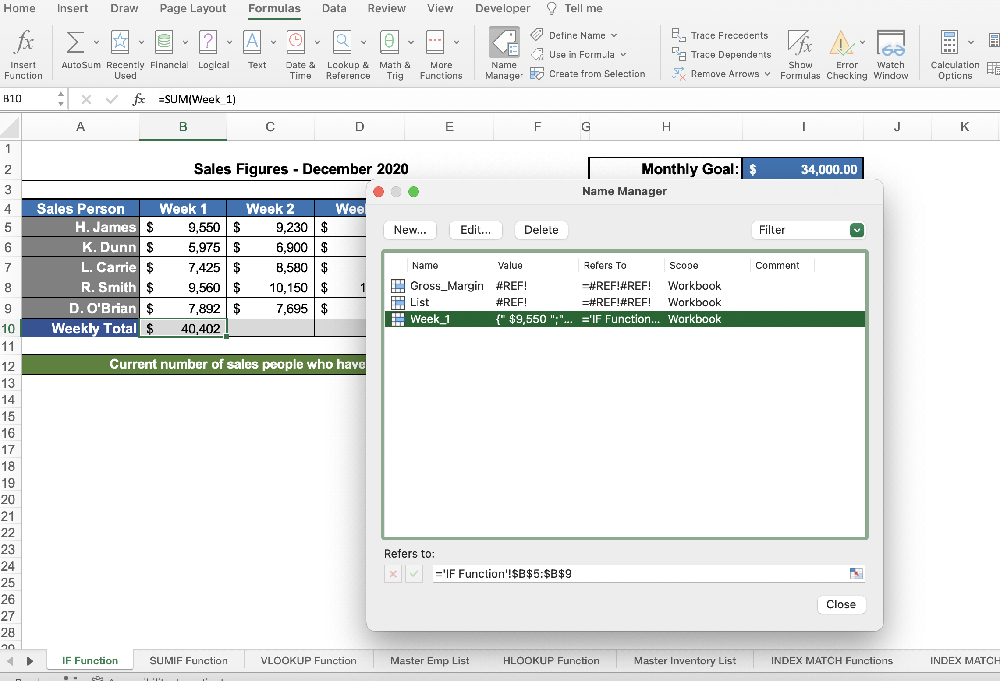

- Sometimes there are broken name ranges, because someone may have deleted them or deleted a worksheet or deleted the range - whatever the reason, it will read "#REF!" to indicate it is broken. You can delete or edit name ranges accordingly.

## Using Excel's `IF()` Function

- Excel has an IF ELSE functionality called the `IF()` function. This operates like most conditional programming operations, where there is a condition to be met, and if that condition is met, behave one way, otherwise, behave a different way.

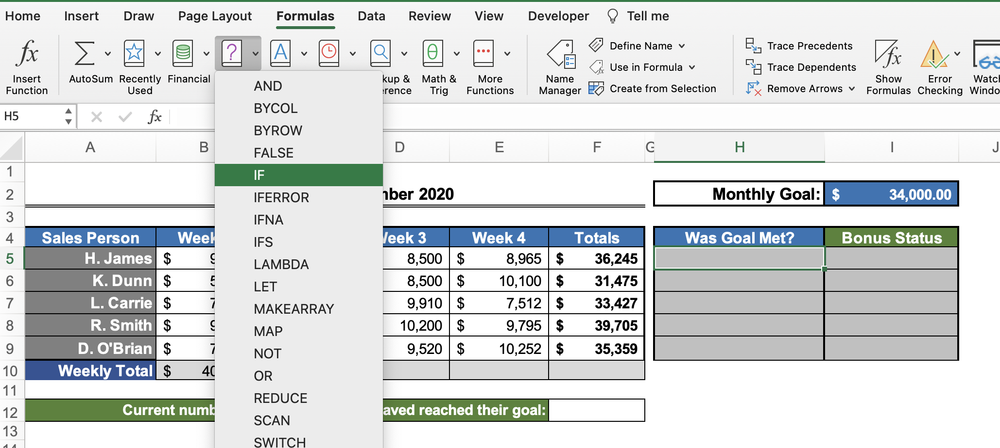

- To implement this functionality, select the cell where you want to write your `` formula, then navigate to the "Formulas" tab and select the drop down menu next to "Logical" and select "IF".

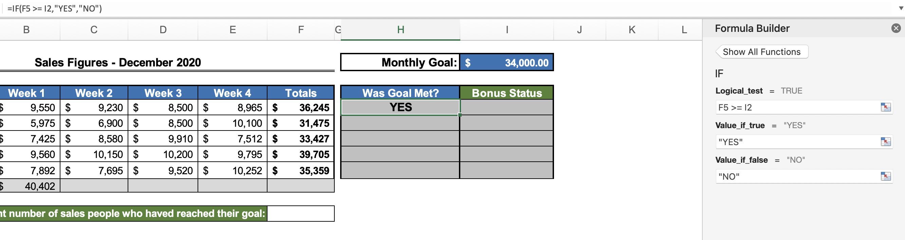

- The argument panel will appear and you can state your condition, then your if true behavior and your else behavior.

## Excel's `IF()` Function with a Name Range

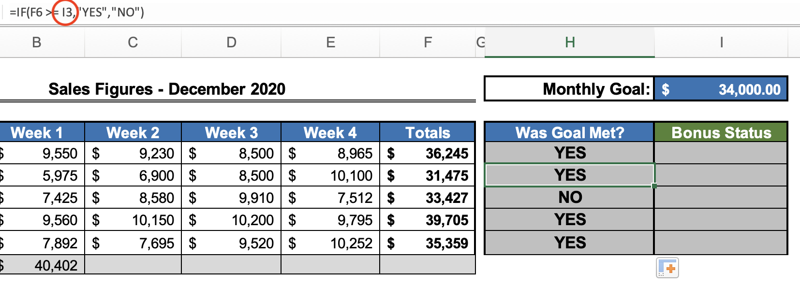

- If we are to copy and paste an `IF()` function, it will update the cells in relation to where you paste the function. Sometimes, we don't want this - we want the cell reference to be fixed/absolute.

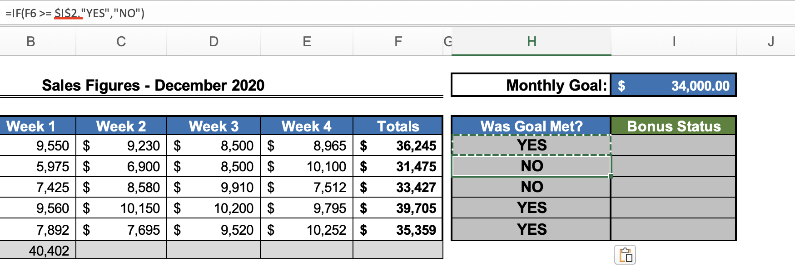

- One way we can do this is making the cell reference absolute using dollar signs (e.g., `$I$2`).

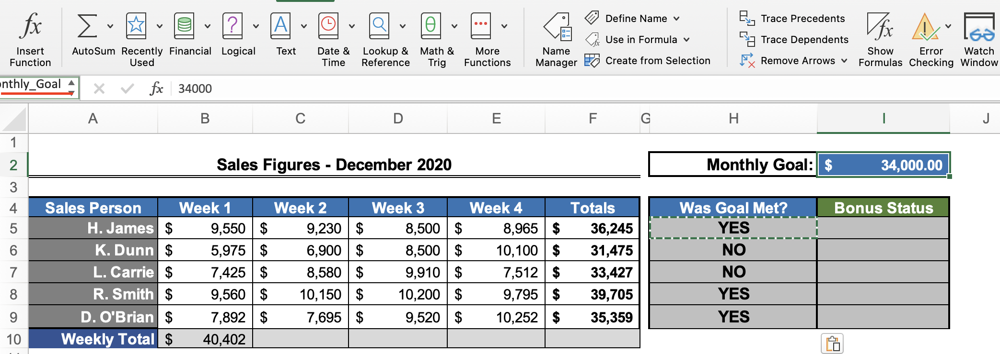

- Another way is to name a cell and reference the name range.

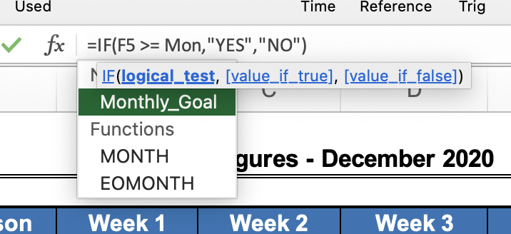
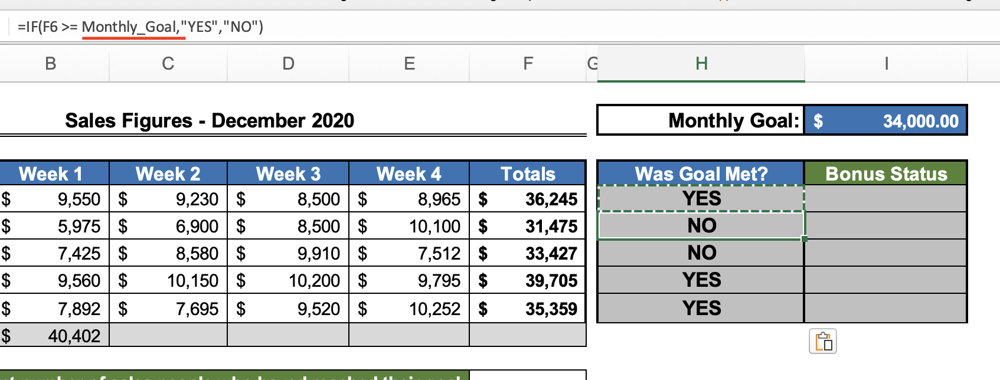

- A few advantages of this are that you can use this reference on different worksheets and it provides more context about what the value is referring to.

## Nesting Functions with Excel

- Nesting functions is putting one function inside of another function.

- For example, if we want a cell to meet more than one condition (e.g., did someone reach a monthly goal and did they make more than $8,000 per week).

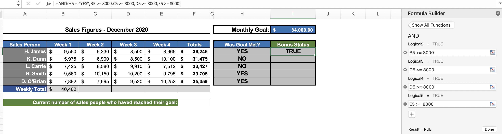

- We could achieve this the long way, using the `AND()` function to add nearly unlimited test conditions.

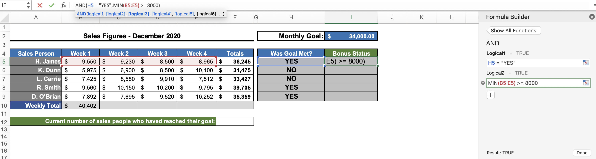

- The shorter way would be to nest the `MIN()` function into the `AND()` function by finding the minimum value of the monthly column range and making sure it's greater than or equal to ">=" to $8,000.

## Nesting Excel's `AND()` Function within the `IF()` Function

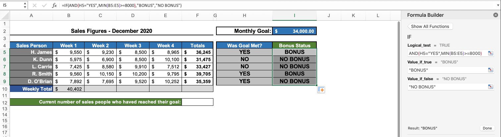

- You can nest the `AND()` function within the `IF()` function, in order to set multiple conditions. For example, `=IF(AND(H5="YES",MIN(B5:E5)>=8000),"BONUS","NO BONUS")`.

## Using Excel's `COUNTIF()` Function

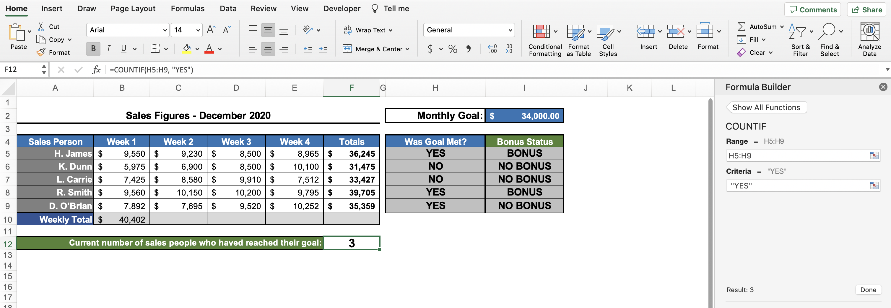

- If we want to count something but only if a condition is true, we can use the `COUNTIF()` function.

- The first argument is the range we want to check, and the second argument is the condition that needs to be met (e.g., only cells that have a value of "YES").

## Using Excel's `SUMIF()` Function

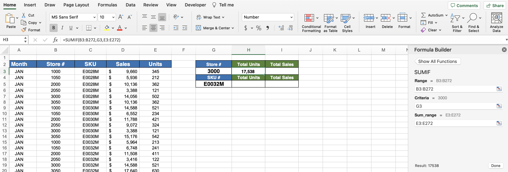

- If we want to sum something but only if a condition is true, we can use the `SUMIF()` function. We can also use the `DSUM()` function, as used in [Section 15](/Section%2015%3A%20Excel%20List%20Functions/README.md).

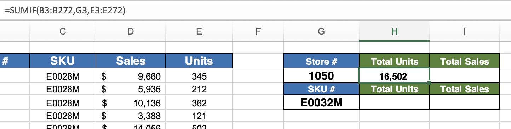

- If you change the value of the second argument in the `SUMIF()` function, the result of the `SUMIF()` function will update.

- You can also hard code a value in the second argument if you don't want the `SUMIF()` function to be dynamic (e.g., `=SUMIF(B3:B272,3000,E3:E272)`).

## Using Excel's `IFERROR()` Function

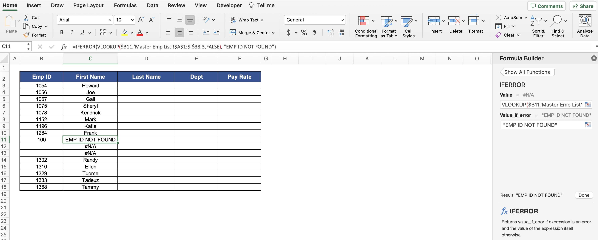

- If a function returns an error, we can customize the value returned by that function, using the `IFERROR()` function.

- The first argument is the function that will potentially return an error, and the second argument is what you want the error to read.

- The `IFERROR()` function is especially useful for templates, where there are no values in the workbook.

**Developer**

- Caroline Crandell - cecrandell - cecrandell19@gmail.com - [LinkedIn](https://www.linkedin.com/in/carolinecrandell/)
