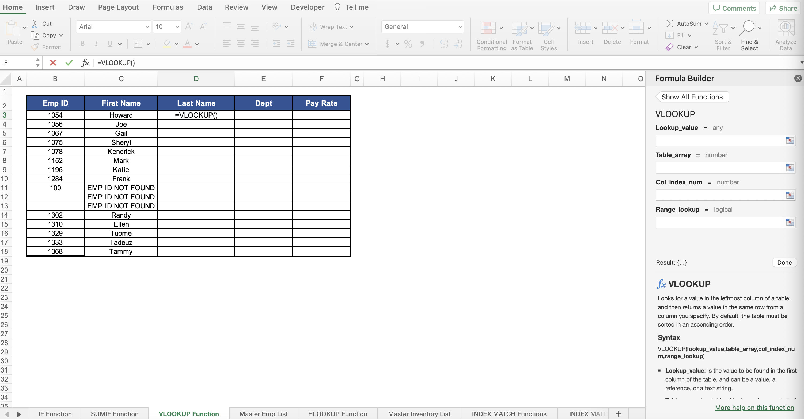
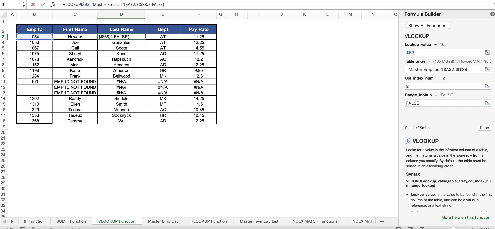
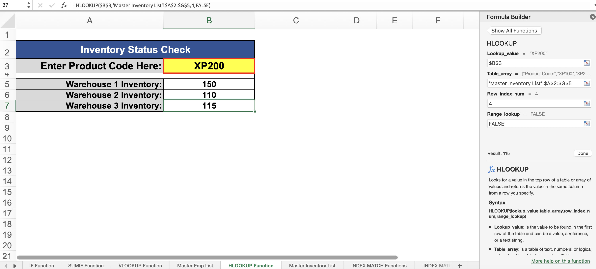
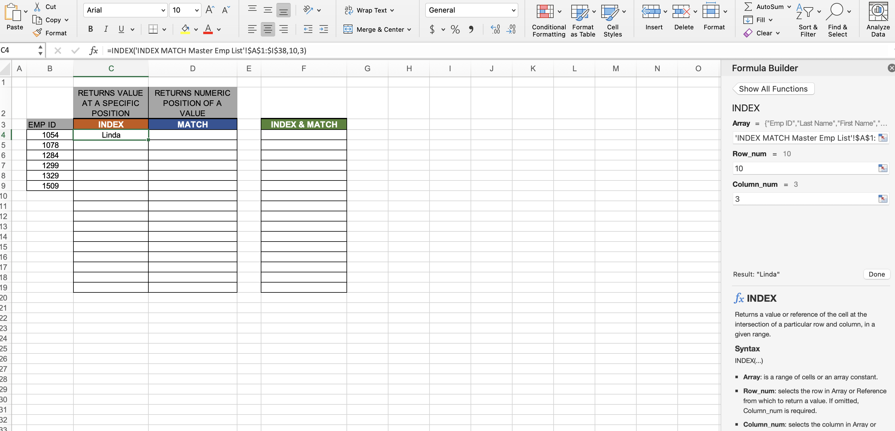
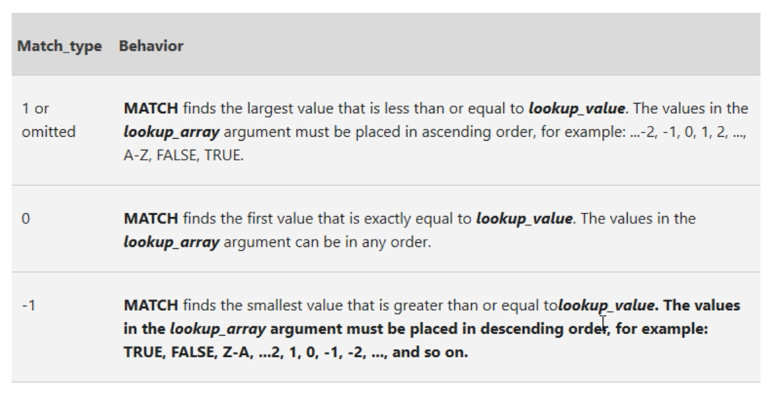
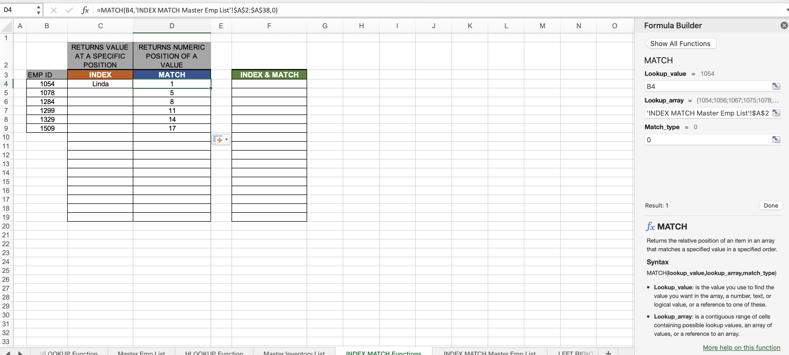

# Section 25: Working with Excel's Lookup Functions

## Microsoft Excel VLOOKUP() Function

- [VLOOKUP function](https://support.microsoft.com/en-us/office/vlookup-function-0bbc8083-26fe-4963-8ab8-93a18ad188a1)

- VLOOKUP() means vertical lookup

1. First argument: what value do I need to look for to help me find the last name (the unique match to join on)(lock the column, not the row `$B3`)
2. Second argument: the entire table/list (very important that the first column of this table/array is the unique value to join on `ID`)
3. Third argument: the column number of the value you want to return back
4. Fourth argument: TRUE if you do not mind a non-exact match (e.g, for ID, it will join on the next best ID if it cannot find the exact ID match), otherwise, FALSE

## Microsoft Excel HLOOKUP() Function

- [HLOOKUP function](https://support.microsoft.com/en-au/office/hlookup-function-a3034eec-b719-4ba3-bb65-e1ad662ed95f)

- HLOOKUP() means horizontal lookup

1. First argument: what value do I need to look for to help me find the inventory (the unique match to join on)(lock the column, not the row `$B$3`)
2. Second argument: the entire table/list
3. Third argument: the number of the column of the unique value you want to join on
4. Fourth argument: TRUE if you do not mind a non-exact match (e.g, for ID, it will join on the next best ID if it cannot find the exact ID match), otherwise, FALSE

## Microsoft Excel INDEX() Function

- [INDEX function](https://support.microsoft.com/en-us/office/index-function-a5dcf0dd-996d-40a4-a822-b56b061328bd)

- A limitation of VLOOKUP() is that the unique value to match on has to be in the first column, it cannot look to the left

- VLOOKUP() is also not very fast, so use them sparingly

- INDEX() and MATCH() used together perform the same functionality as VLOOKUP() but without the limitations

1. First argument: the entire table/list (make it absolute)
2. Second argument: the number of column you are looking for
3. Third argument: the number of row you are looking for

## Microsoft Excel MATCH() Function

- [MATCH function](https://support.microsoft.com/en-au/office/match-function-e8dffd45-c762-47d6-bf89-533f4a37673a)

- This function gives the position of the value you are searching for in a table or array

1. First argument: the cell value of the value you are looking for
2. Second argument: the entire table/list (make it absolute)
3. Third argument: optional, but looks for matches (image below)

- Highlight a cell/range that you want to make absolute and do `Cmd + T`

**Developer**

- Caroline Crandell - cecrandell - cecrandell19@gmail.com - [LinkedIn](https://www.linkedin.com/in/carolinecrandell/)
