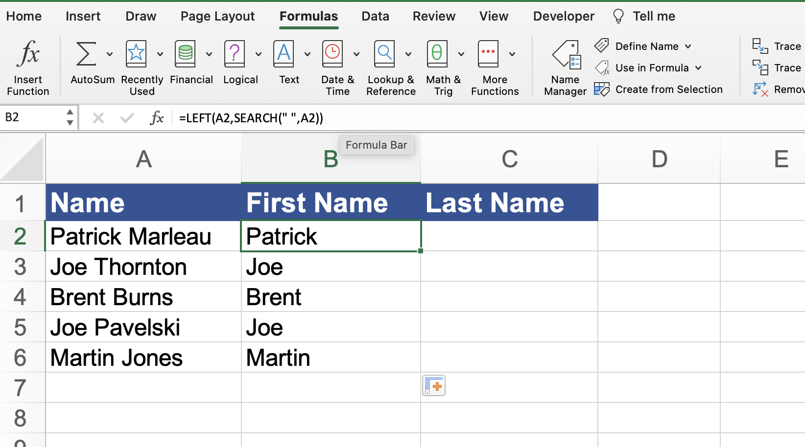

# Section 26: Working with Excel's Text Based Functions

## Using Excel's LEFT(), RIGHT() and MID() Functions

- [LEFT Function](https://support.microsoft.com/en-us/office/left-leftb-functions-9203d2d2-7960-479b-84c6-1ea52b99640c)

- [RIGHT Function](https://support.microsoft.com/en-us/office/right-rightb-functions-240267ee-9afa-4639-a02b-f19e1786cf2f)

- [MID Function](https://support.microsoft.com/en-gb/office/mid-function-2eba57be-0c05-4bdc-bf81-5ecf4421eb8as)

## Using Excel's LEN() Functions

- [LEN Function](https://support.microsoft.com/en-au/office/len-lenb-functions-29236f94-cedc-429d-affd-b5e33d2c67cb)

## Using Excel's SEARCH() Functions

- [SEARCH Function](https://support.microsoft.com/en-us/office/search-searchb-functions-9ab04538-0e55-4719-a72e-b6f54513b495)

- `=LEFT(A2,SEARCH(" ",A2))` SEARCH looks for the space and sets that as the position to stop at in the `LEFT` function

- `=RIGHT(A2,LEN(A2)-SEARCH(" ",A2))` takes the length of all characters and subtracts the number of characters from the space, and uses that as the position to dynamically stop at in the `RIGHT` function

## Using Excel's CONCATENTATE() Functions

- [CONCATENTATE Function](https://support.microsoft.com/en-us/office/concatenate-function-8f8ae884-2ca8-4f7a-b093-75d702bea31d)

## Using Excel Adv. Functions and Formulas Quick Guide

- [Guide](./Resources/MasterExcelAdvancedFunctionsFormulas-01.pdf)

**Developer**

- Caroline Crandell - cecrandell - cecrandell19@gmail.com - [LinkedIn](https://www.linkedin.com/in/carolinecrandell/)
