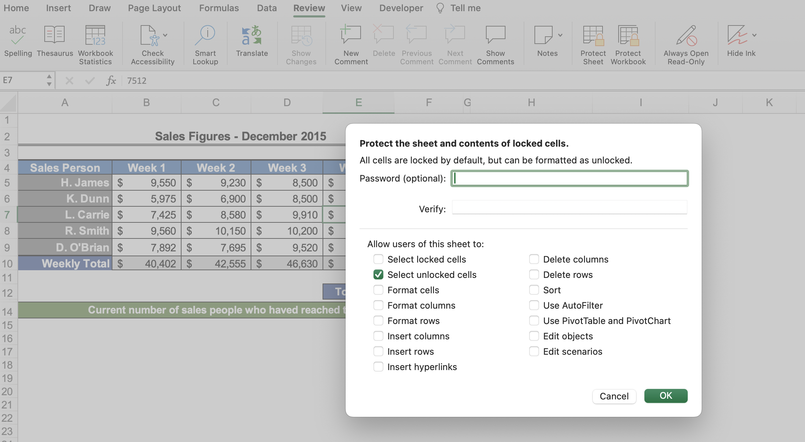
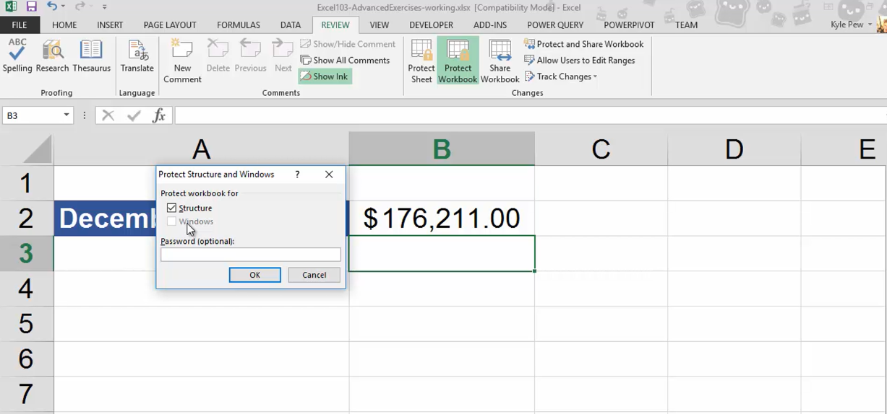
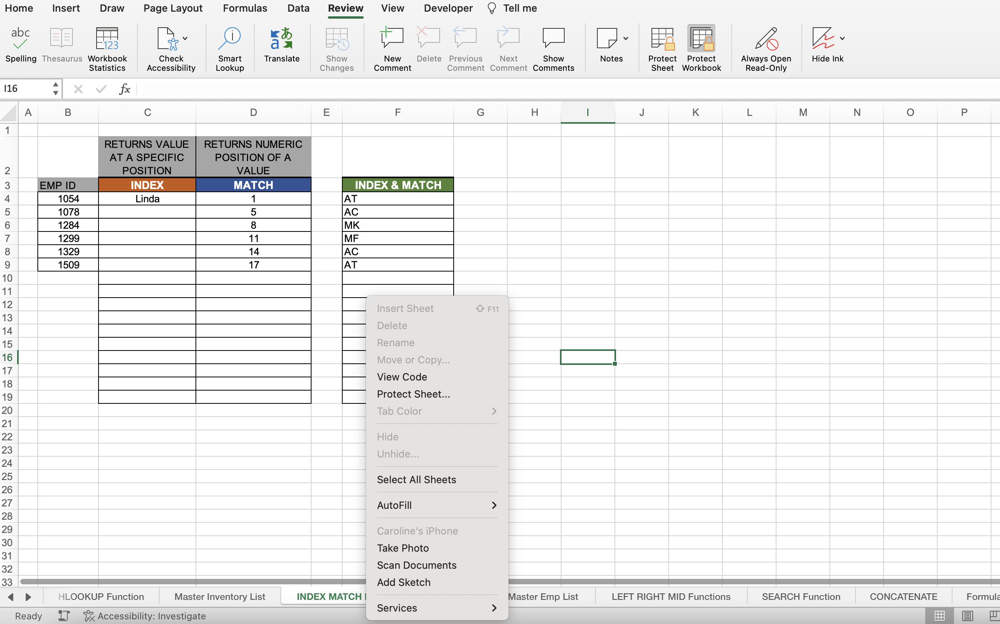

# Section 28: Protecting Excel Worksheets and Workbooks

## Protecting Specific Cells in a Worksheet

- [Protecting Specific Cells in a Worksheet](https://support.microsoft.com/en-us/office/lock-or-unlock-specific-areas-of-a-protected-worksheet-75481b72-db8a-4267-8c43-042a5f2cd93a)

- [Protecting Specific Cells in a Worksheet Mac](https://support.microsoft.com/en-gb/office/lock-cells-to-protect-them-in-excel-for-mac-59bb04cf-1a79-4a69-9828-568c98bdb310)

1. Select all cells in a sheet you want to be editable then `Cmd + 1`

2. Select the "Protection" tab > Uncheck "Locked"

3. In the "Review" tab, select "Protect Worksheet" and unselect "Select locked cells"

## Protecting the Structure of a Workbook

- [Protect a workbook](https://support.microsoft.com/en-us/office/protect-a-workbook-7e365a4d-3e89-4616-84ca-1931257c1517)

- In the "Review" tab, toggle "Protect Workbook" to lock and unlock certain functions (e.g., deleting or renaming a worksheet)

## Adding a Workbook Password

- [Require a password to open or modify a workbook](https://support.microsoft.com/en-us/office/require-a-password-to-open-or-modify-a-workbook-10579f0e-b2d9-4c05-b9f8-4109a6bce643)

- File > Info > Protect Workbook

**Developer**

- Caroline Crandell - cecrandell - cecrandell19@gmail.com - [LinkedIn](https://www.linkedin.com/in/carolinecrandell/)
