# Section 29: Mastering Excel's "What If?" Tools

## Working with Exccel's Goal Seek Tool

- [Use Goal Seek to find the result you want by adjusting an input value](https://support.microsoft.com/en-au/office/use-goal-seek-to-find-the-result-you-want-by-adjusting-an-input-value-320cb99e-f4a4-417f-b1c3-4f369d6e66c7)

- Formulas > Financial > PMT

- Rate / 12 (interest rate)

- Nper (number of payments)

- Pv (present value of the mortgage)

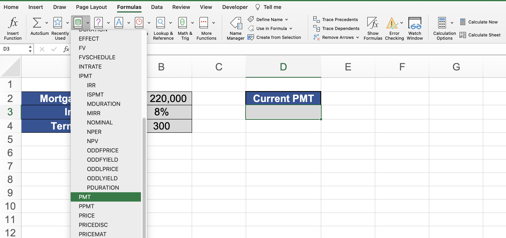
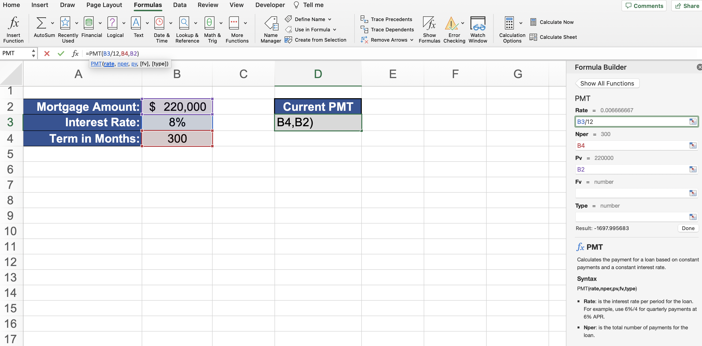

- Data > What-If Analysis > Goal Seek

- Set Cell (cell you want to adjust)

- To value: (goal value)

- By changing cell: (cell you want it to adjust)

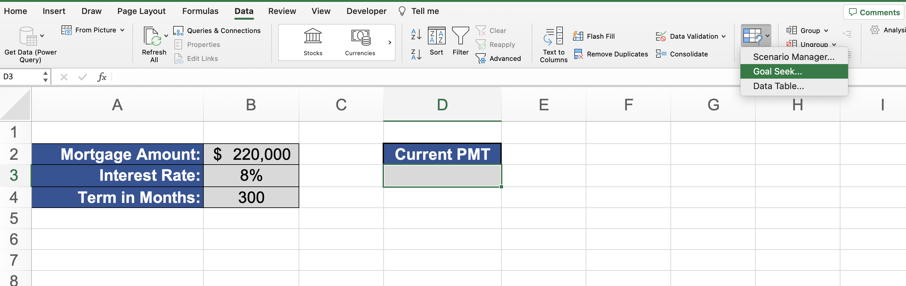
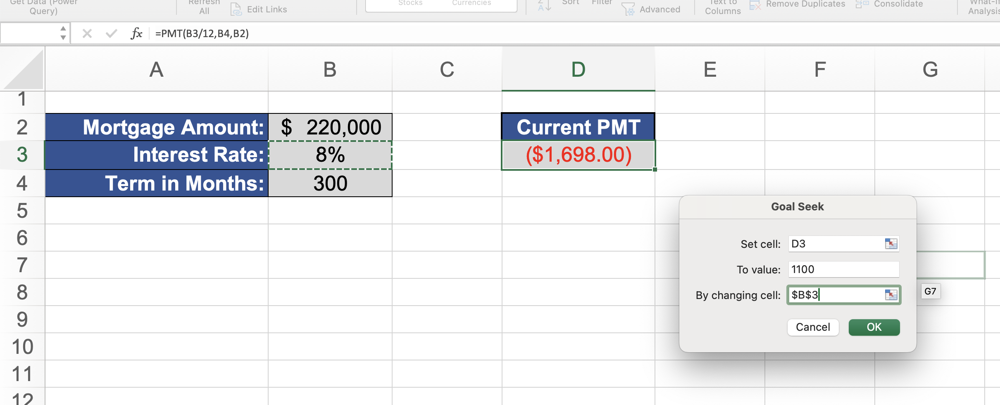
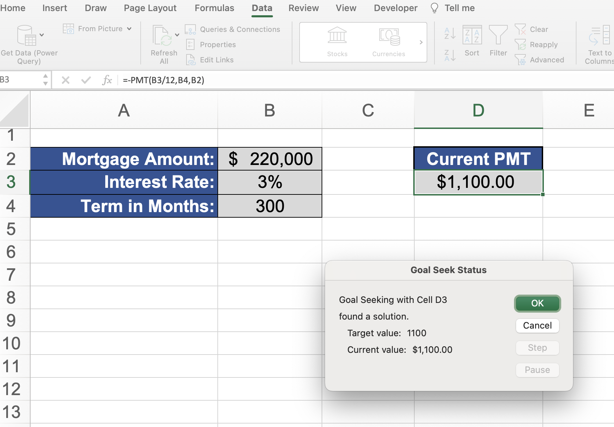

## Working with Excel's Solver Tool

- First you need to install Solver using the steps below

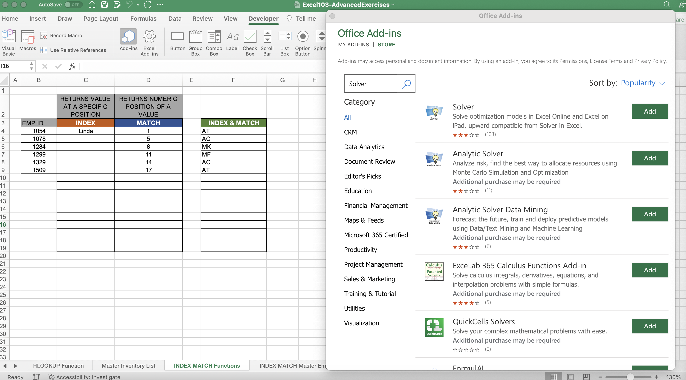
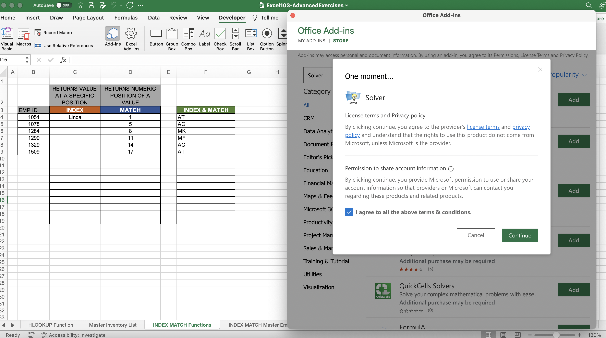
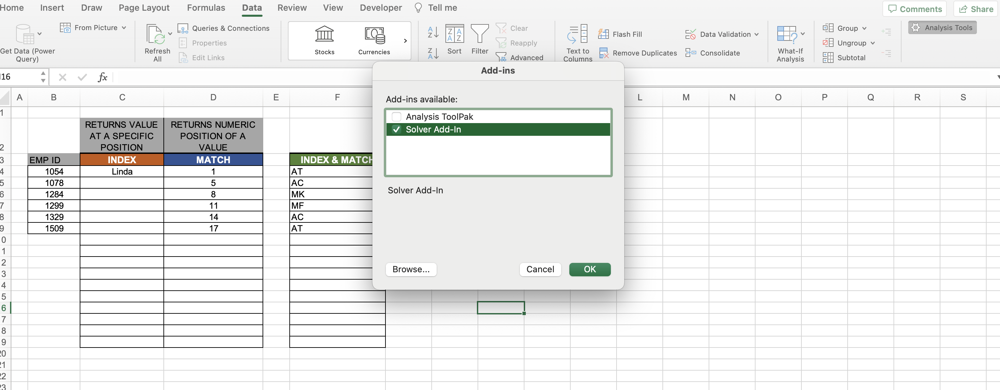
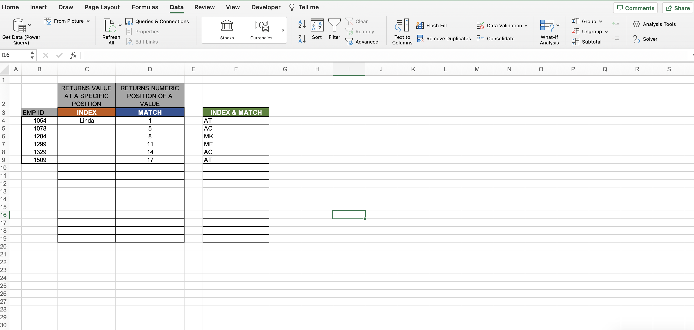

- Add the constraints and then Solver will find a solution

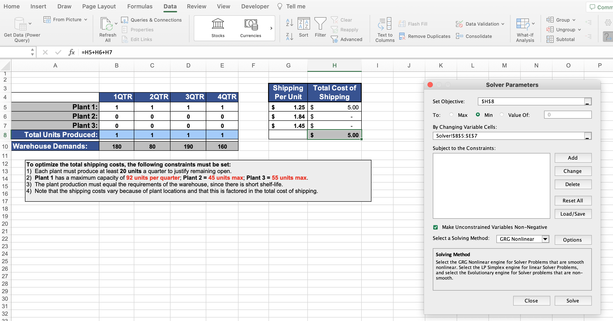
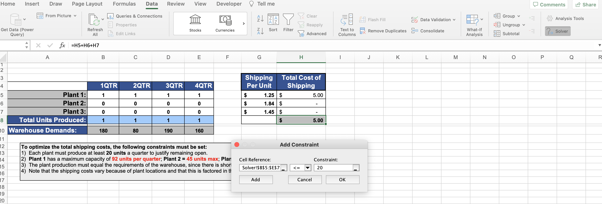
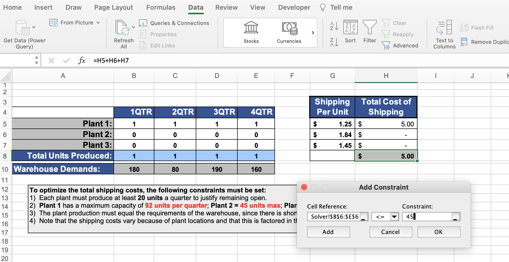
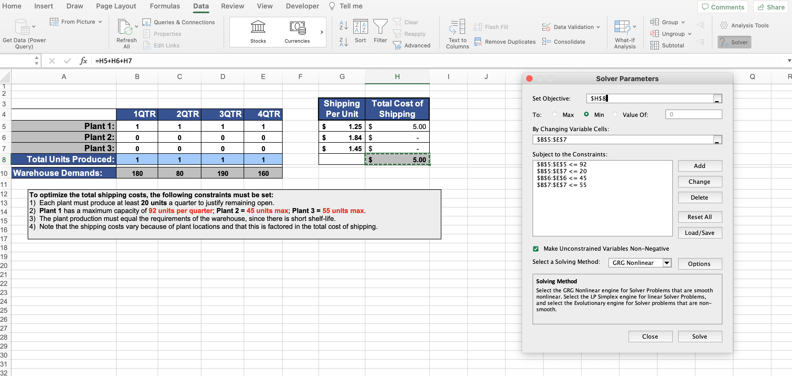
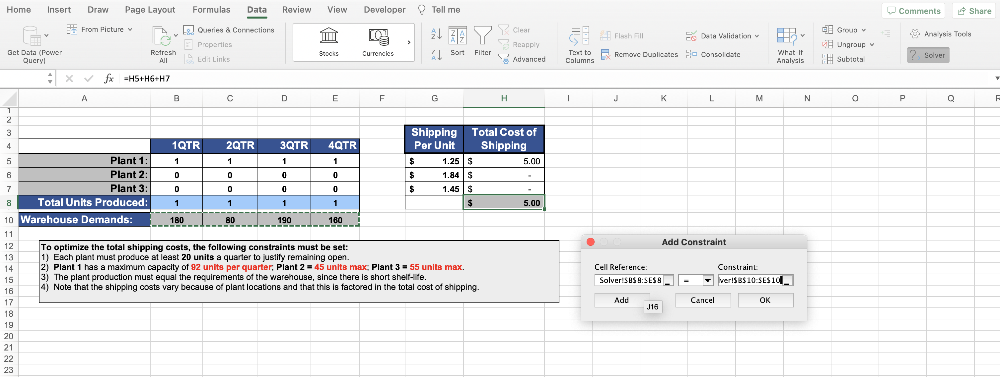
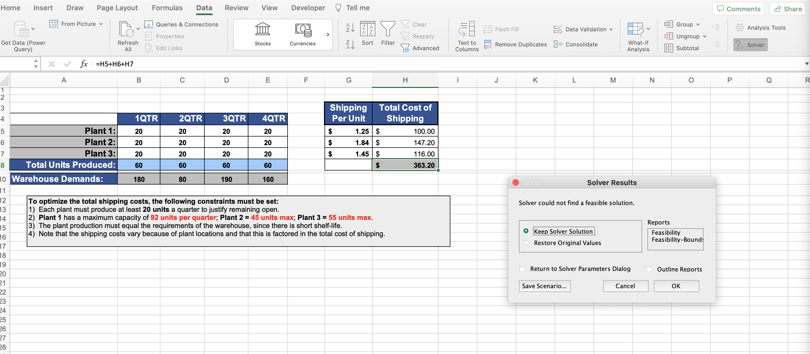

## Building Effective Data Tables in Excel

## Creating Scenarios in Excel

**Developer**

- Caroline Crandell - cecrandell - cecrandell19@gmail.com - [LinkedIn](https://www.linkedin.com/in/carolinecrandell/)
