# Section 2: Microsoft Excel Fundamentals

- The main difference between the Windows and Mac version of Excel is really just the interface.

## Introduction to the the Interface

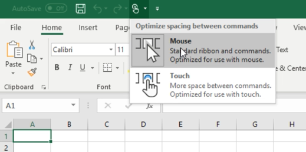

- Two different modes: touch screen (a bit bigger) and mouse mode.

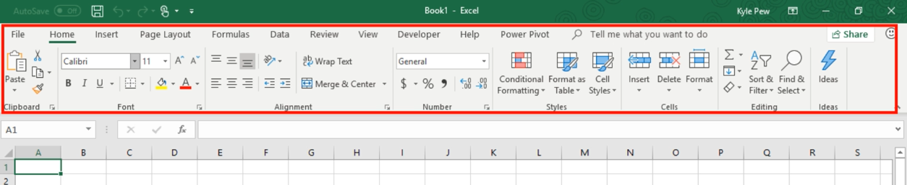

- The top section is known as the ribbon, which comprises of various customizable sections.

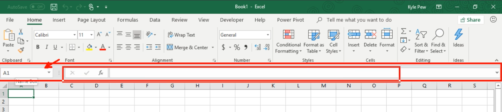

- The section below the ribbon is known as the formula bar, which has the name box on the left and the formula entry section on the right.

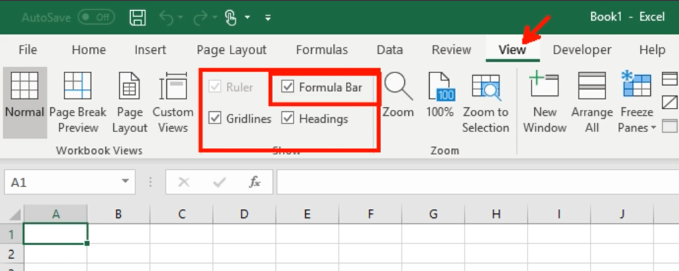

- If you can't see the formula bar, make sure you have it ticked in the "View" tab.

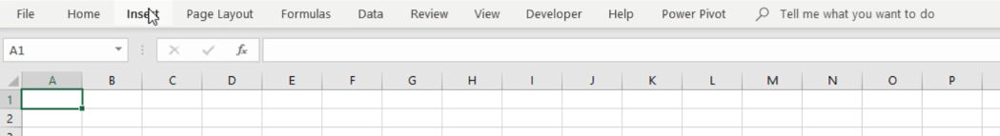

- To minimize the ribbon, double click any section. To toggle back, double click again.

- On Windows, right click on any button in the ribbon to add it to the "Quick Access Toolbar at the top.

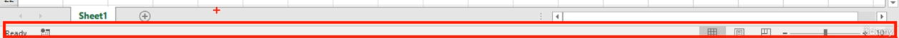

- To change the view, you can adjust this from the "status bar" at the bottom, or the "View" tab.

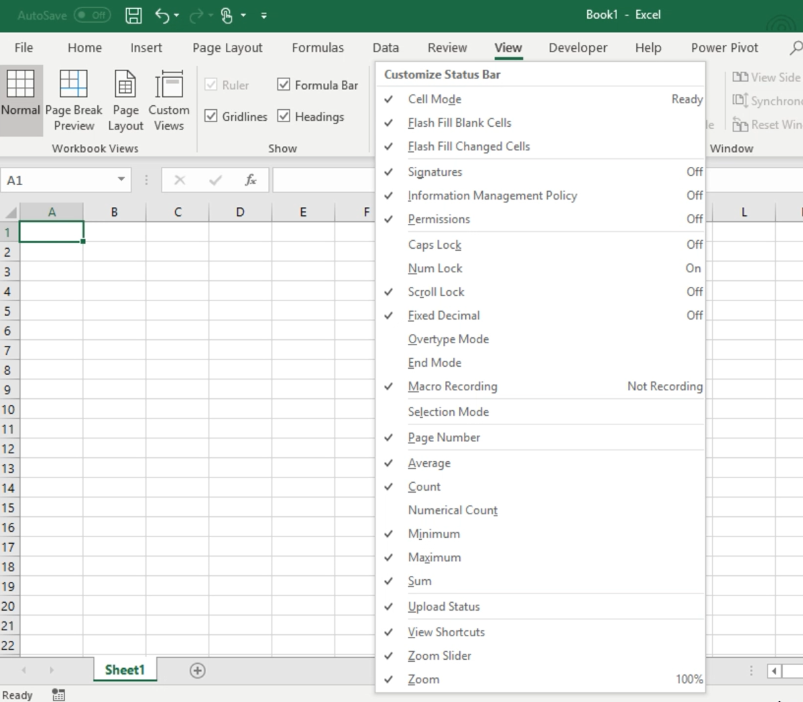

- If you want to update the status bar, right click on it to customize it.

## Understanding the Workbook

- Within an Excel workbook, there's a worksheet. You can have unlimited worksheets depending on the memory of your computer.

- Inside of the worksheet, there are columns and rows. Where they intersect is a cell. Whatever cell you've selected will show up in the name box.

- Prior to 2007, the file extension was .xls, and now it's .xlsx.

## Quiz

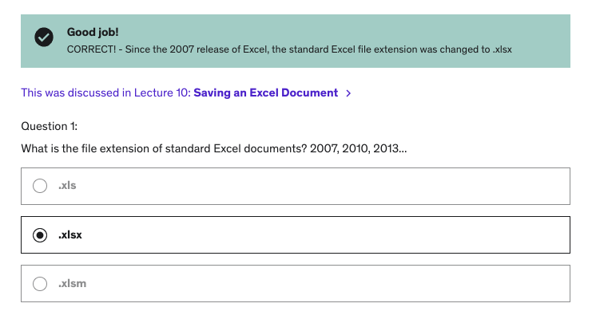
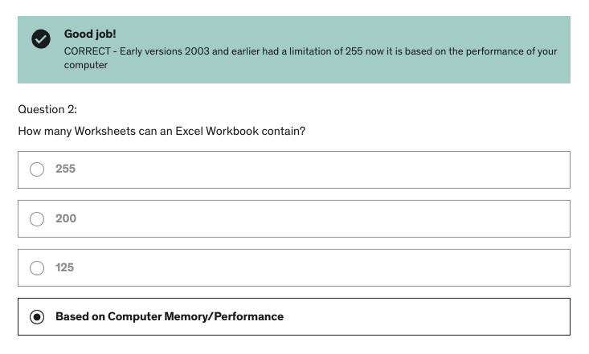
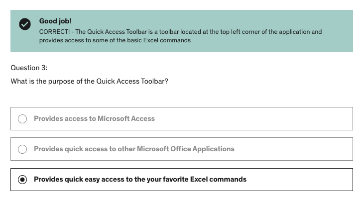
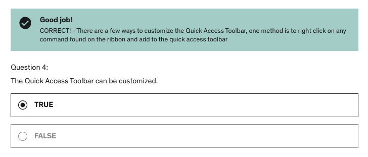
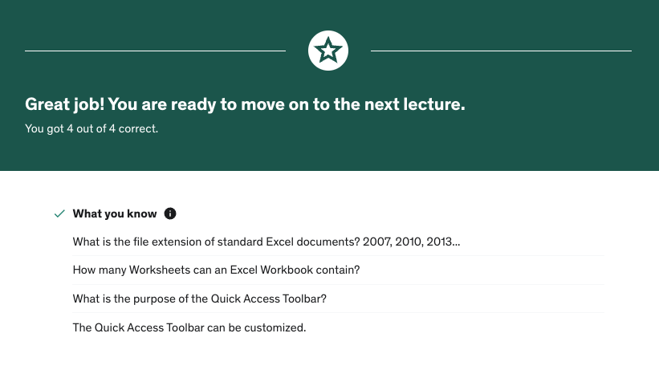

**Developer**

- Caroline Crandell - cecrandell - cecrandell19@gmail.com - [LinkedIn](https://www.linkedin.com/in/carolinecrandell/)