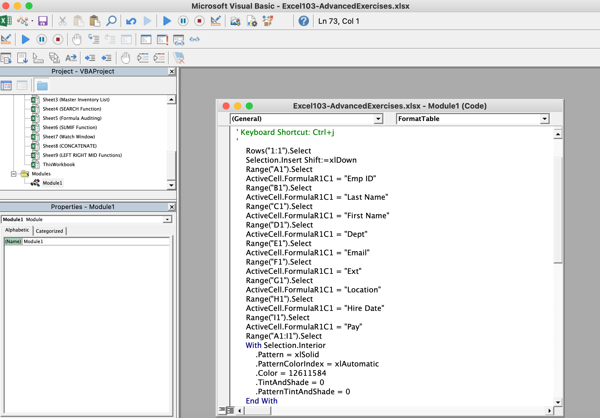

# Section 30: Automating Repetitive Tasks in Excel with Macros

## Understanding Excel Macros

- [Quick start: Create a macro](https://support.microsoft.com/en-au/office/quick-start-create-a-macro-741130ca-080d-49f5-9471-1e5fb3d581a8)

- Macros are useful for when you need to repeat the same process over and over again (e.g., adding a column header, formatting a column, cleaning a weekly set of raw data, etc)

## Activating the Developer Tab in Excel

- [Customize the ribbon in Office](https://support.microsoft.com/en-au/office/customize-the-ribbon-in-office-00f24ca7-6021-48d3-9514-a31a460ecb31) - this is to add the Developer Tab

## Creating a Macro with the Macro Recorder

- Click "Record Macro" and fill in details - once you click "OK", Excel will start recording all of your actions

- Excel will not allow spaces in Macro names

- Command + Shift + Plus adds a row

- After you are done, click "Stop Recording"

## Editing a Macro with VBA

- [Edit a macro](https://support.microsoft.com/en-gb/office/edit-a-macro-ed9e8c3d-58fd-47a1-83eb-bdee680376bb)

- To edit the macro, you need to select "Visual Basic" in the Developer tab to customize the steps in in the Module code (see screenshots below)

## Creating Buttons to Run Macros

- [Assign a macro to a Form or a Control button](https://support.microsoft.com/en-au/office/assign-a-macro-to-a-form-or-a-control-button-d58edd7d-cb04-4964-bead-9c72c843a283)

- Excel workbooks with macros need to be saved as `.xlsm` files

**Developer**

- Caroline Crandell - cecrandell - cecrandell19@gmail.com - [LinkedIn](https://www.linkedin.com/in/carolinecrandell/)
