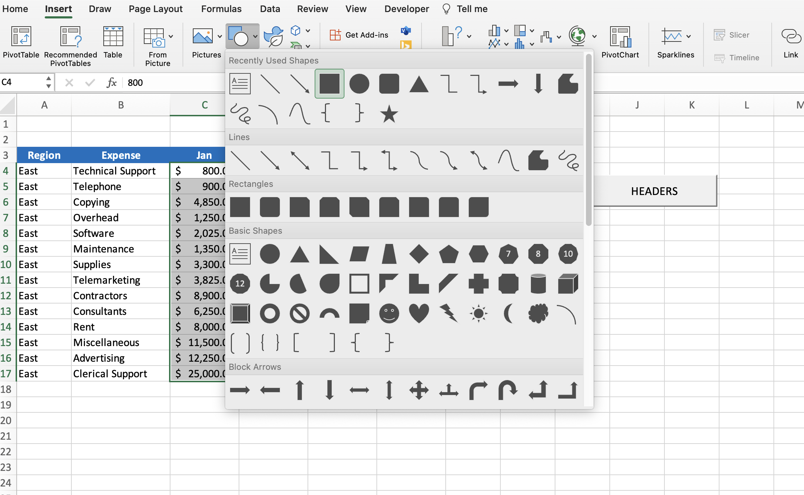
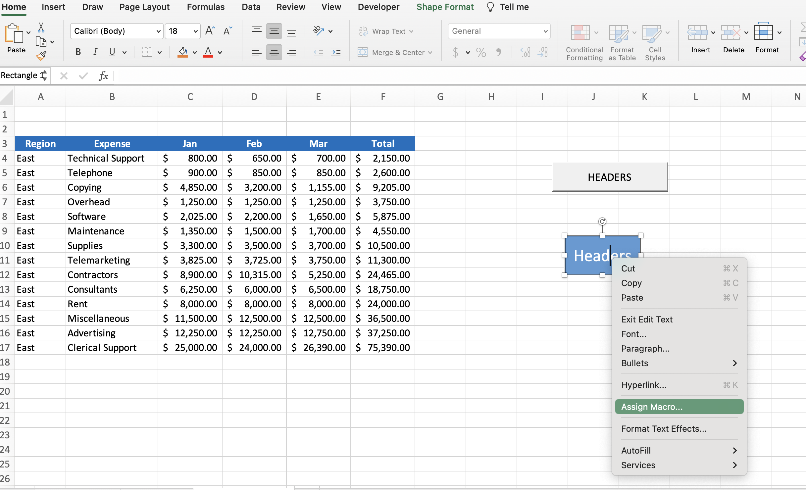
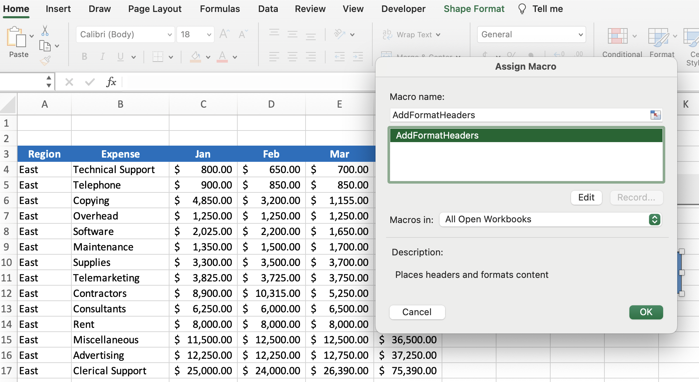
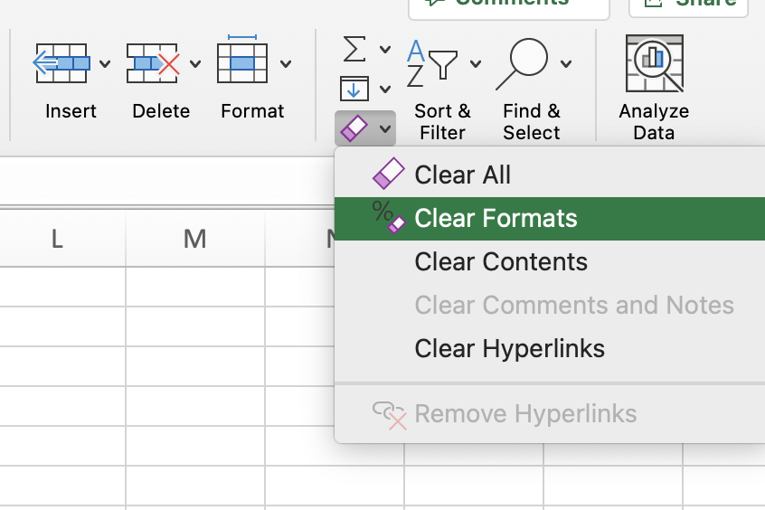
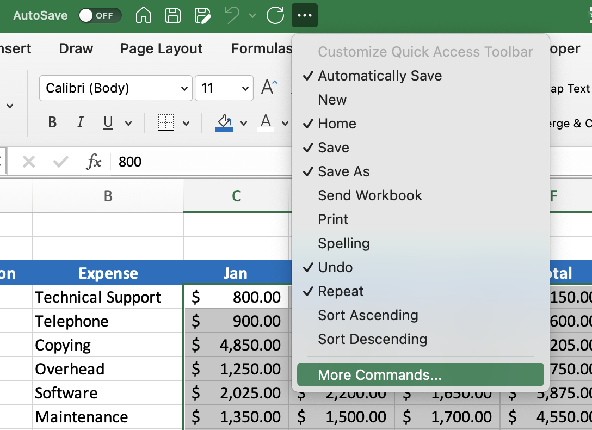
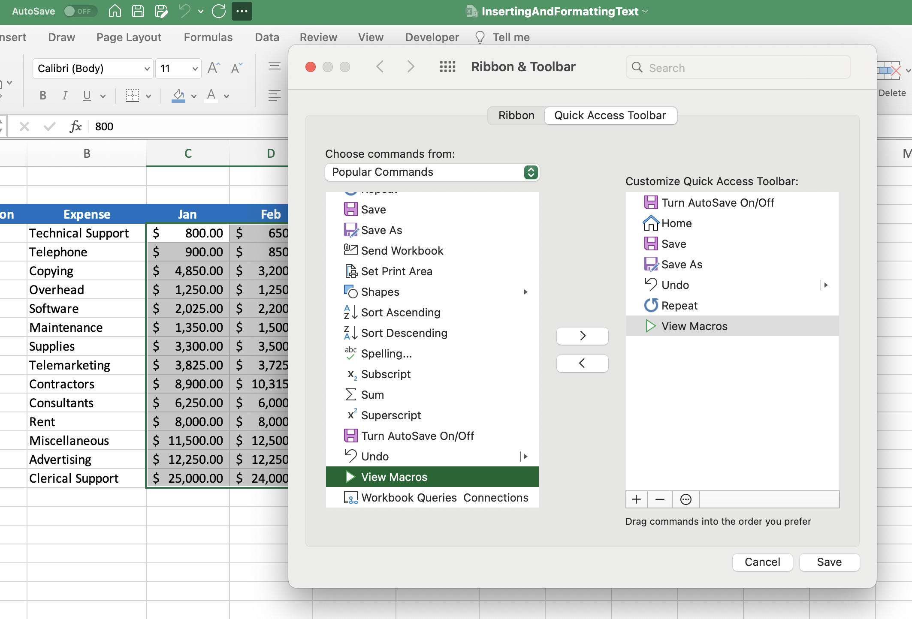
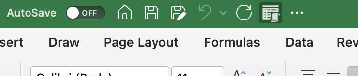
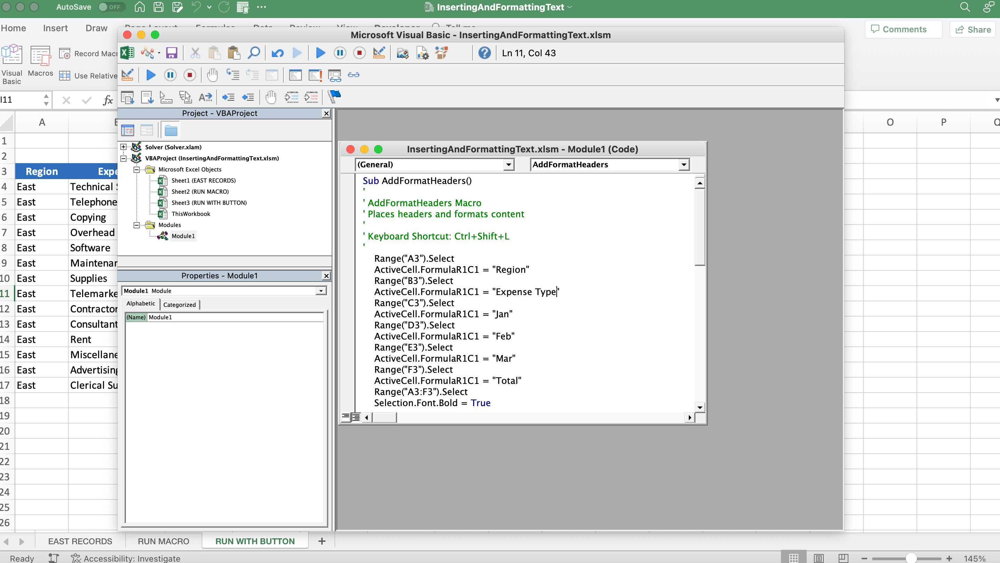
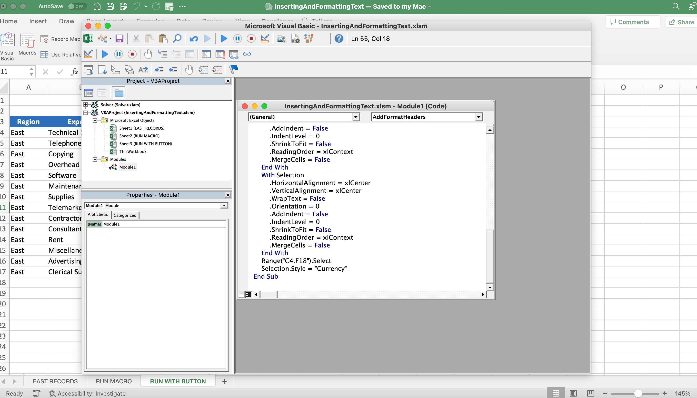

# Section 34: Project #1: Using Excel's Macro Recorder Tool

<!-- ## Introduction to Project #1: Inserting and Formatting Text

## Project #1: Section Exercise Files

## Activating the Excel Developer Tab -->

## Project #1: Starting Recording!

- Selecting "Personal Macro Workbook" will make macro available to any workbook you open on your personal laptop

## Running a Microsoft Excel Macro

- To edit the shortcut or run the macro manually, simply select the "Macro" button on the Developer tab and click "Options" for the shortcut or "Run" to run the macro on that worksheet

## Project # 1: Running an Excel Macro with a Button

- Buttons are specific to worksheets

- You cannot change the color or border of buttons

## BONUS - Create a Custom Button Using Excel Shapes

- Insert a shape, right-click the shape and then select "Assign Macro..." then select which macro you want to assign to the shape and click the macro

- To test a button or shape with an assigned macro that formats, you can select all of the relevant cells then click "Clear Formats..." under the Home tab

## Adding the Excel Macro to the Quick Access Toolbar

- [Quick Access Toolbar](https://support.microsoft.com/en-au/office/move-the-quick-access-toolbar-d74e73f2-0471-442a-8178-f37cc93d0954)

## Project #1: Editing the VBA Recorded by the Macro Recorder

- Edit the module to customize the Visual Basic code

## Save a Workbook with a Macro/VBA Code

- [Save a macro](https://support.microsoft.com/en-us/office/save-a-macro-24a026ef-3145-4bf8-a5f2-2fc7889ff74a)

## Practical Uses of Excel Macros

- Import Data

- Cleaning Up and Formatting Data

- Sorting and Filtering Data

**Developer**

- Caroline Crandell - cecrandell - cecrandell19@gmail.com - [LinkedIn](https://www.linkedin.com/in/carolinecrandell/)
