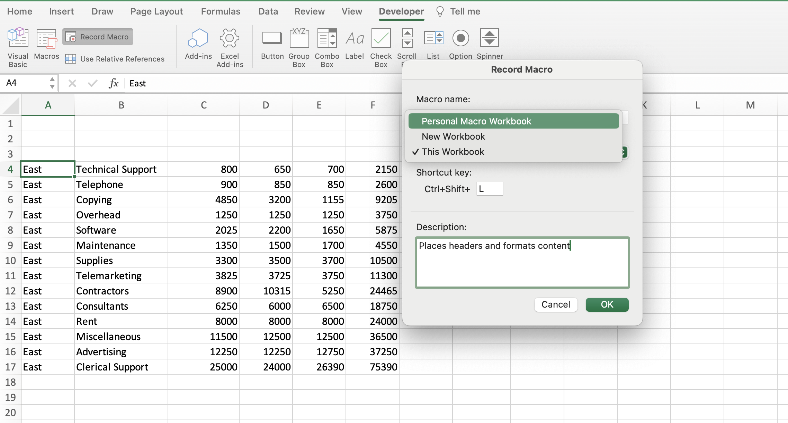
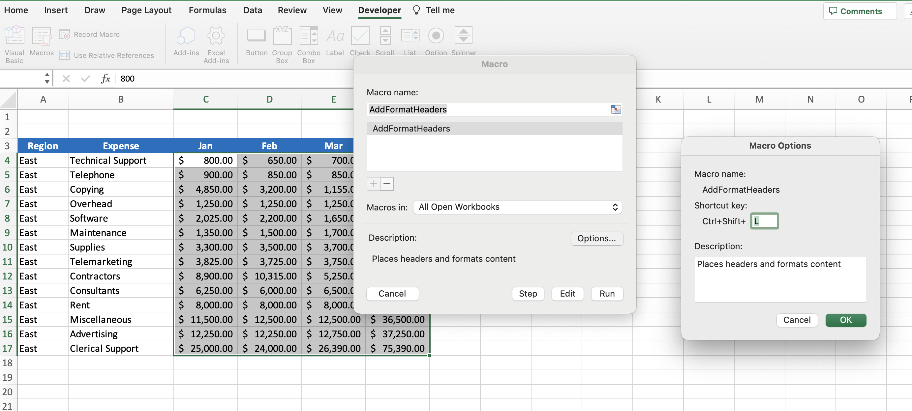

# Section 34: Project #1: Using Excel's Macro Recorder Tool

## Introduction to Project #1: Inserting and Formatting Text

## Project #1: Section Exercise Files

## Activating the Excel Developer Tab

## Project #1: Starting Recording!

- Selecting "Personal Macro Workbook" will make macro available to any workbook you open on your personal laptop

## Running a Microsoft Excel Macro

- To edit the shortcut or run the macro manually, simply select the "Macro" button on the Developer tab and click "Options" for the shortcut or "Run" to run the macro on that worksheet

**Developer**

- Caroline Crandell - cecrandell - cecrandell19@gmail.com - [LinkedIn](https://www.linkedin.com/in/carolinecrandell/)
