# Section 35: Excel VBA Concepts

View the PowerPoint [here](/Section%2035:%20Excel%20VBA%20Concepts/Resources/ExcelMacrosAndVBA-PP.pptx)

## Intro to Excel VBA Concepts

- VBA is short for Visual Basic for Applications - Visual Basic is not exclusive to Excel

- VBA is an object-oriented programming language

- Range is an object (e.g., `C1:D2`)

- Properties include: address, column, row, font, etc

- Methods include: copy, cut, delete, etc

- VBA code is written in sub-procedures, which live in modules

<!-- ## Intro to Excel VBA Object Oriented Programming Concepts

## Intro to Excel VBA Exercise Files (DOWNLOAD) -->

## The Visual Basic Editor (VBE)

- ALT + F11 - opens up Visual Basic Editor on Windows

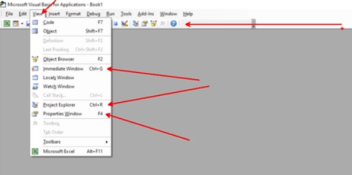
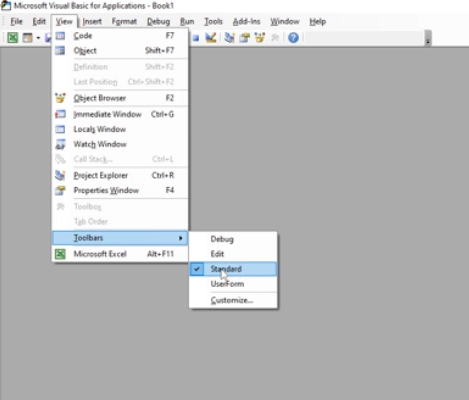

## Introduction to the Excel VBA Immediate Window

- In the Immediate Window, anything you type in there happens "immediately", like a console

- To return a value in the Immediate Window, start the line with a question mark

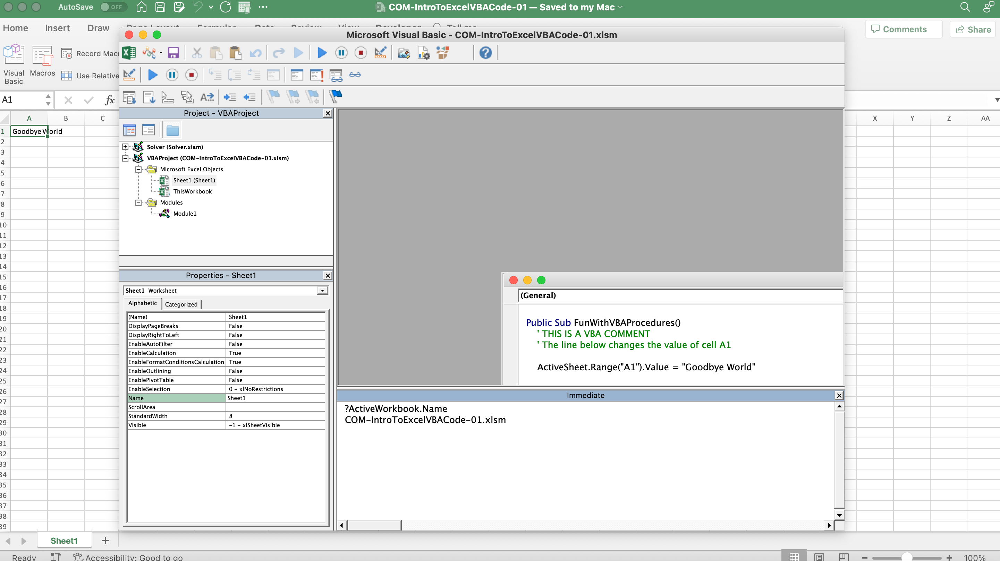
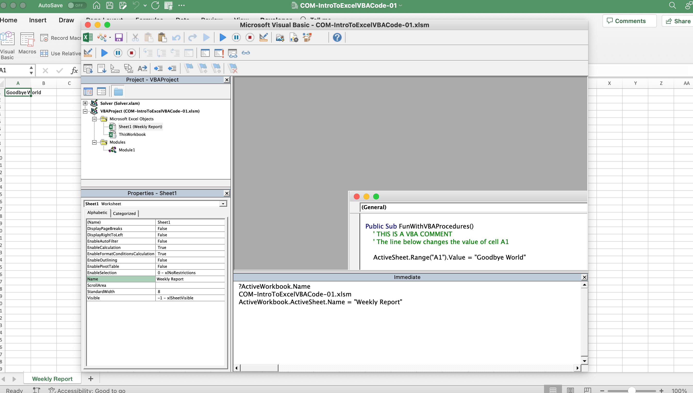
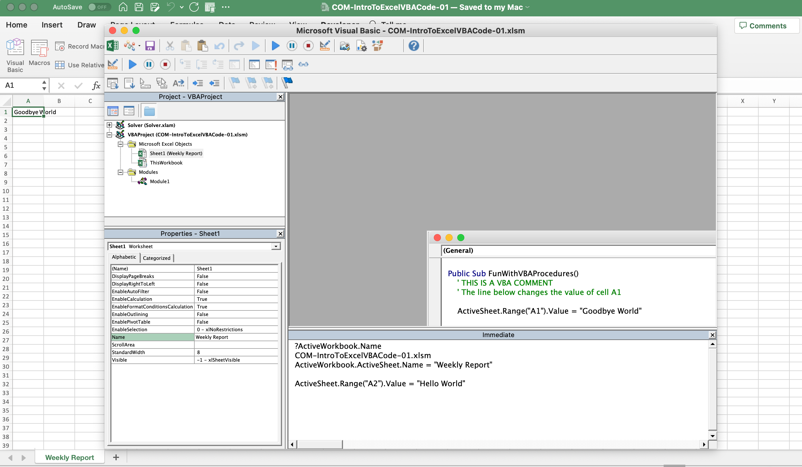
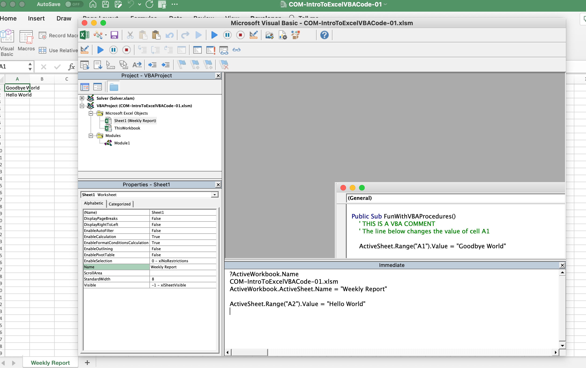

## Excel VBA Modules

- To create a new module, right-click in the Project Explorer in Visual Basic and click Insert then "Module"

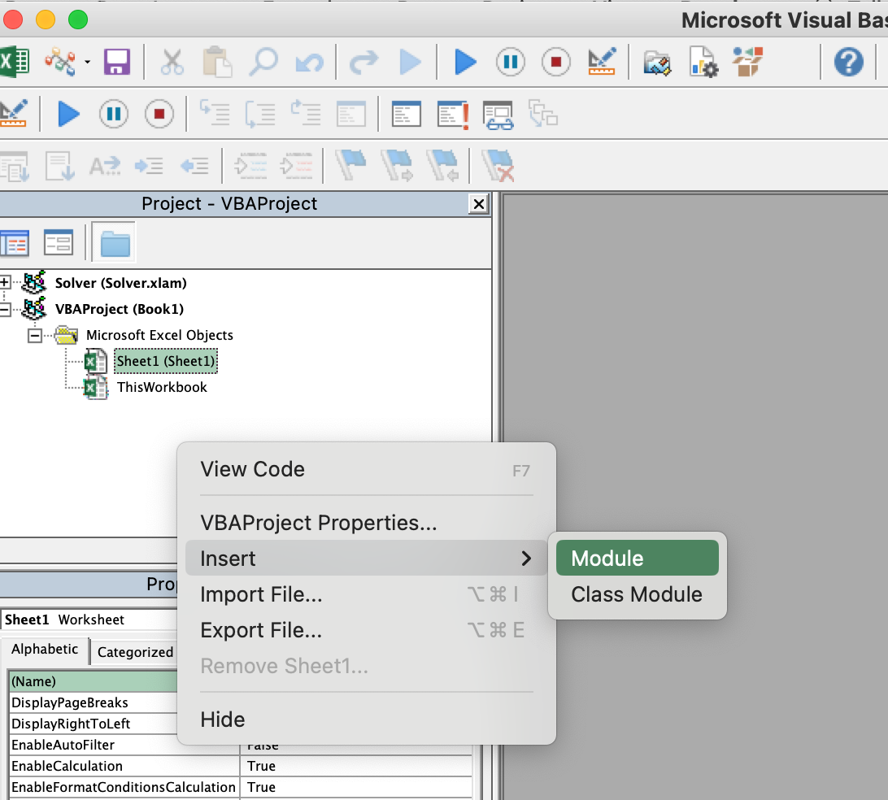

## Creating an Excel VBA Procedure

- [Writing a Sub procedure](https://learn.microsoft.com/en-us/office/vba/language/concepts/getting-started/writing-a-sub-procedure)

- To add a procedure, click the dropdown in Visual Basic and select Procedure

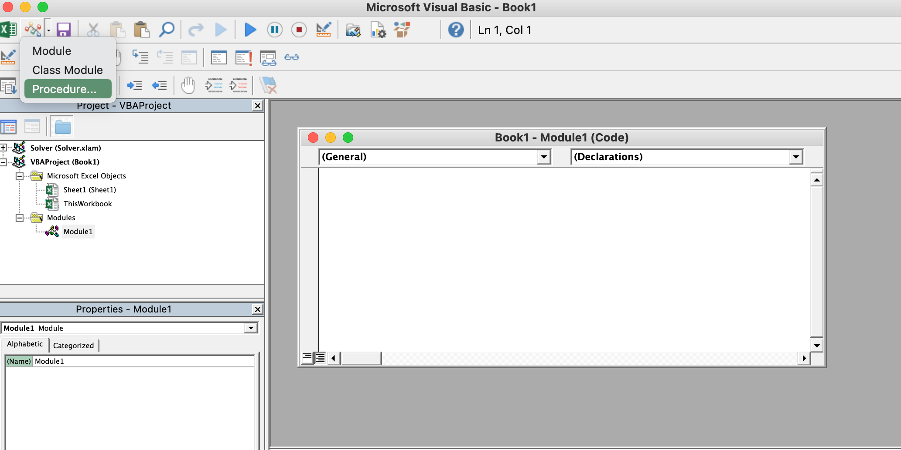

- Procedure names can be 255 characters, can contain numbers but cannot start with a number, and cannot have spaces

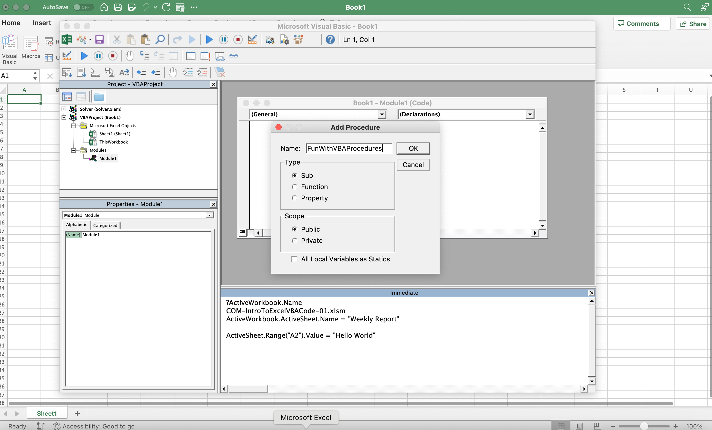

- We will focus on sub-procedures that are public (private limits use to only that module)

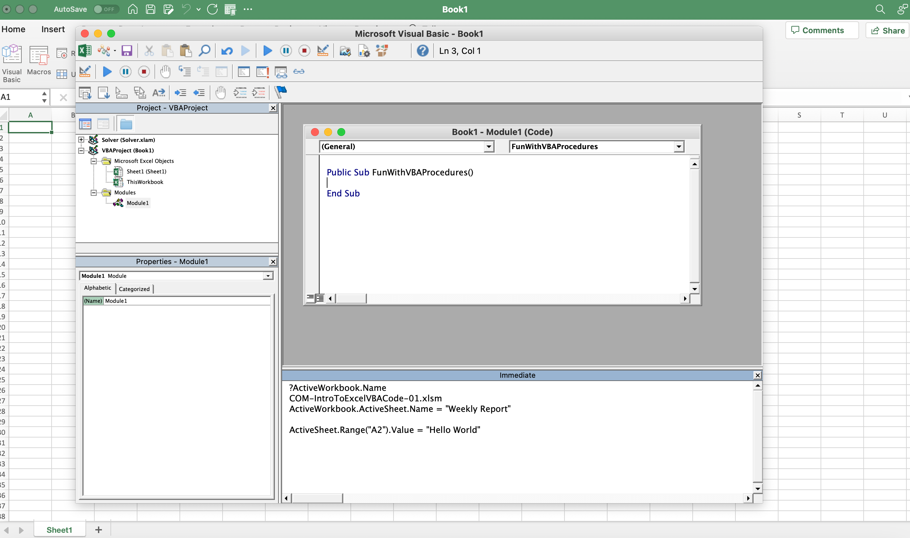

## Adding Code to a VBA Procedure

- Press the blue "Play" button to run your sub-procedure code

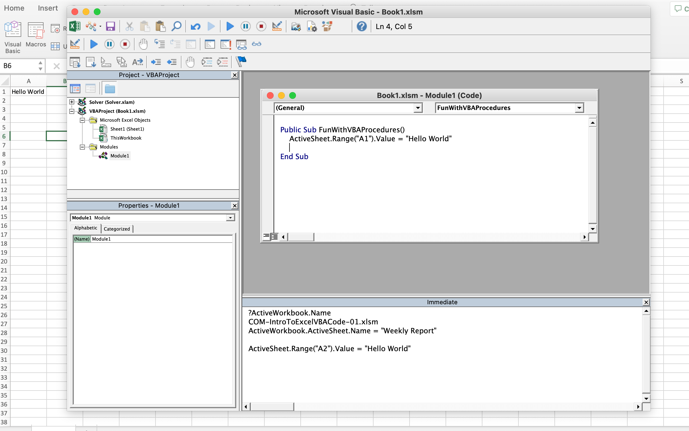

## Including Excel VBA Comments

- An apostrophe indicates a comment in VBA

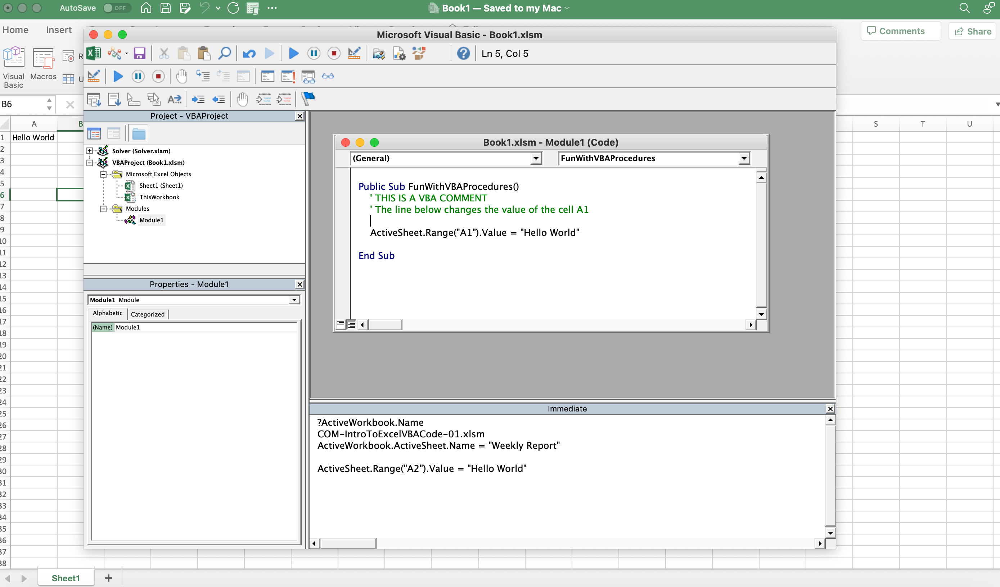

## Excel VBA MSGBOX Function

- [MsgBox function](https://learn.microsoft.com/en-us/office/vba/language/reference/user-interface-help/msgbox-function)

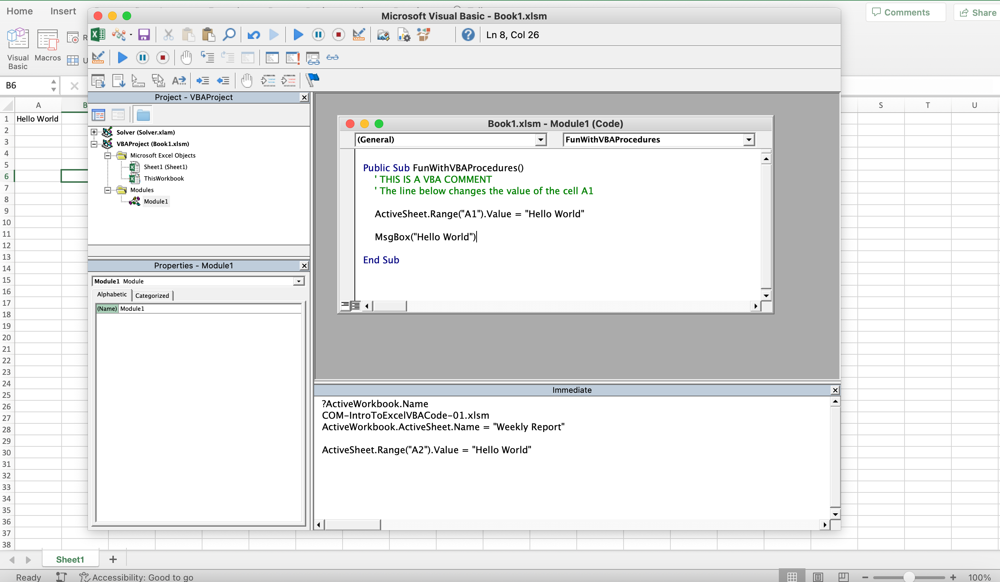
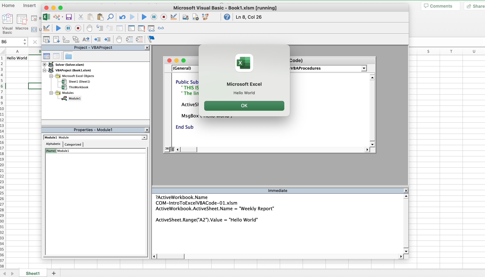

- You can also make the value in the `MsgBox` function dynamic

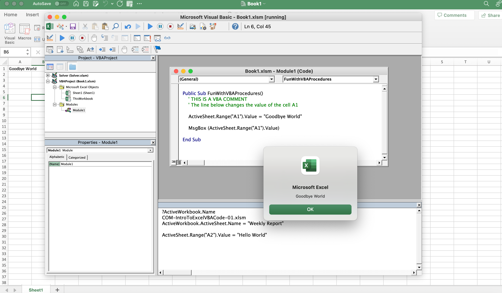

## Excel VBA MsgBox Microsoft Help Information

- To get help on any in-built VBA Excel function, highlight the function, right-click, select Definition, then click the question mark and this will take you to the help page for that function in the browser

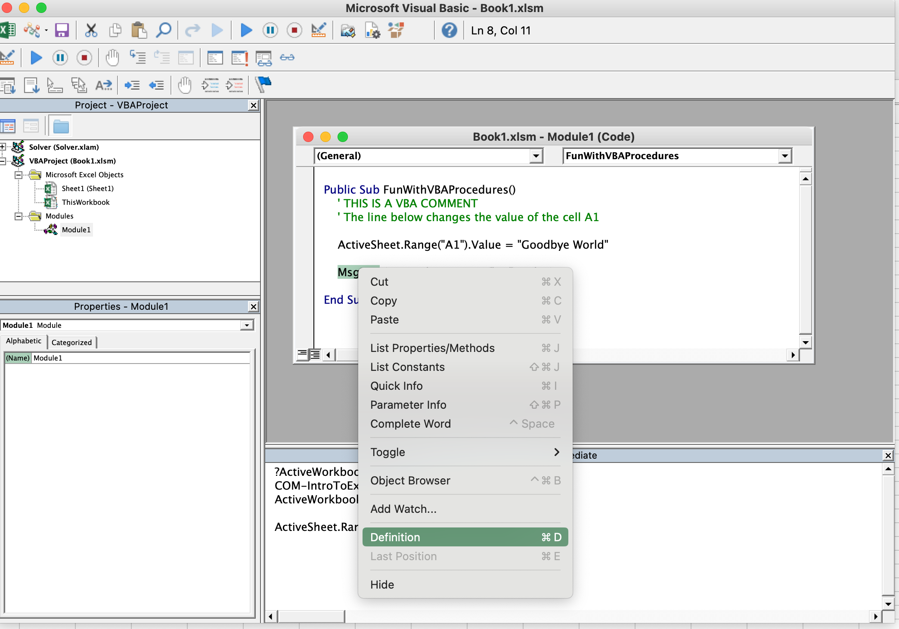
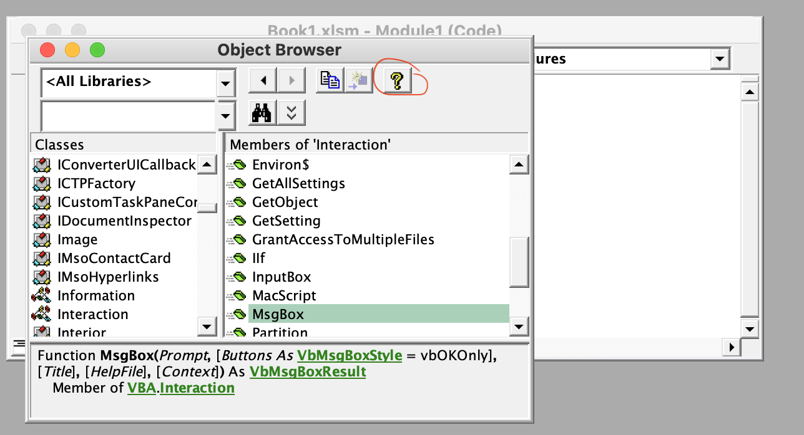

## Understanding and working with Excel VBA Variables

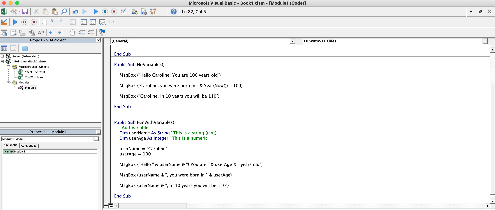

<!-- ## REMINDER: Saving an Excel Workbook with VBA Code -->

**Developer**

- Caroline Crandell - cecrandell - cecrandell19@gmail.com - [LinkedIn](https://www.linkedin.com/in/carolinecrandell/)
