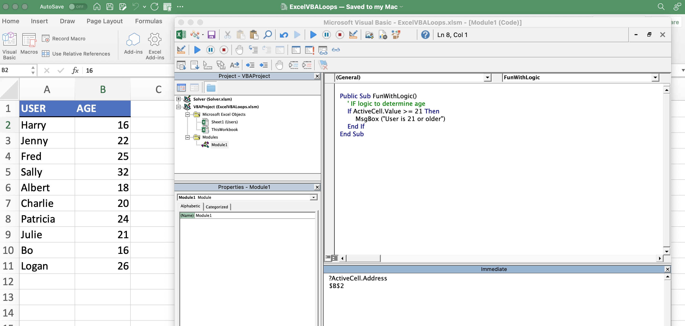
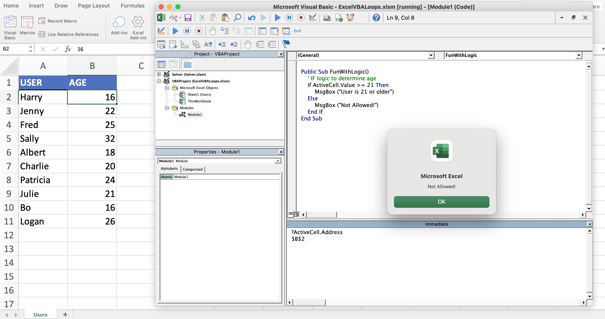
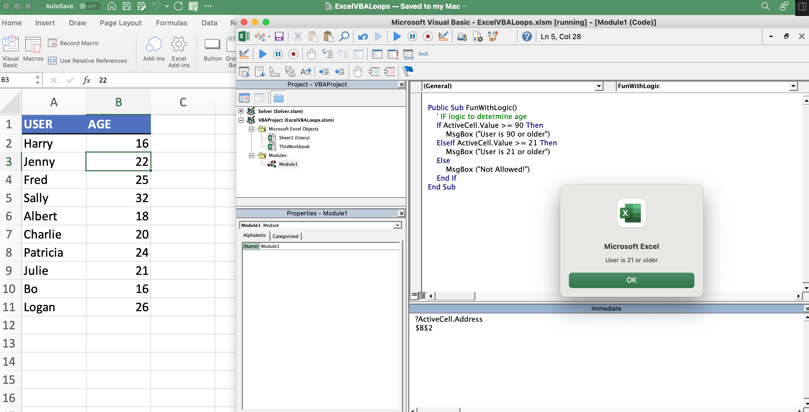
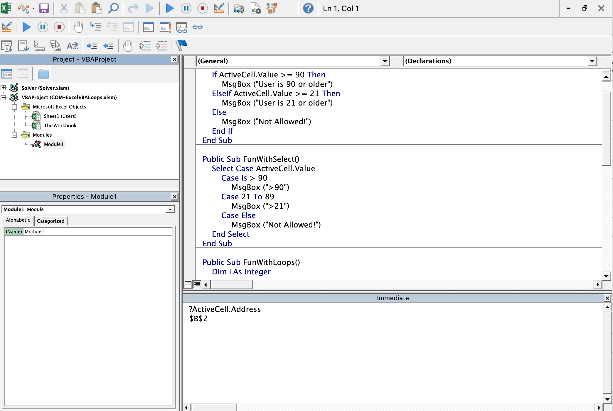
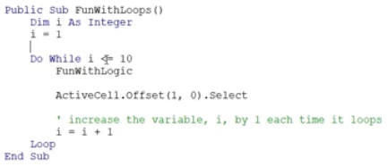
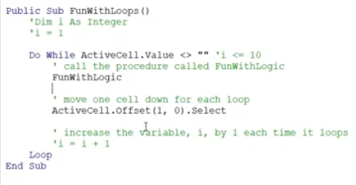
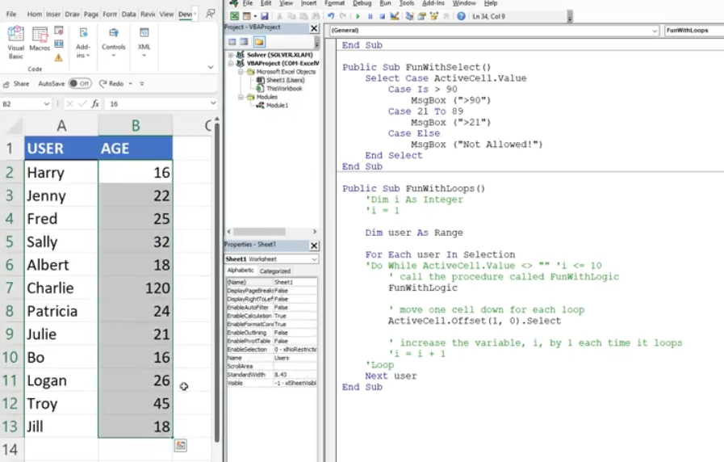
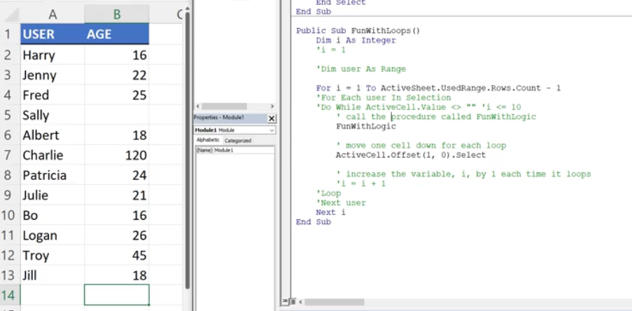

# Section 36: Working with Excel VBA Logic Statements

<!-- ## Working with Excel VBA Logic Exercise Files (DOWNLOAD) -->

## Building Logic with an Excel VBA IF Statement

## Including an Else Statement in the VBA IF Statement

## Expanding the IF Logic with Multiple ElseIf Statements

## Working with Excel VBA Select Case Statements

## Working with an Excel VBA Do While Loop

## Excel VBA Do While Loop Dynamic Condition

- `Do While ActiveCell.Value <> ""` stops at the first empty cell

## Working with an Excel VBA For Each Loop

- `Selection` is a keyword in VBA that indicates a range that is highlighted

## Working with an Excel VBA For Next Loop

- `ActiveSheet.UsedRange.Rows.Count` is a keyword that shows what has been used - very dynamic

- Subtract 1 to not use the headers

**Developer**

- Caroline Crandell - cecrandell - cecrandell19@gmail.com - [LinkedIn](https://www.linkedin.com/in/carolinecrandell/)
