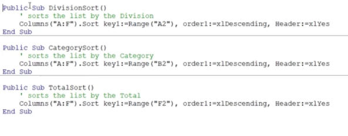
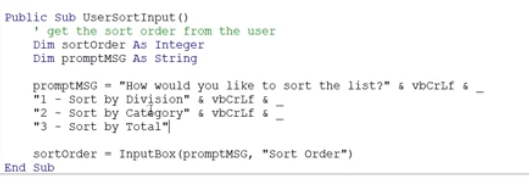
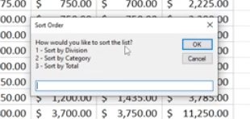
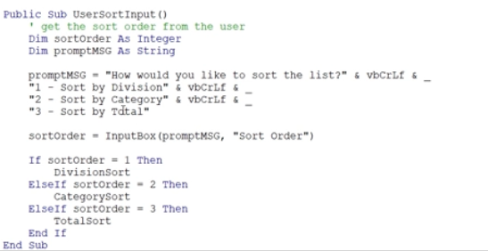
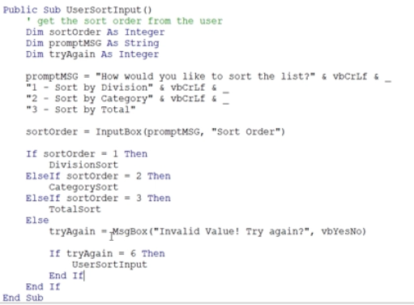
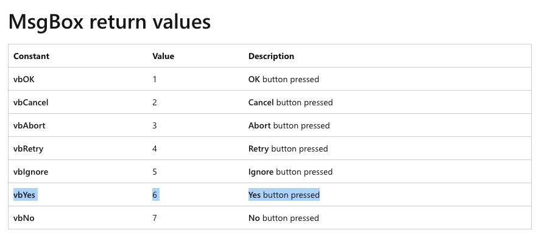
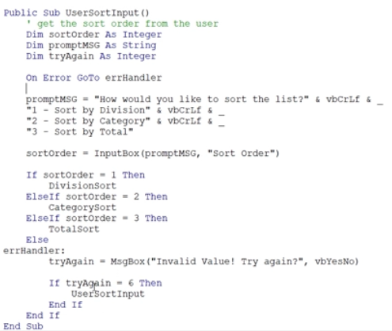
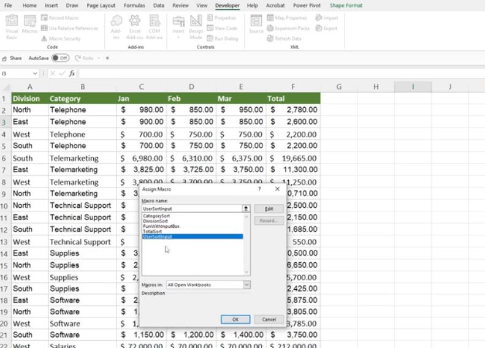

# Section 37: Project #2: Moving Beyond the Basics and into VBA

<!-- ## Introduction to Project #2: Interacting with the User

## Beyond the Basics Sort Project Exercise Files (DOWNLOAD) -->

## Project #2: Introduction to the Excel VBA Range.Sort Method

- [SORT function](https://support.microsoft.com/en-au/office/sort-function-22f63bd0-ccc8-492f-953d-c20e8e44b86c)

## Creating the Excel VBA Sort Procedures for the Project

- `:=` is the assignment operator


- Copy and paste the procedures and customize for division, category, and total



## Project #2: Prompting the User for Information

- [InputBox function](https://learn.microsoft.com/en-us/office/vba/language/reference/user-interface-help/inputbox-function)

- `userInput = InputBox("What is your favorite color?", "Favorite Color")` - asks the user for input

## Continue Excel VBA InputBox

- `vbcrlf` is carriage return-linefeed combination

- [Miscellaneous constants](https://learn.microsoft.com/en-us/office/vba/language/reference/user-interface-help/miscellaneous-constants)




## Project #2: Building Logic into Your Macros



## Project #2: Alerting the User of Errors

- [MsgBox return values](https://learn.microsoft.com/en-us/office/vba/language/reference/user-interface-help/msgbox-constants)

- `vbYes - 6 - Yes button pressed`




## Using Excel VBA Error Control Statements

- What if the user does not input anything?

- `On Error GoTo errHandler`

- [](https://learn.microsoft.com/en-us/office/vba/language/reference/user-interface-help/on-error-statement)

- Example:

```
Sub InitializeMatrix(Var1, Var2, Var3, Var4)
 On Error GoTo ErrorHandler
 . . .
 Exit Sub
ErrorHandler:
 . . .
 Resume Next
End Sub
```



## Create a Button to Run the Sort Procedure and Save



**Developer**

- Caroline Crandell - cecrandell - cecrandell19@gmail.com - [LinkedIn](https://www.linkedin.com/in/carolinecrandell/)
