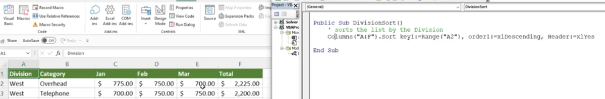

# Section 37: Project #2: Moving Beyond the Basics and into VBA

## Introduction to Project #2: Interacting with the User

## Beyond the Basics Sort Project Exercise Files (DOWNLOAD)

## Project #2: Introduction to the Excel VBA Range.Sort Method

## Creating the Excel VBA Sort Procedures for the Project

## Project #2: Prompting the User for Information

## Continue Excel VBA InputBox

## Project #2: Building Logic into Your Macros

## Project #2: Alerting the User of Errors

## Using Excel VBA Error Control Statements

## Create a Button to Run the Sort Procedure and Save

**Developer**

- Caroline Crandell - cecrandell - cecrandell19@gmail.com - [LinkedIn](https://www.linkedin.com/in/carolinecrandell/)
