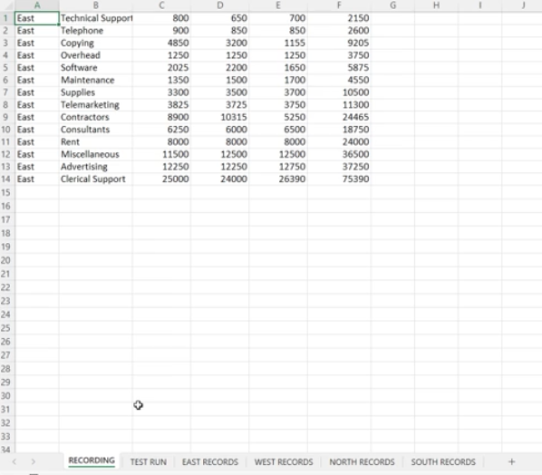
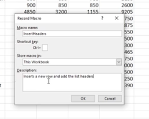
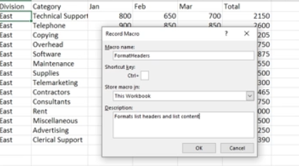
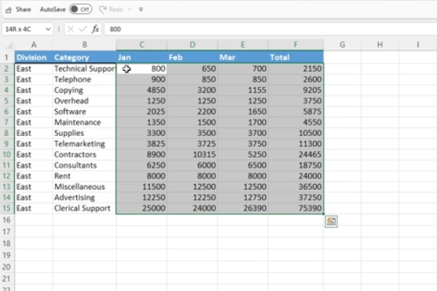
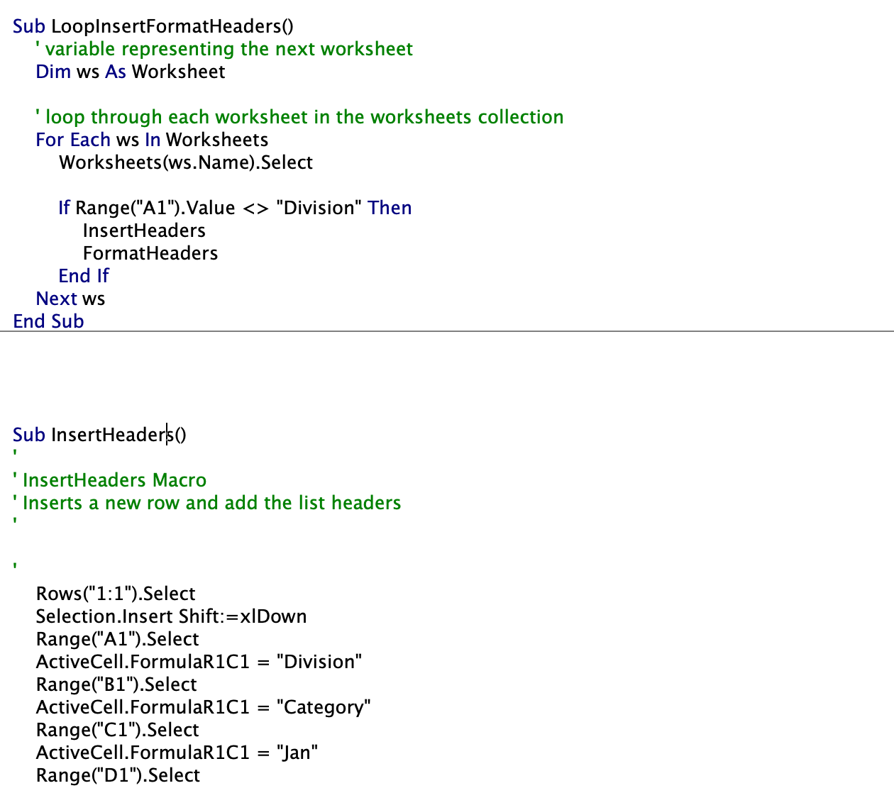
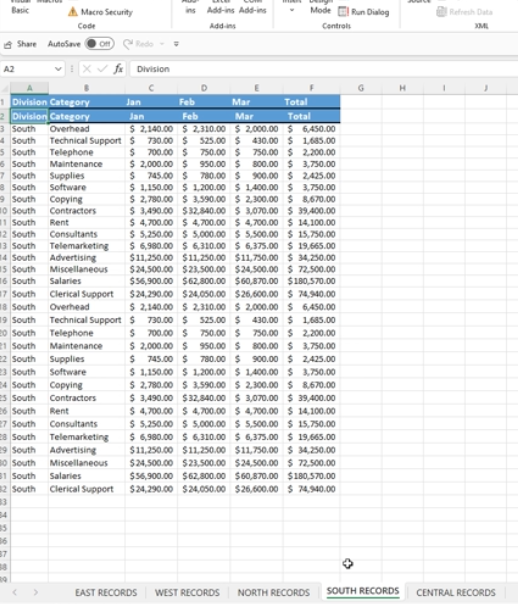

# Section 38: Project #3: Preparing and Cleaning Up Data with Excel VBA

<!-- ## Introduction to Project #3: Cleaning Up and Formatting Data -->

<!-- ## Project #3: Exercise Files (DOWNLOAD) -->

<!-- ## Project #3: Preparing to the Use the Macro Recorder -->

## Project #3: Inserting the Headers

- It is good to have a tab that is dummy data to test our macros on



## Project #3: Formatting the Headers

- We create one macro recording for each procedure so that if something goes wrong, it is easer to undo



## Project #3: Testing the Macros

- Macros should be like functions - only serving one purpose per procedure



## Project #3: Using an Excel VBA Loop to Loop through all Worksheets

- It is better to select cells through hot keys (Command + Shift + Down or Left) because macros record this dynamically, not through hard-coded ranges



- Code for looping through the worksheets (including the logic)

```
Sub LoopInsertFormatHeaders()
    ' variable representing the next worksheet
    Dim ws As Worksheet

    ' loop through each worksheet in the worksheets collection
    For Each ws In Worksheets
        Worksheets(ws.Name).Select

        If Range("A1").Value <> "Division" Then
            InsertHeaders
            FormatHeaders
        End If
    Next ws
End Sub
```



## Project #3: Testing the Excel VBA Loop

- Save the workbook before running the procedure, and if it does not go to plan, you can exit the workbook without saving and open it back up and edit Visual Basic

## Project #3: Adding Logic to an Excel VBA Loops

- Make sure to add logic so that the macro does not repeat formatting/adding headers to worksheets that already have it



**Developer**

- Caroline Crandell - cecrandell - cecrandell19@gmail.com - [LinkedIn](https://www.linkedin.com/in/carolinecrandell/)
