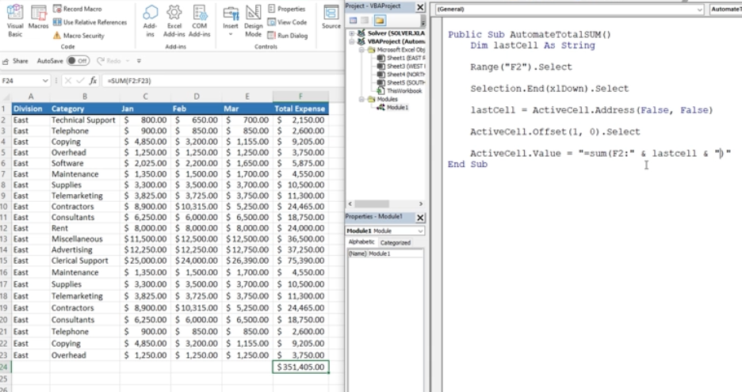

# Section 39: Project #4: Using VBA to Automate Excel Formulas

<!-- ## Introduction to Project #4: Automate Excel Formulas -->

<!-- ## Project #4: Automate Sum Function Exercise Files (DOWNLOAD) -->

## Project #4: Start the Procedure to Automate the SUM Function

- [How to select ranges using Visual Basic for Applications](https://support.microsoft.com/en-au/topic/how-to-select-ranges-using-visual-basic-for-applications-novice-examples-cfc560b1-3dfc-bda7-a0da-a3cbed6abcab)

- `Selection.End(xlDown).Select` jumps to the last cell in a column above the first empty cell


## Working with the Range Address Property

- `lastCell = ActiveCell.Address` assigns the final cell you just selected


## Creating the SUM Function in VBA

```
ActiveCell.Offset(1,0).Select
ActiveCell.Value = "=sum(F2:" & lastCell & ")"
```



## Run the Excel VBA Procedure to SUM Records

- Then you can run it once on a worksheet to check it works on other worksheets dynamically

## Project #4: Loop the SUM() Function Over Multiple Worksheets

- To loop through the worksheets


**Developer**

- Caroline Crandell - cecrandell - cecrandell19@gmail.com - [LinkedIn](https://www.linkedin.com/in/carolinecrandell/)
