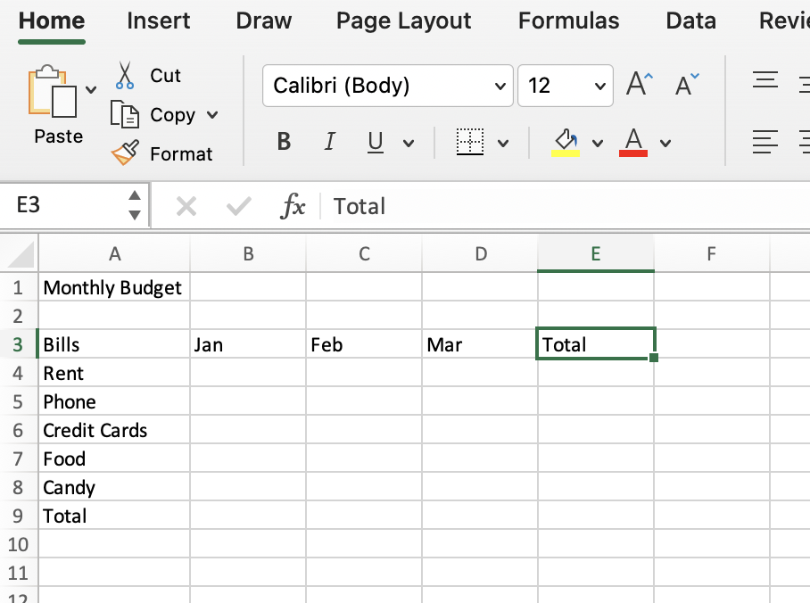
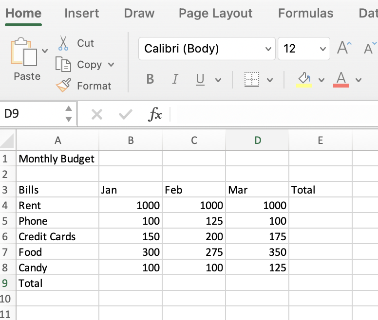
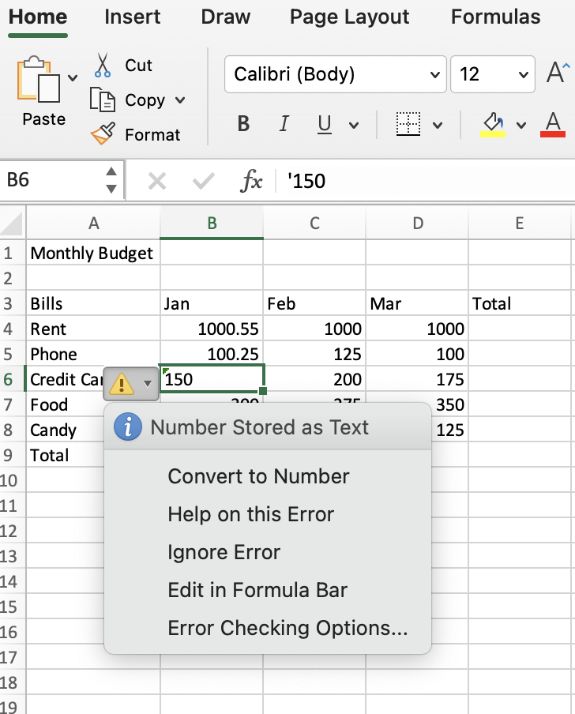
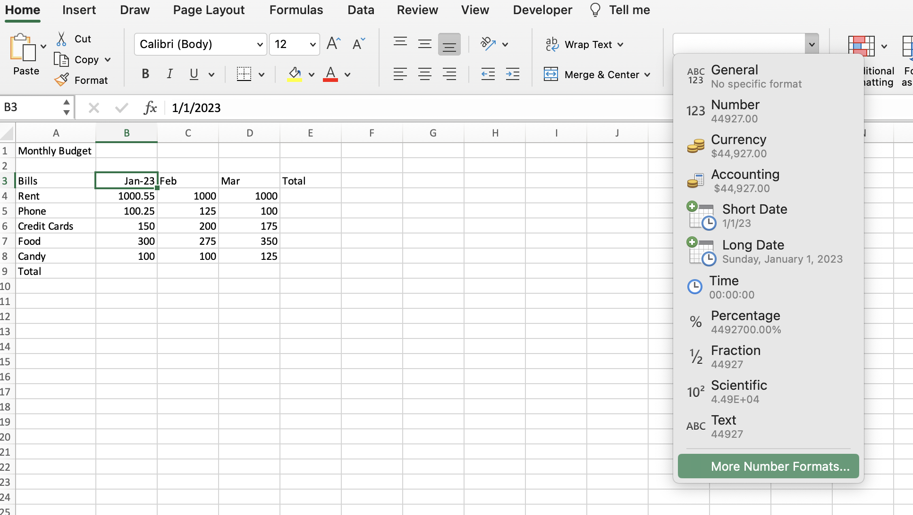
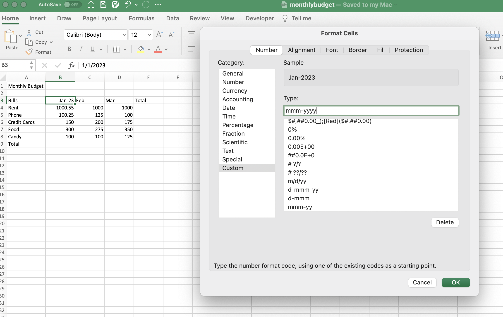

# Section 3: Entering and Editing Text and Formulas

## Labels

- There are row labels on the side and column labels at the tope, where we can put text values (alpha values are letters).

- Numeric values are right-aligned by default in Excel. This makes our decimals cleaner. Alpha values are left-aligned by default.

- If you import data and your numeric values are left-aligned, there will often be a green triangle in the top left corner of each of those cells, which means Excel is thinking there is something wrong there and it's treating those text values as alpha values.

- The solution is to right-click the cell and select "Convert to number".

## Date Values

- Typically, a date comprises of 3 parts: day, month, and year. Date values are right-aligned by default, and dates are treated as numeric values.

- To format date, select "More Number Formats...".

- Then create a custom format if the format you want is not in the common date formats.
