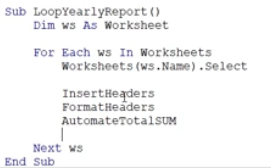
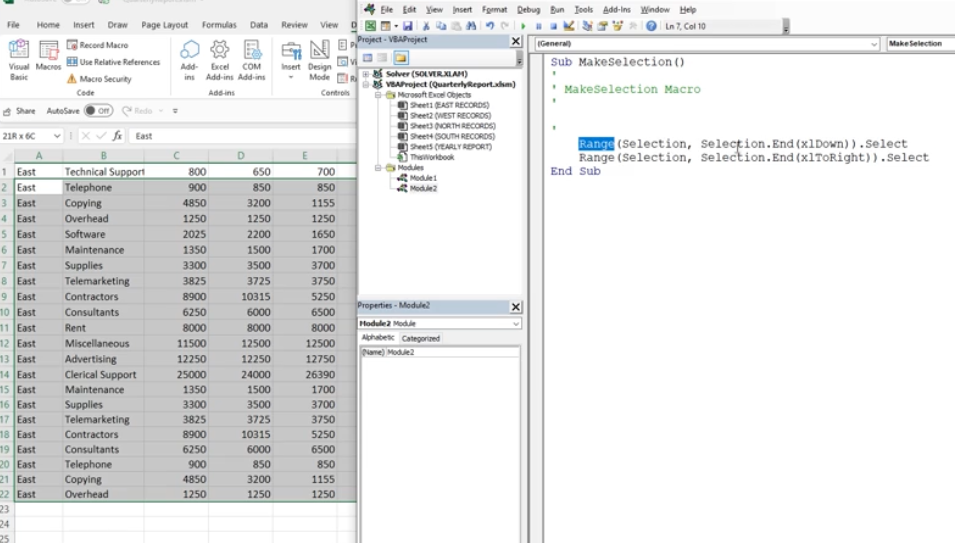
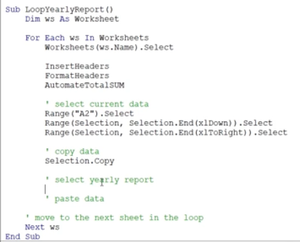
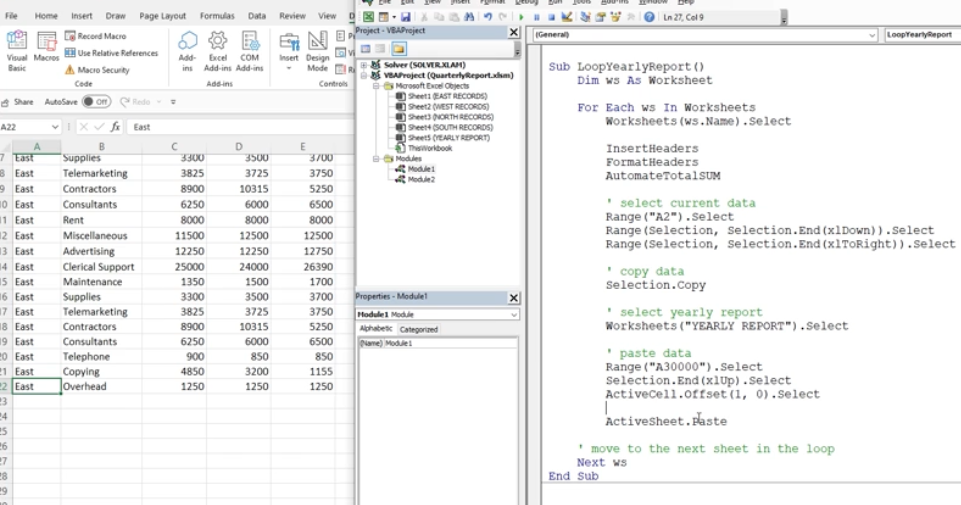
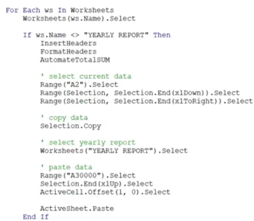
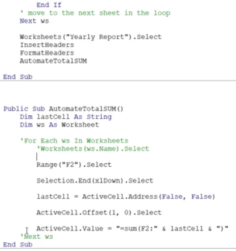
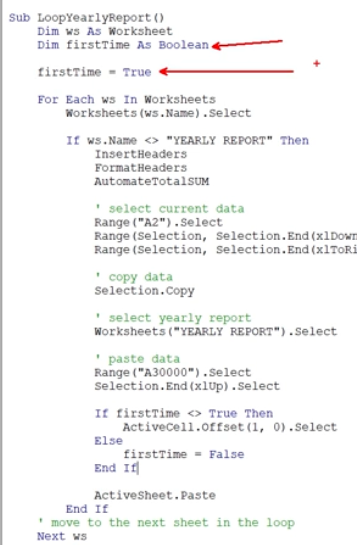

# Section 40: Project #5: Bringing it All Together and a Weekly Report

<!-- ## Introduction to Project #5: Creating the Final Report -->

<!-- ## Project #5: Final Report Loop Exercise Files (DOWNLOAD) -->

## Project #5: Creating the Final Report Excel VBA Loop

- Set up some basic formatting and summing

## Project #5 - Copying Content with Excel VBA

- If you are unsure of what the VBA code is, you can quickly start recording a macro, do what you need to do, then stop recording and look at the module code

## Project #5 - Pasting Content with Excel VBA

## Cleaning Up the Final Report VBA Loop Code

- Clean up the loop code so that the formatting does not run on the Yearly Report worksheet

- Add a final block of formatting procedures for the "Yearly Report" worksheet and comment out the loops in the AutomateTotalSum so that it does not loop twice

## Adding Logic to Stop the Loop from Running Multiple Times on a Worksheet

- Create a boolean for the first time code

<!-- ## Project #5 - Running the Final Report Procedure -->

**Developer**

- Caroline Crandell - cecrandell - cecrandell19@gmail.com - [LinkedIn](https://www.linkedin.com/in/carolinecrandell/)
