# Section 41: Project #6: Working with Excel VBA User Forms

<!-- ## Introduction to Project #6: Working with Excel VBA User Forms (DOWNLOAD) -->

<!-- ## Project #6: Working with Excel VBA User Forms Exercise Files (DOWNLOAD) -->

## Project #6: Creating an Excel User Form

- To create a user form, open Visual Basic in the Developer tab, Insert > UserForm

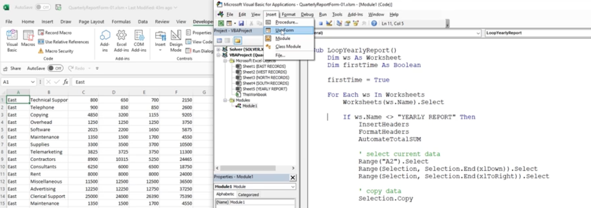
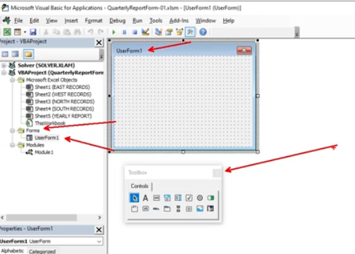

- The toolbox has the Combobox, Label, and the CommandButton

- Run > Run Sub/UserForm to run the UserForm

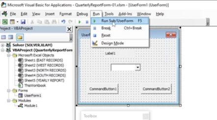

## Project #6: Working with Form and Control Properties

- Name the form in the Properties box (name is for Visual Basic - camelcase etc) and whereas Caption is the name the user sees

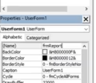
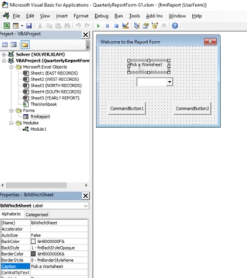

<!-- ## Project #6: Formatting Excel VBA User Form Controls -->

## Project #6: Adding VBA Code to the Initialize Event

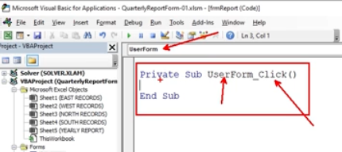
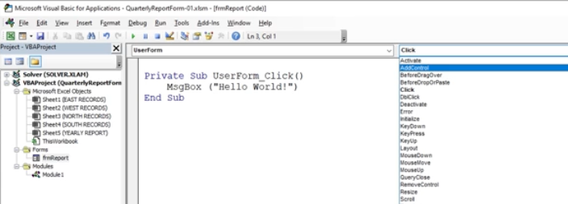
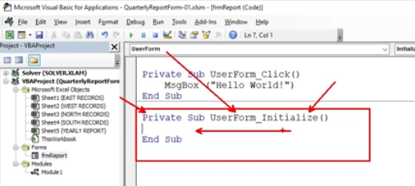
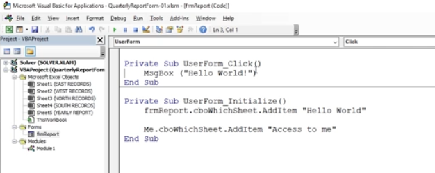
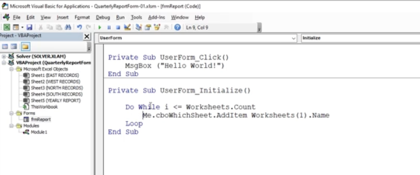

## Project #6: Using the AddItem Method within a Loop

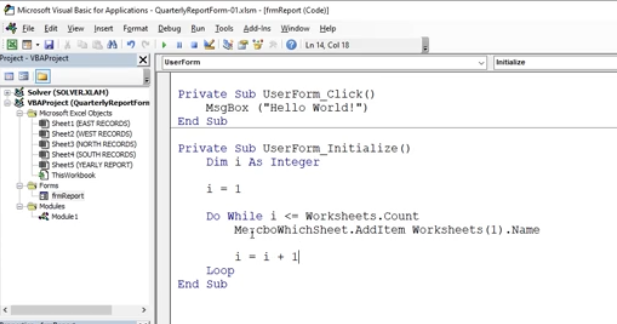

## Project #6: Adding VBA Code to the ComboBox Change Event

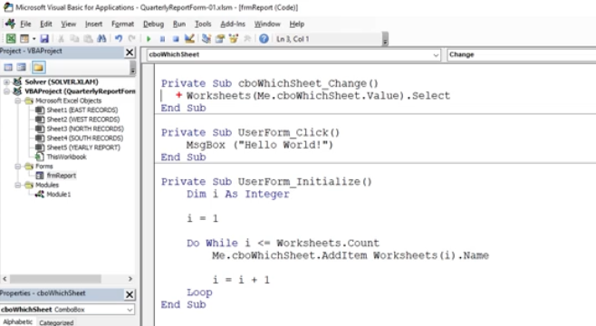

## Project #6: Adding VBA Code to the Add Worksheet Button

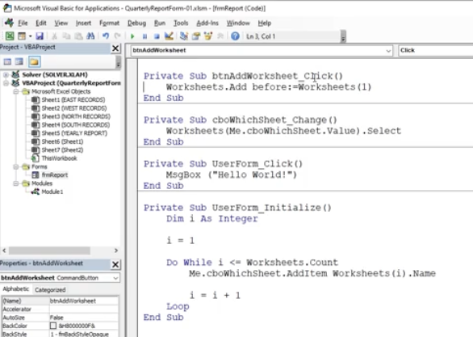

## Project #6: Change Worksheet Name

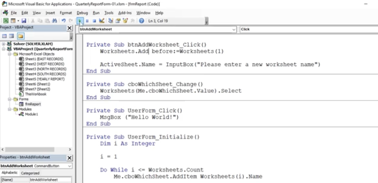

## Project #6: Catch Errors When Adding a Worksheet

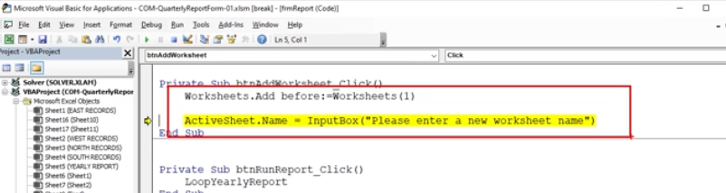

## Add Sheet Procedure Catch Errors

- [AddSheetError-Solution-01](/Section%2041:%20Project%20#6:%20Working%20with%20Excel%20VBA%20User%20Forms/Resources/AddSheetError-Solution-01.txt)

## Project #6: Additional Conditions on the Loop

- Anytime you run anything big in VBA, save first, so that you can exit without saving to restore back to wherever you left off before executing the code

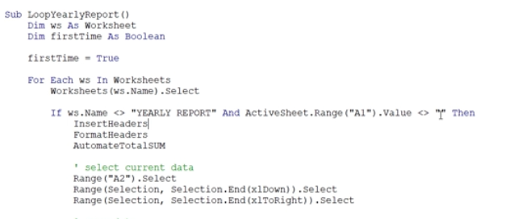

## Project #6: Running the Final Report Procedure

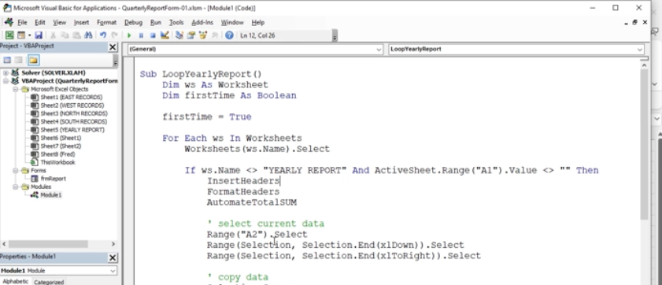

## Project #6: Showing the VBA User Form on Workbook Open

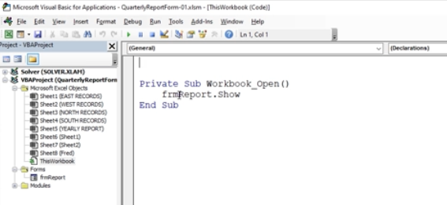

**Developer**

- Caroline Crandell - cecrandell - cecrandell19@gmail.com - [LinkedIn](https://www.linkedin.com/in/carolinecrandell/)
