# Section 42: Project #7: Importing Data from Text Files

## Project #7: Opening a Text File for Import (Resources)

## Project #7: Opening a Text File for Import

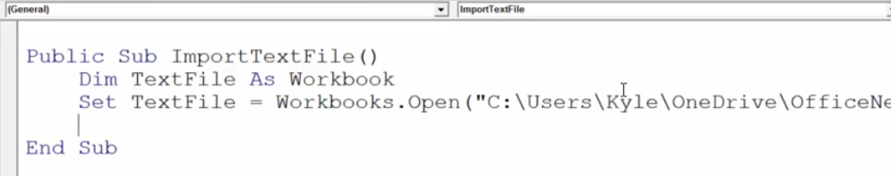

## Project #7: Get Data from Text File

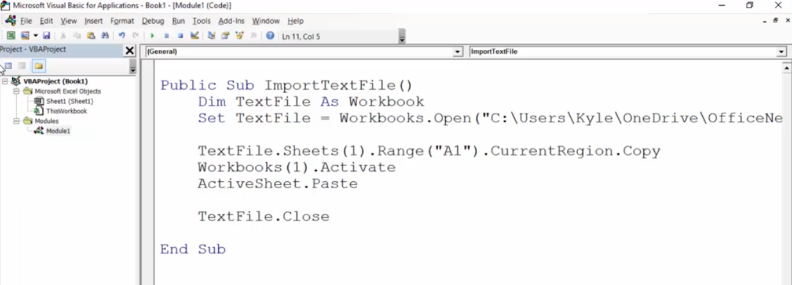

## Project #7: Importing Multiple Text Files with the GetOpenFilename Method

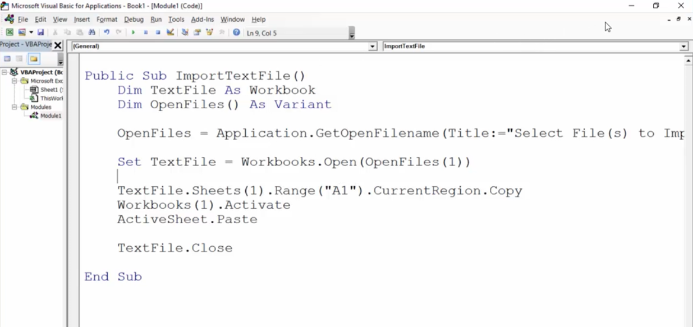

## Project #7: Creating a Loop to Read Each File

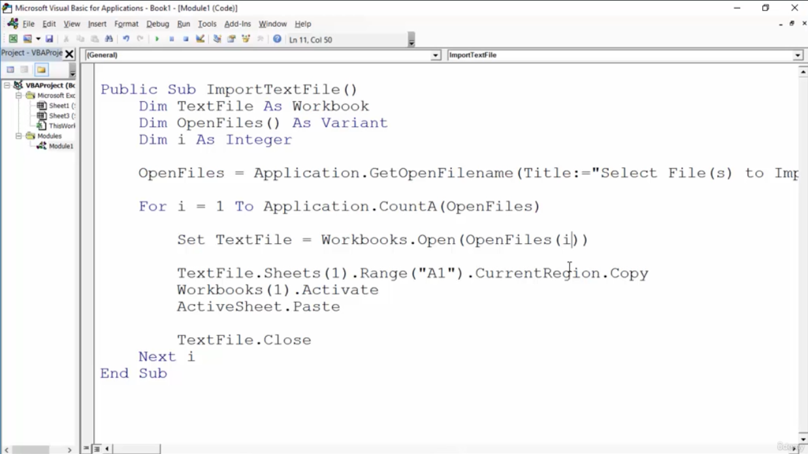

## Project #7: Adding a New Sheet for Imported Data

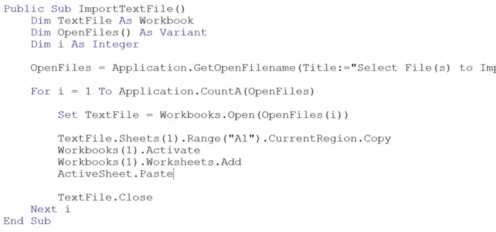

## Project #7: Clear the Clipboard

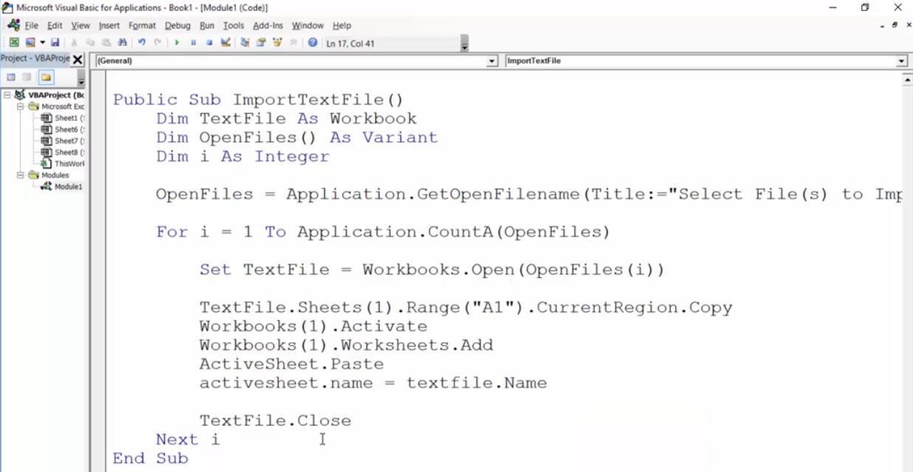
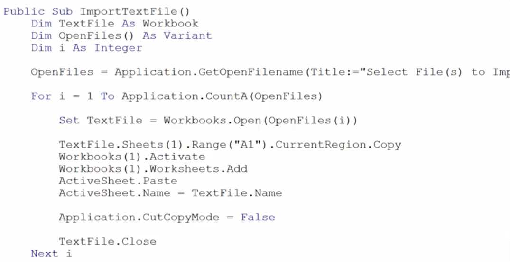

## Project #7: Working with the ScreenUpdating Property

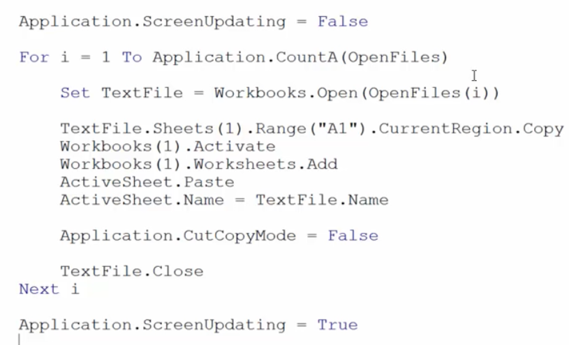

## Project #7: Creating Reusable Code with a VBA Function

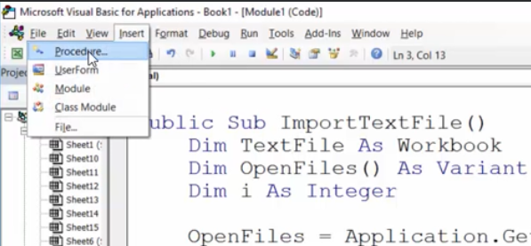
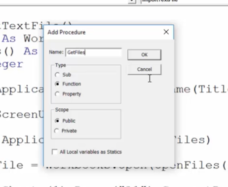

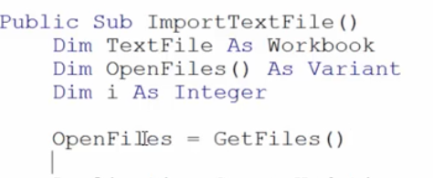

**Developer**

- Caroline Crandell - cecrandell - cecrandell19@gmail.com - [LinkedIn](https://www.linkedin.com/in/carolinecrandell/)
