# Section 4: Working with Basic Excel Functions

## Excel Function

- "A predefined formula that performs a calculation."

## Building Block of Excel Functions

- 3 Parts of an Excel Function:

`= FUNCTION NAME (ARGUMENTS)` (e.g., `=SUM(B4:B8)`)

- The colon character in Excel indicates "through", like in a range (e.g., `=SUM(B4:B8)`).

## Function Arguments Window

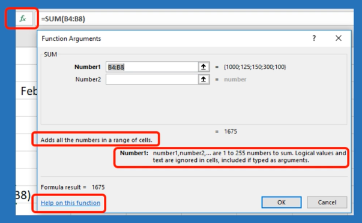

- To open the Function Arguments Window, you can click on the "fx" icon in the formula bar. This assists with defining the function you're using and what arguments are needed/what they mean.

- On Windows, on the bottom left of the Function Arguments Window, you can click "Help on this function", and it will take you to a Mirosoft webpage with more information.

## Excel Functions

- 461+ functions as of 2013 in Excel.

- Excel functions can be found in the "Formulas" tab.

- Often if Excel removes a function, they'll replace it with a different one.

## SUM()

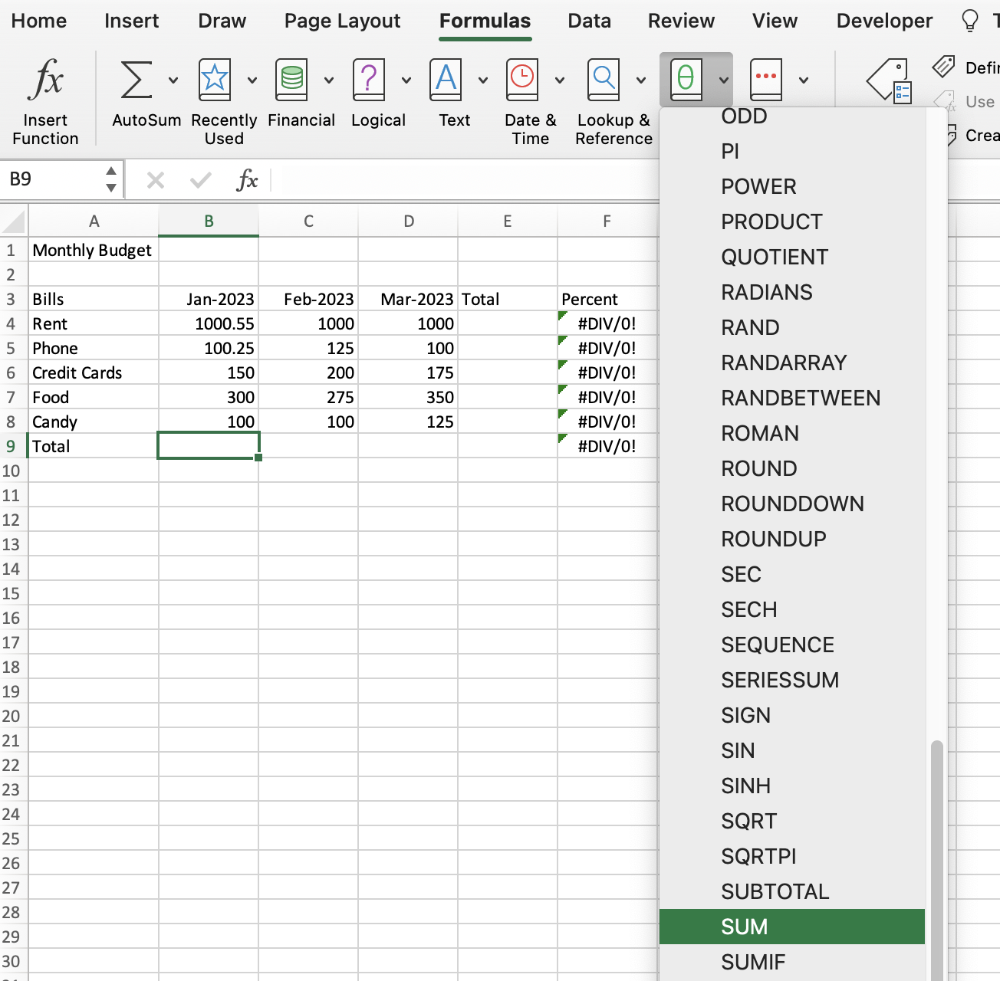

- To find the `SUM` function, go to the "Formulas" tab and click on the drop down on "Math & Trig" and find `SUM`.

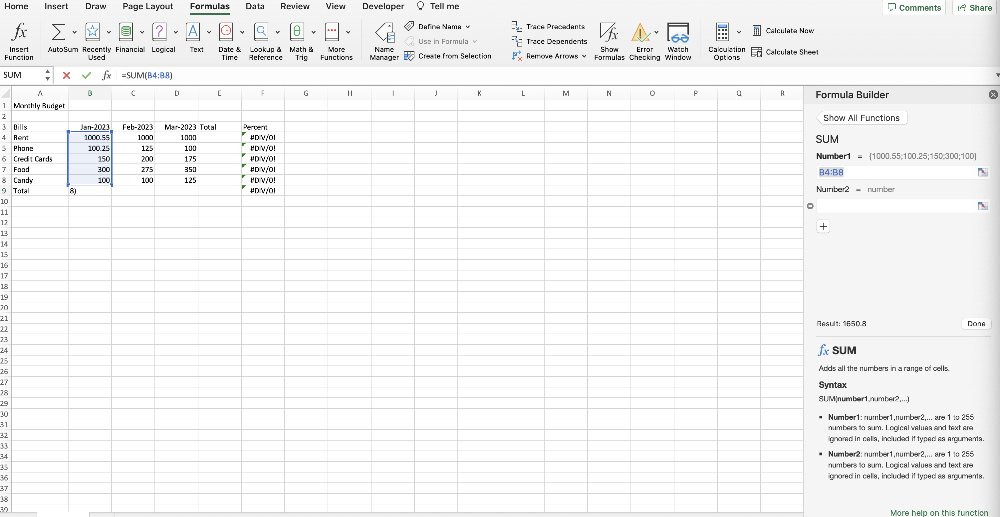

- Excel will detect which cells you want to `SUM` and predict then populate the range in the "Function Arguments Window". You can cutomize as necessary.

## MIN() and MAX()

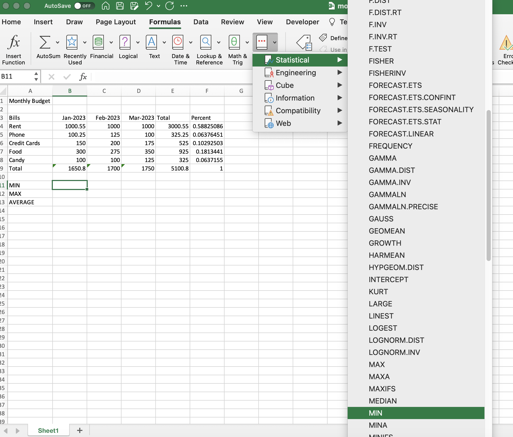
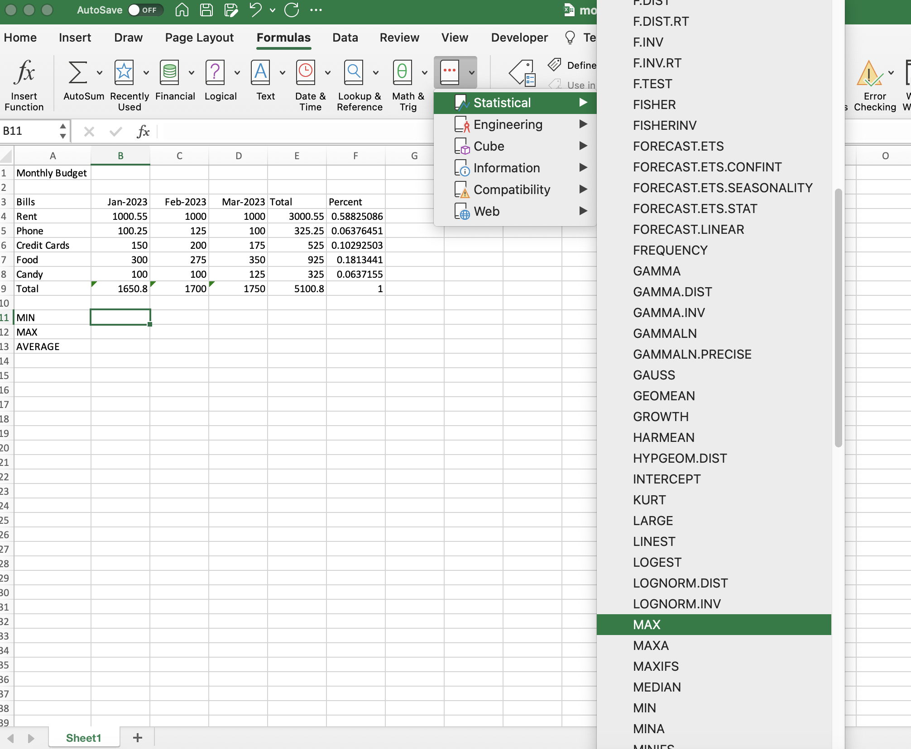

- To find `MIN()` and `MAX()` formulas, you can find them under the "Formulas" tab, then "More Fucntions", then "Statistical".

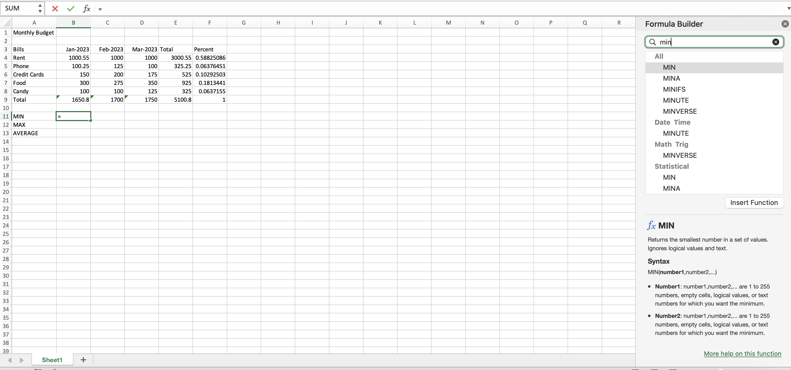
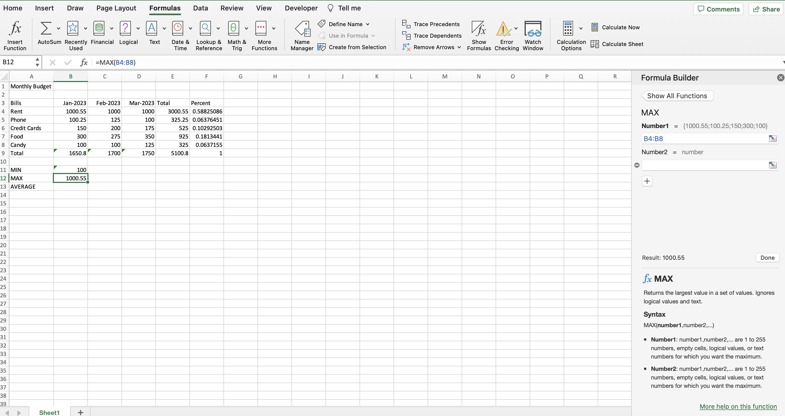

- Or, you can click on the "fx" icon on the formula bar and search for the function you're looking for.

<!-- ## Quiz

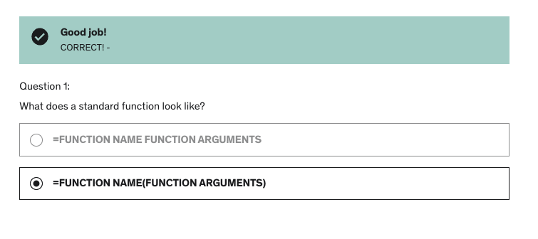
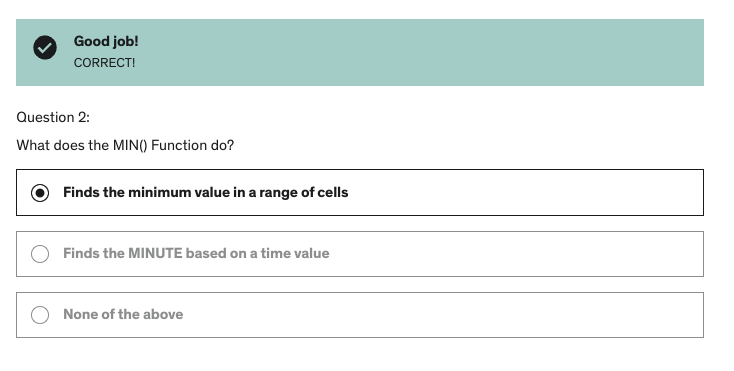
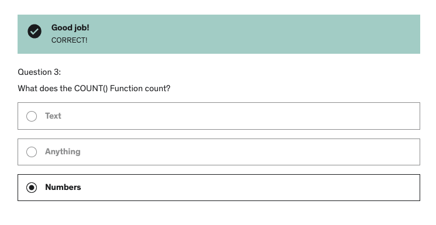
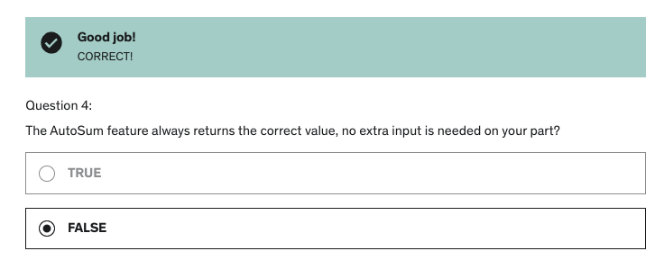
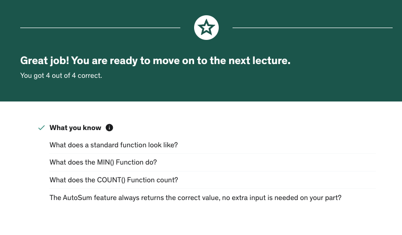 -->

**Developer**

- Caroline Crandell - cecrandell - cecrandell19@gmail.com - [LinkedIn](https://www.linkedin.com/in/carolinecrandell/)
