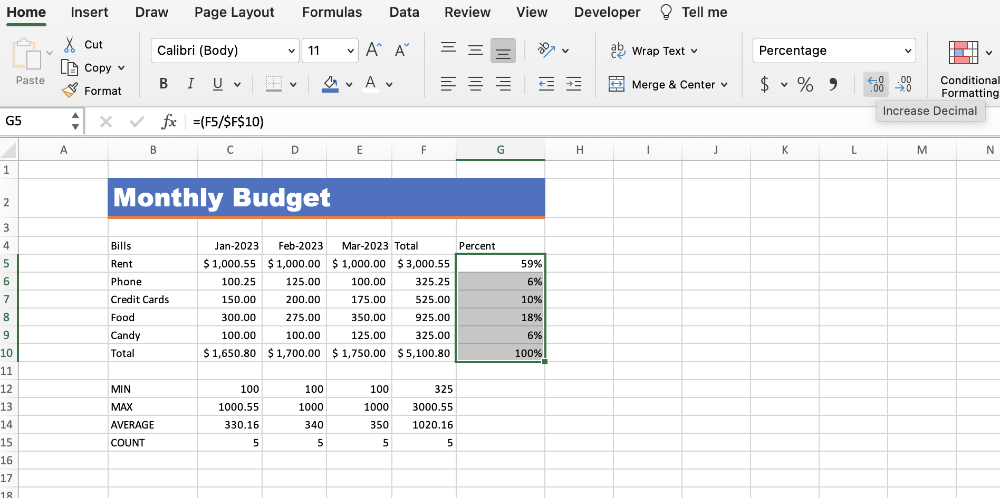

# Section 6: Formatting Data in an Excel Worksheet

## Working with Font Formatting Commands

- Sometimes less is more, and we want things to stand out.

- Theme colors were introduced to Excel in 2007.

- The theme color is attached to the document. In the "Page Layout" tab, you can select "Themes" on the left side, and you can see that the default is "Office".

- If you change the theme here, the font colors will change accordingly.

## Excel Cell Borders

- To browse more border options, select "More Borders..." in the drop down and a new window will appear.

- In the new window, you will need to select new features to preview and then click where you want to preview them in the "Border:" section on the right side.

## Formatting Data as Currency Values

- To format currency, select the drop down next to the dollar sign ($) in the ribbon and select your currency of choice.

- In finance, a nice format trick is to make the first row and the final row in currency format, and then the rows in between "comma" style, which can be selected in the ribbon.

## Formatting Percentages

- To format percentages, click the percent (%) icon in the ribbon.

- By default, the percent icon rounds up, but you can select the "Increase decimal" icon to add decimal places for more accuracy (one click for each decimal place you would like to add/subtract).

## Format Painter

- The Format Painter functionality is like copy and paste, but it is for formatting only.

- If you click the "Format Painter" icon once (in the ribbon under the "Home" tab on the left side), then you can use it once somewhere else. If you double click it, you can use it an unlimited amount of times (even in different worksheets) until you press "Esc" or click on the "Format Painter" icon again.

## Creating Styles to Format Data

- If you want to reuse a specific formatting that you've designed, you can create a "style". Then if you update the style, it updates your whole workbook.

- Select "New Cell Style..." under "Cell Styles", then untick "Numbers" unless you are certain this style will only be used on numeric values.

- Once you've made the new cell style, you can apply it to any cell you want in the workbook.

- If you need to modify the style, right-click on the style and make changes.

- This will then update the style on every cell the style is applied to in the workbook.

## Merge and Center

- Merge and Center combines several cells into one and centers the text.

- Don't use Merge and Center for lists because you run into issues with sorting and filtering. It can also wreak havoc with printing operations as well. It's best for titles, and pretty much exclusively for that.

## Conditional Formatting

- Conditional formatting applies formatting based on a condition (e.g., if a cell value is above $500, make it turn red).

- First, select the cells that you want to apply conditional formatting to.

- Then select the drop down next to Conditional Formatting in the ribbon and select "Greater Than..." and here, we create a condition that dictates if the formatting should be applied.

- Then we choose styles that we want to apply to the cell when it meets the condition.

- Conditional formatting is also dynamic, so if you change the value of the cell to something that no longer meets the condition (e.g., 249), the formatting will no longer be applied.

## Editing Excel Conditional Formatting

- To modify a conditional formatting rule, select "Conditional Formatting", then "Manage Rules...", then make sure you select "This Worksheet" from the drop down at the top.

- Then select "Edit Rule..." to edit the conditional formatting.

- From here, you can update the value, change the condition, or select "Custom Formatting" from the drop down, and choose a new style.

- Then click OK and you can see that the conditional formatting has been updated.

## Quiz

**Developer**

- Caroline Crandell - cecrandell - cecrandell19@gmail.com - [LinkedIn](https://www.linkedin.com/in/carolinecrandell/)
