# Section 7: Inserting Images and Shapes into an Excel Worksheet

## Inserting Images

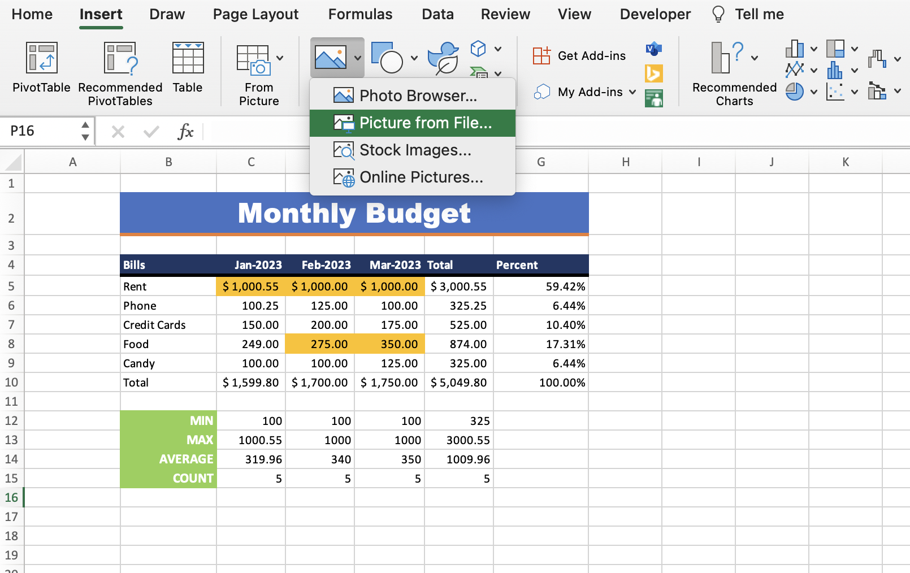

- To insert an image into your workbook, go to the "Insert" tab and select the drop down under the "Pictures" icon.

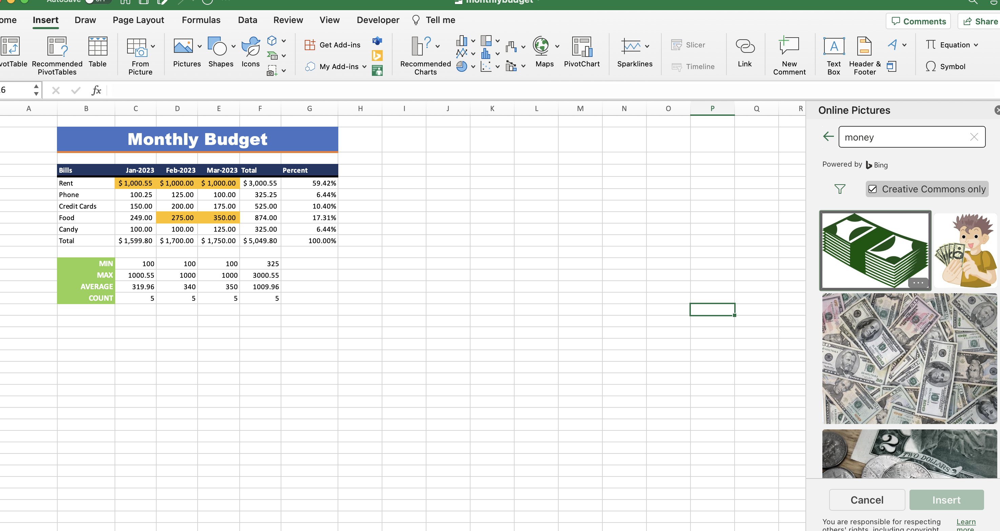

- The online images option is powered by Microsoft Bing as the default search engine.

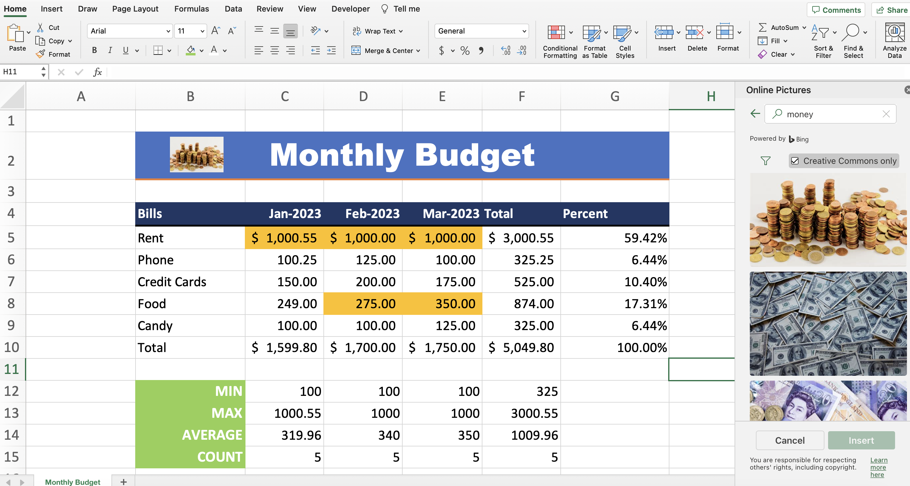

- Type in what you're searching for and insert onto the worksheet.

## Inserting Shapes

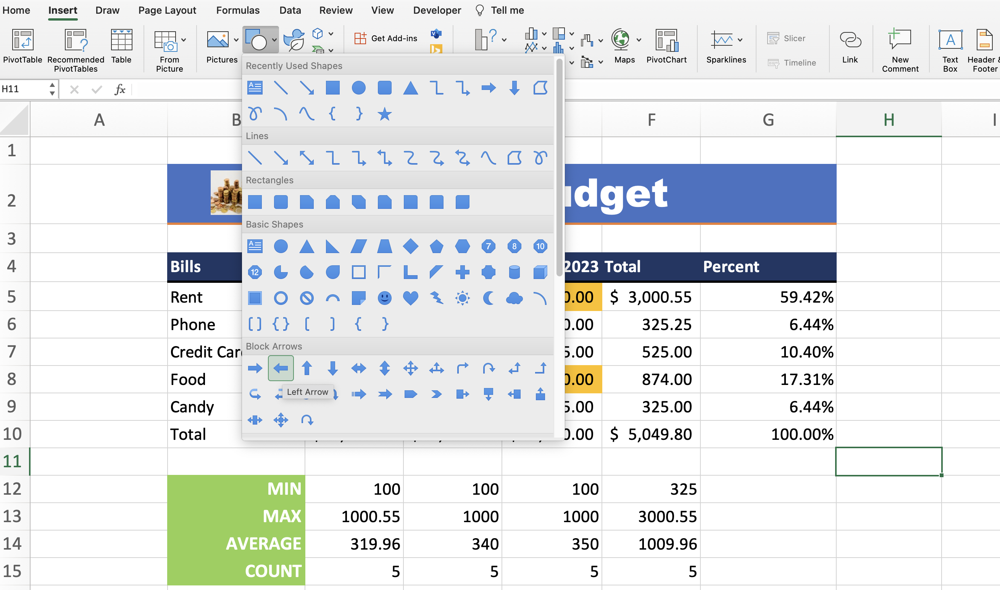

- To insert a shape into your workbook, go to the "Insert" tab and select the drop down under the "Shapes" icon.

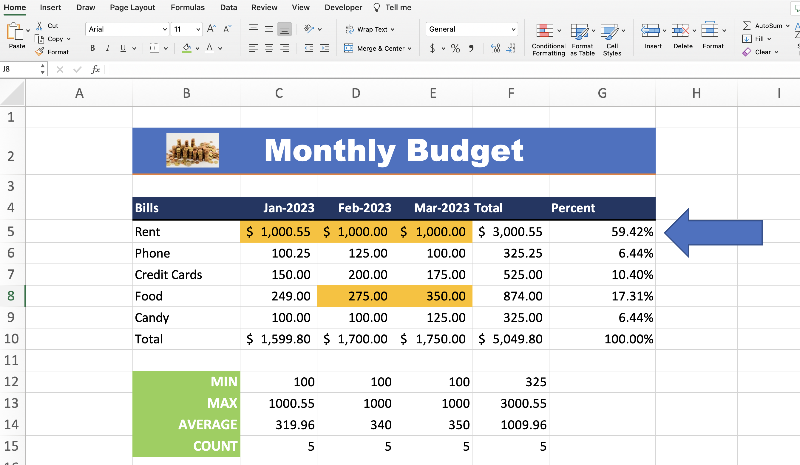

- Select the shape you want and format it how you want.

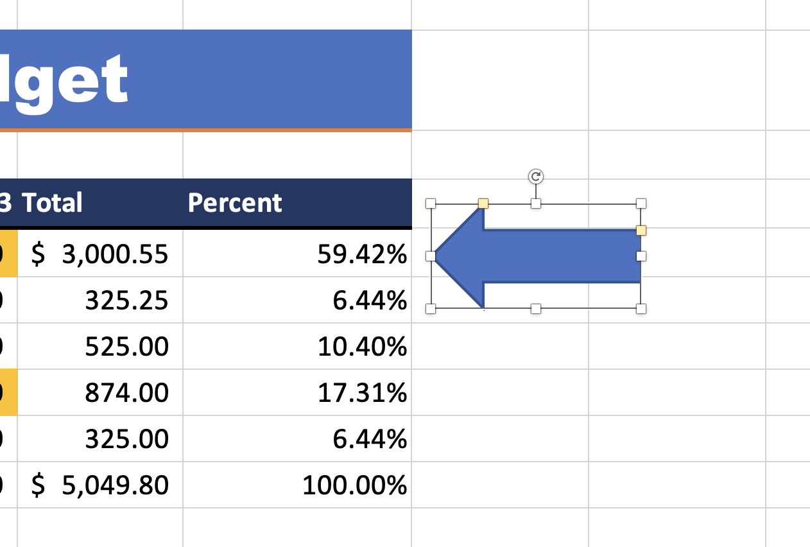

- The white markers on a shape allow you to resize the shape. The yellow markers allow you to adjust unique attributes of the shape (e.g., the thickness of an arrowhead or the arc of a smile on a smily face).

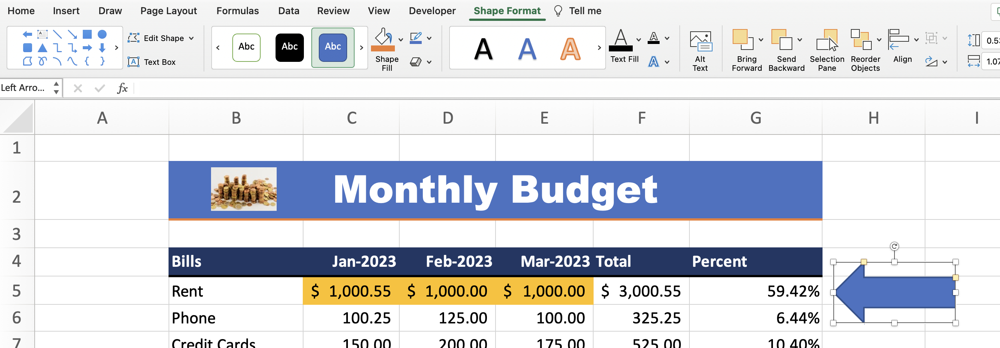

- When you have the shape selected, a new tab will appear: "Shape Format". Under this tab, you can adjust the styling of the shape (e.g., fill, outline, effects, etc.).

## SmartArt

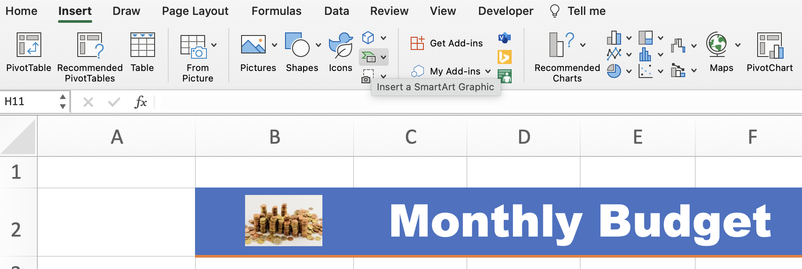

- SmartArt lets you create diagrams, from the "Insert" tab on the ribbon. Click the "SmartArt" icon and select the graphic you would life.

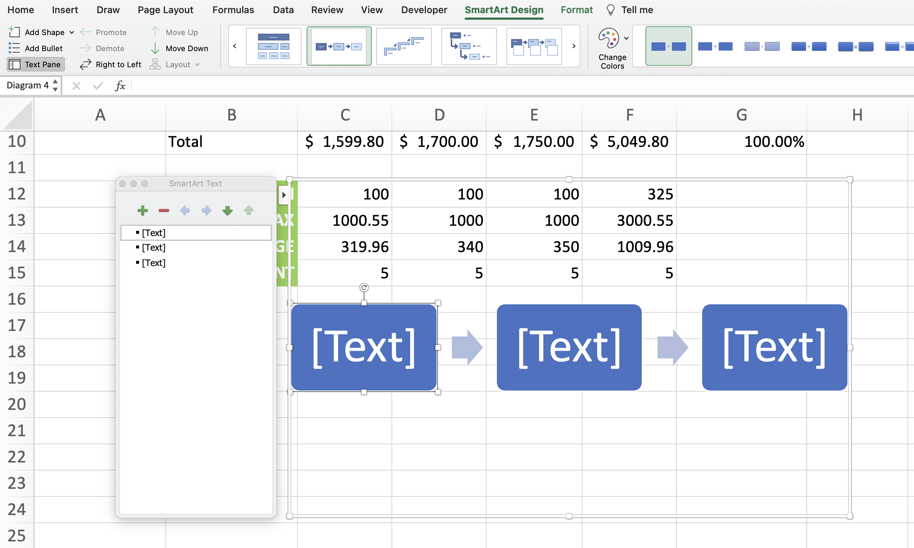
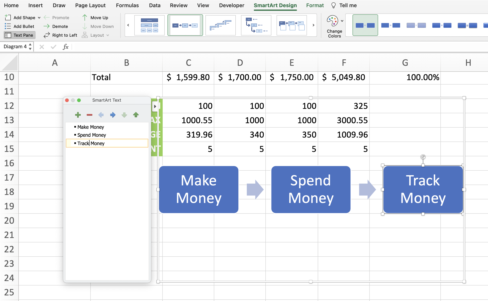

- You can toggle the "Text Pane" on the left of the ribbon, which makes it easier to edit text.

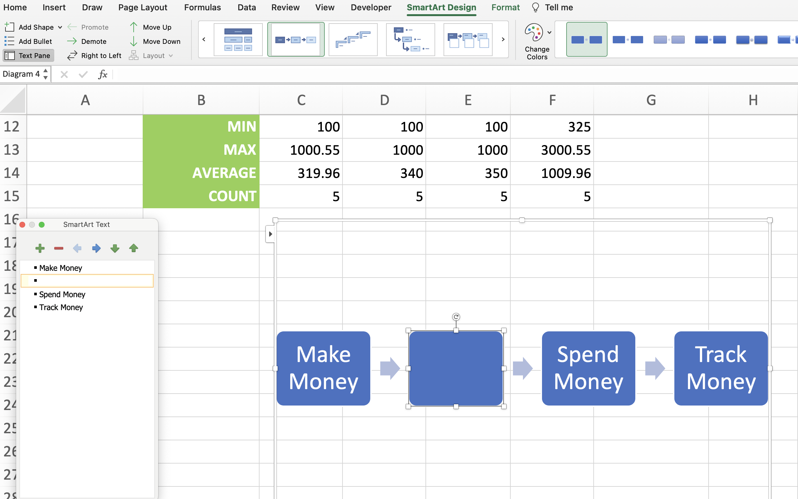

- If you press "Enter" on the text pane, it will make a new section in the graphic.

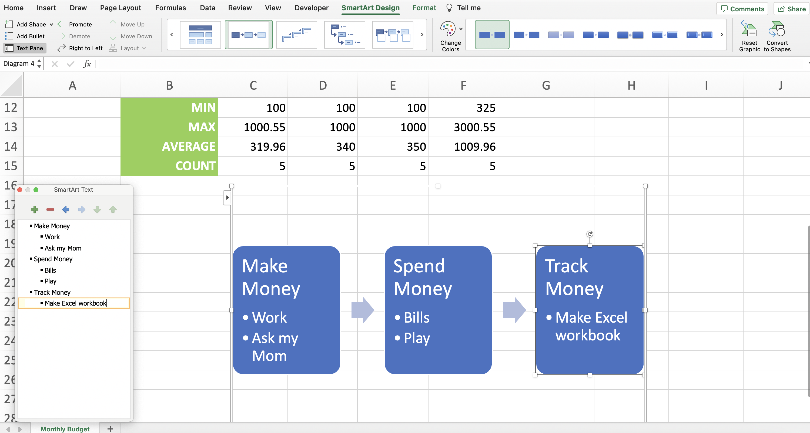

- If you would like a sub section, you can press "Enter" then "Tab" on your keyboard.

<!-- ## Quiz

 -->

**Developer**

- Caroline Crandell - cecrandell - cecrandell19@gmail.com - [LinkedIn](https://www.linkedin.com/in/carolinecrandell/)
